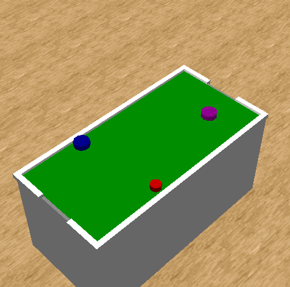
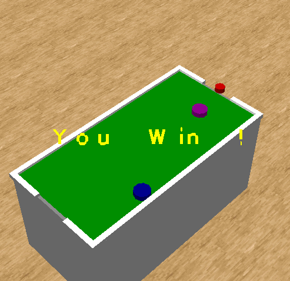

This project is based on an arcade game called "Air Hockey" found in JumPin Gym U.S.A("美国冒险乐园"in Chinese).This is a 2-player game playing on a table with goals on opposite sides. Each player will use a piece of "Mallet" to push a disc (called Puck) into other's goal
and at the same time protect one's goal from the Puck. Apart from the two goals, the table is
surrounded by walls which bounce the Puck and prevent the Puck goes outside.

The program just supports single player,so the opponent is controlled by computer. Implement this arcade game through OpenGL2.0

`main.cpp`
```cpp
#include <windows.h>
#include <gl.h>
#include <glut.h>
#include <stdlib.h>
#include <iostream>
#include <cmath>
#include <math.h>
#include <iomanip> 
#include <stdlib.h>
#include <windows.h>
#include <stdio.h>
#include <fstream>

#pragma warning(disable:4996)
using namespace std;

unsigned char *pBmpBuf;

int bmpWidth;
int bmpHeight;
RGBQUAD *pColorTable;


static GLuint texName;

int biBitCount;
bool readBmp(char *bmpName)
{
	FILE *fp = fopen(bmpName, "rb");
	if (fp == 0) return 0;
	
	fseek(fp, sizeof(BITMAPFILEHEADER), 0);

	BITMAPINFOHEADER head;

	fread(&head, sizeof(BITMAPINFOHEADER), 1, fp); 

	bmpWidth = head.biWidth;
	bmpHeight = head.biHeight;
	biBitCount = head.biBitCount;

	int lineByte = (bmpWidth * biBitCount / 8 + 3) / 4 * 4;

	if (biBitCount == 8)
	{
		pColorTable = new RGBQUAD[256];
		fread(pColorTable, sizeof(RGBQUAD), 256, fp);
	}
	pBmpBuf = new unsigned char[lineByte * bmpHeight];
	fread(pBmpBuf, 1, lineByte * bmpHeight, fp);
	fclose(fp);

	return 1;
}


const float PI = 3.14159265359;
const int FRAME_WIDTH = 800;
const int FRAME_HEIGHT = 800;
int angle[8];
int option = 0;
int frameNum = 0;
int now_frame_width = FRAME_WIDTH;
int now_frame_height = FRAME_HEIGHT;


float cylinder_r = 12.8;

float view_angle_z = 0.0f;
float view_angle_x = 106.0f;


const float eye_R = 10.0f;
const float PuckRadius = 0.1f;
const float MalletsRadius = 0.15f;

float eye_position_x = 0.0f;
float eye_position_y = 7.0f;
float eye_position_z = 10.0f;

float P_position_x = 0.0f;
float P_position_z = 1.0f;

float A_position_x = 0.0f;
float A_position_z = 0.0f;

float B_position_x = 0.0f;
float B_position_z = 3.0f;


boolean SaveDIB24(const char* lpszFileName, DWORD dwWidth, DWORD dwHeight, void* lpvBits)
{
	HANDLE hFile;

	BOOL bOK;
	DWORD dwNumWritten;
	DWORD dwWidthAlign;
	BITMAPFILEHEADER bmfh;
	BITMAPINFOHEADER bmih;

	__try {

		hFile = CreateFile(
			lpszFileName,
			GENERIC_WRITE,
			0,
			NULL,
			CREATE_ALWAYS,
			0,
			NULL
			);
		if (hFile == INVALID_HANDLE_VALUE) return 0;

		dwWidthAlign = ((dwWidth*sizeof(RGBTRIPLE) + 3) / 4) * 4;

		bmfh.bfReserved1 = bmfh.bfReserved2 = 0;
		bmfh.bfType = ('B' | 'M' << 8);
		bmfh.bfOffBits = sizeof(BITMAPFILEHEADER) + sizeof(BITMAPINFOHEADER);
		bmfh.bfSize = bmfh.bfOffBits + dwWidthAlign*dwHeight;

		bOK = WriteFile(
			hFile,
			&bmfh,
			sizeof(bmfh),
			&dwNumWritten,
			NULL
			);
		if (!bOK) return 0;


		bmih.biSize = sizeof(BITMAPINFOHEADER);
		bmih.biWidth = dwWidth;
		bmih.biHeight = dwHeight;
		bmih.biPlanes = 1;
		bmih.biBitCount = 24;
		bmih.biCompression = 0;
		bmih.biSizeImage = 0;
		bmih.biXPelsPerMeter = 0;
		bmih.biYPelsPerMeter = 0;
		bmih.biClrUsed = 0;
		bmih.biClrImportant = 0;

		bOK = WriteFile(
			hFile,
			&bmih,
			sizeof(bmih),
			&dwNumWritten,
			NULL
			);
		if (!bOK) return 0;

		bOK = WriteFile(
			hFile,
			lpvBits,
			dwWidthAlign*dwHeight,
			&dwNumWritten,
			NULL
			);
		if (!bOK) return 0;

	}
	__finally {

		CloseHandle(hFile);

	}

	return 1;
}


// test
float var_a = 0.0f;
float var_b = 0.0f;
float var_c = 0.0f;


bool is_stop = false;
bool is_win = true;


const float puckV = 0.005;
float puck_x = 0.7;
float puck_z = 0.7;

void hitTest(float x, float z)
{
	const float pow_reflect_radius = pow(PuckRadius + MalletsRadius, 2);
	float dis_pow2 = pow(P_position_x - x, 2) + pow(P_position_z - z, 2);
	if (dis_pow2 < pow_reflect_radius)
	{
		float v_x = (x - P_position_x);
		float v_z = (z - P_position_z);
		float unit_v_x = v_x / sqrt(pow(v_x, 2) + pow(v_z, 2));
		float unit_v_z = v_z / sqrt(pow(v_x, 2) + pow(v_z, 2));
		float product = unit_v_x * puck_x + unit_v_z * puck_z;
		if (product < 0) return;
		float reflect_x = unit_v_x * product;
		float reflect_z = unit_v_z * product;
		puck_x = puck_x - 2 * reflect_x;
		puck_z = puck_z - 2 * reflect_z;
		
		float unit_puck_x = puck_x / sqrt(pow(puck_x, 2) + pow(puck_z, 2));
		float unit_puck_z = puck_z / sqrt(pow(puck_x, 2) + pow(puck_z, 2));
		puck_x = unit_puck_x;
		puck_z = unit_puck_z;
	}
}

void next()
{
	if (is_stop) return;

	if (P_position_x < -0.8)
		puck_x = puck_x < 0 ? -puck_x : puck_x;
	else if (P_position_x > 0.8)
		puck_x = puck_x > 0 ? -puck_x : puck_x;

	else if (P_position_z < -0.8 || P_position_z > 3.8) {
		if (-0.3 < P_position_x && P_position_x < 0.3) {
			is_stop = true;
			is_win = P_position_z < 2 ? true : false;
			if (is_win)	
				MessageBox(NULL, "You Win !", "result", MB_OK | MB_ICONINFORMATION);
			else 
				MessageBox(NULL, "You Lost !", "result", MB_OK | MB_ICONINFORMATION);
			return;
		}
		else if(P_position_z < -0.8){
			puck_z = puck_z < 0 ? -puck_z : puck_z;
		}
		else {
			puck_z = puck_z > 0 ? -puck_z : puck_z;
		}
	}

	hitTest(A_position_x, A_position_z);
	hitTest(B_position_x, B_position_z);

	P_position_x += puck_x * puckV;
	P_position_z += puck_z * puckV;

	float A_P_x_range = P_position_x - A_position_x;
	float A_move_x = A_P_x_range / 100;
	A_position_x += A_move_x;
}


void initGame() 
{
	is_stop = false;
	P_position_x = 0.0f;
	P_position_z = 1.0f;

	A_position_x = 0.0f;
	A_position_z = 0.0f;

	float angle = rand() % 360;
	puck_x = sin(PI * angle / 180.0);
	puck_z = cos(PI * angle / 180.0);
}

void keyboard(unsigned char key, int x, int y)
{
	switch (key) {
	case 27:  
		exit(0);
		break;
	case 13:
		cout << "enter" << endl;;
		initGame();
		break;
	case 'a':
		var_a += 0.01;
		break;
	case 'z':
		var_a -= 0.01;
		break;
	case 's':
		var_b += 0.01;
		break;
	case 'x':
		var_b -= 0.01;
		break;
	case 'd':
		var_c += 0.01;
		break;
	case 'c':
		var_c -= 0.01;
		break;
	case 'q':
		cout << "var_a : " << var_a << endl;
		cout << "var_b : " << var_b << endl;
		cout << "var_c : " << var_c << endl;
		break;
	}
}

float view_angle = 0.0;

void specialFunc(int key, int x, int y)
{
	switch (key) {
	case 100:
		cout << "left" << endl;
//		if (view_angle < 60.0)
			view_angle -= 1.0f;
			eye_position_x = eye_R * sin(PI * view_angle / 180.0f);
			eye_position_z = eye_R * cos(PI * view_angle / 180.0f);
		break;
	case 101:
		cout << "up" << endl;
		eye_position_y += 0.2f;
		break;
	case 102:
		cout << "right" << endl;
//		if (view_angle > -60.0)
			view_angle += 1.0f;
		eye_position_x = eye_R * sin(PI * view_angle / 180.0f);
		eye_position_z = eye_R * cos(PI * view_angle / 180.0f);
		break;
	case 103:
		cout << "down" << endl;
		eye_position_y -= 0.2f;
		break;
	}
}


GLUquadricObj* cylinder_obj = gluNewQuadric();


void displayFloor()
{

	glPushMatrix();
//	glTranslatef(0.0, -5.0, 0.0);
	glEnable(GL_TEXTURE_2D);
//	glTexEnvf(GL_TEXTURE_ENV, GL_TEXTURE_ENV_MODE, GL_DECAL);

	glBindTexture(GL_TEXTURE_2D, texName);
	glBegin(GL_QUADS);
	glColor3f(0.9, 0.5, 0.2);
	glNormal3f(0.0, 1.0, 0.0);
	glTexCoord2f(0.0, 20.0);
	glVertex3f(-50, 0.0, 50);

	glNormal3f(0.0, 1.0, 0.0);
	glTexCoord2f(20.0, 20.0);
	glVertex3f(50, 0.0, 50);

	glNormal3f(0.0, 1.0, 0.0);
	glTexCoord2f(20.0, 0.0);
	glVertex3f(50, 0.0, -50);

	glNormal3f(0.0, 1.0, 0.0);
	glTexCoord2f(0.0, 0.0);
	glVertex3f(-50, 0.0, -50);
	glEnd();

	glDisable(GL_TEXTURE_2D);
	glPopMatrix();

}


void displayTable()
{
	glPushMatrix();
	glBegin(GL_QUADS);                                     

/////////////////////1
	glColor3f(0.3, 0.35, 0.4);     
	glVertex3f(1.0f, 2.0f, 4.0f);      
	glVertex3f(-1.0f, 2.0f, 4.0f);      
	glVertex3f(-1.0f, 0.0f, 4.0f);  
	glVertex3f(1.0f, 0.0f, 4.0f);     

	glVertex3f(1.0f, 0.0f, -1.0f);       
	glVertex3f(-1.0f, 0.0f, -1.0f); 
	glVertex3f(-1.0f, 2.0f, -1.0f);    
	glVertex3f(1.0f, 2.0f, -1.0f);    

	glVertex3f(-1.0f, 2.0f, 4.0f);   
	glVertex3f(-1.0f, 2.0f, -1.0f);   
	glVertex3f(-1.0f, 0.0f, -1.0f);  
	glVertex3f(-1.0f, 0.0f, 4.0f);  

	glVertex3f(1.0f, 2.0f, -1.0f);   
	glVertex3f(1.0f, 2.0f, 4.0f);   
	glVertex3f(1.0f, 0.0f, 4.0f); 
	glVertex3f(1.0f, 0.0f, -1.0f);

	glVertex3f(1.0f, 0.1f, -1.0f);
	glVertex3f(1.0f, 0.1f, 4.0f);
	glVertex3f(-1.0f, 0.1f, 4.0f);
	glVertex3f(-1.0f, 0.1f, -1.0f);


/////////////////////2
	glColor3f(0.9, 0.9, 0.9);
	glVertex3f(1.05f, 2.05f, 4.05f);
	glVertex3f(0.3f, 2.05f, 4.05f);
	glVertex3f(0.3f, 2.05f, 3.95f);	
	glVertex3f(1.05f, 2.05f, 3.95f);

	glVertex3f(-1.05f, 2.05f, 4.05f);
	glVertex3f(-0.3f, 2.05f, 4.05f);
	glVertex3f(-0.3f, 2.05f, 3.95f);
	glVertex3f(-1.05f, 2.05f, 3.95f);

	glVertex3f(-1.05f, 2.05f, -1.05f);
	glVertex3f(-0.3f, 2.05f, -1.05f);
	glVertex3f(-0.3f, 2.05f, -0.95f);
	glVertex3f(-1.05f, 2.05f, -0.95f);

	glVertex3f(1.05f, 2.05f, -1.05f);
	glVertex3f(0.3f, 2.05f, -1.05f);
	glVertex3f(0.3f, 2.05f, -0.95f);
	glVertex3f(1.05f, 2.05f, -0.95f);

	glVertex3f(1.05f, 2.05f, 4.05f);
	glVertex3f(0.95f, 2.05f, 4.05f);
	glVertex3f(0.95f, 2.05f, -0.95f);
	glVertex3f(1.05f, 2.05f, -0.95f);

	glVertex3f(-1.05f, 2.05f, 4.05f);
	glVertex3f(-0.95f, 2.05f, 4.05f);
	glVertex3f(-0.95f, 2.05f, -0.95f);
	glVertex3f(-1.05f, 2.05f, -0.95f);
//////////////////////////////////3
	glColor3f(0.3, 0.35, 0.405);
	glVertex3f(1.05f, 2.0f, 4.05f);
	glVertex3f(0.3f, 2.0f, 4.05f);
	glVertex3f(0.3f, 2.0f, 3.95f);
	glVertex3f(1.05f, 2.0f, 3.95f);

	glVertex3f(-1.05f, 2.0f, 4.05f);
	glVertex3f(-0.3f, 2.0f, 4.05f);
	glVertex3f(-0.3f, 2.0f, 3.95f);
	glVertex3f(-1.05f, 2.0f, 3.95f);

	glVertex3f(-1.05f, 2.0f, -1.05f);
	glVertex3f(-0.3f, 2.0f, -1.05f);
	glVertex3f(-0.3f, 2.0f, -0.95f);
	glVertex3f(-1.05f, 2.0f, -0.95f);

	glVertex3f(1.05f, 2.0f, -1.05f);
	glVertex3f(0.3f, 2.0f, -1.05f);
	glVertex3f(0.3f, 2.0f, -0.95f);
	glVertex3f(1.05f, 2.0f, -0.95f);

	glVertex3f(1.05f, 2.0f, 4.05f);
	glVertex3f(0.95f, 2.0f, 4.05f);
	glVertex3f(0.95f, 2.0f, -0.95f);
	glVertex3f(1.05f, 2.0f, -0.95f);

	glVertex3f(-1.05f, 2.0f, 4.05f);
	glVertex3f(-0.95f, 2.0f, 4.05f);
	glVertex3f(-0.95f, 2.0f, -0.95f);
	glVertex3f(-1.05f, 2.0f, -0.95f);

//////////////////////////////4
	glColor3f(0.3, 0.35, 0.405);
	glVertex3f(1.05f, 2.05f, 4.05f);
	glVertex3f(0.3f, 2.05f, 4.05f);
	glVertex3f(0.3f, 2.0f, 4.05f);
	glVertex3f(1.05f, 2.0f, 4.05f);

	glVertex3f(-1.05f, 2.05f, 4.05f);
	glVertex3f(-0.3f, 2.05f, 4.05f);
	glVertex3f(-0.3f, 2.0f, 4.05f);
	glVertex3f(-1.05f, 2.0f, 4.05f);

	glVertex3f(-1.05f, 2.05f, -1.05f);
	glVertex3f(-0.3f, 2.05f, -1.05f);
	glVertex3f(-0.3f, 2.0f, -1.05f);
	glVertex3f(-1.05f, 2.0f, -1.05f);

	glVertex3f(1.05f, 2.05f, -1.05f);
	glVertex3f(0.3f, 2.05f, -1.05f);
	glVertex3f(0.3f, 2.0f, -1.05f);
	glVertex3f(1.05f, 2.0f, -1.05f);

	glVertex3f(1.05f, 2.05f, 4.05f);
	glVertex3f(1.05f, 2.0f, 4.05f);
	glVertex3f(1.05f, 2.05f, -1.05f);
	glVertex3f(1.05f, 2.0f, -1.05f);

	glVertex3f(-1.05f, 2.05f, 4.05f);
	glVertex3f(-1.05f, 2.0f, 4.05f);
	glVertex3f(-1.05f, 2.05f, -1.05f);
	glVertex3f(-1.05f, 2.0f, -1.05f);
//////////////////////5
	glColor3f(0.3, 0.35, 0.405);
	glVertex3f(0.3f, 2.05f, 4.05f);
	glVertex3f(0.3f, 2.05f, 3.95f);
	glVertex3f(0.3f, 2.0f, 4.05f);
	glVertex3f(0.3f, 2.0f, 3.95f);

	glVertex3f(-0.3f, 2.05f, 4.05f);
	glVertex3f(-0.3f, 2.05f, 3.95f);
	glVertex3f(-0.3f, 2.0f, 4.05f);
	glVertex3f(-0.3f, 2.0f, 3.95f);

	glVertex3f(-0.3f, 2.05f, -1.05f);
	glVertex3f(-0.3f, 2.05f, -0.95f);
	glVertex3f(-0.3f, 2.0f, -1.05f);
	glVertex3f(-0.3f, 2.0f, -0.95f);

	glVertex3f(0.3f, 2.05f, -1.05f);
	glVertex3f(0.3f, 2.05f, -0.95f);
	glVertex3f(0.3f, 2.0f, -1.05f);
	glVertex3f(0.3f, 2.0f, -0.95f);
//////////////////////6
	glColor3f(0.3, 0.35, 0.405);
	glVertex3f(1.05f, 2.05f, 3.95f);
	glVertex3f(0.3f, 2.05f, 3.95f);
	glVertex3f(0.3f, 2.0f, 3.95f);
	glVertex3f(1.05f, 2.0f, 3.95f);

	glVertex3f(-1.05f, 2.05f, 3.95f);
	glVertex3f(-0.3f, 2.05f, 3.95f);
	glVertex3f(-0.3f, 2.0f, 3.95f);
	glVertex3f(-1.05f, 2.0f, 3.95f);

	glVertex3f(-1.05f, 2.05f, -0.95f);
	glVertex3f(-0.3f, 2.05f, -0.95f);
	glVertex3f(-0.3f, 2.0f, -0.95f);
	glVertex3f(-1.05f, 2.0f, -0.95f);

	glVertex3f(1.05f, 2.05f, -0.95f);
	glVertex3f(0.3f, 2.05f, -0.95f);
	glVertex3f(0.3f, 2.0f, -0.95f);
	glVertex3f(1.05f, 2.0f, -0.95f);

	glVertex3f(0.95f, 2.05f, 4.05f);
	glVertex3f(0.95f, 2.0f, 4.05f);
	glVertex3f(0.95f, 2.05f, -1.05f);
	glVertex3f(0.95f, 2.0f, -1.05f);

	glVertex3f(-0.95f, 2.05f, 4.05f);
	glVertex3f(-0.95f, 2.0f, 4.05f);
	glVertex3f(-0.95f, 2.05f, -1.05f);
	glVertex3f(-0.95f, 2.0f, -1.05f);


//////////////////////7
	glColor3f(0.22, 0.55, 0.0);
	glVertex3f(1.0f, 2.0f, -1.0f);
	glVertex3f(1.0f, 2.0f, 4.0f);
	glVertex3f(-1.0f, 2.0f, 4.0f);
	glVertex3f(-1.0f, 2.0f, -1.0f);


	glEnd();

	glPopMatrix();
}


void displayDisc()
{
	// Puck
	glPushMatrix();
	glTranslatef(P_position_x, 2.0f, P_position_z);
	glRotatef(-90.0, 1, 0, 0);
	glColor3f(0.5, 0.02, 0.02);
	gluCylinder(cylinder_obj, PuckRadius, PuckRadius, 0.07f, 32, 32);
	glTranslatef(0.0f, 0.0f, 0.07f);
	glColor3f(0.7, 0.05, 0.05);
	gluDisk(cylinder_obj, 0.0f, PuckRadius, 32, 32);
	glPopMatrix();

	// Mallets A
	glPushMatrix();
	glTranslatef(A_position_x, 2.0f, A_position_z);
	glRotatef(-90.0, 1, 0, 0);
	glColor3f(0.2, 0.02, 0.25);
	gluCylinder(cylinder_obj, MalletsRadius, MalletsRadius, 0.07f, 32, 32);
	glTranslatef(0.0f, 0.0f, 0.07f);
	glColor3f(0.35, 0.05, 0.35);
	gluDisk(cylinder_obj, 0.0f, MalletsRadius, 32, 32);
	glPopMatrix();

	// Mallets B
	glPushMatrix();
	glTranslatef(B_position_x, 2.0f, B_position_z);
	glRotatef(-90.0, 1, 0, 0);
	glColor3f(0.1, 0.02, 0.5);
	gluCylinder(cylinder_obj, 0.15f, 0.15f, 0.07f, 32, 32);
	glTranslatef(0.0f, 0.0f, 0.07f);
	glColor3f(0.05, 0.05, 0.7);
	gluDisk(cylinder_obj, 0.0f, 0.15f, 32, 32);
	glPopMatrix();
}


void display()
{

	glClearColor(0.0, 0.0, 0.0, 0.0);
	glClear(GL_COLOR_BUFFER_BIT | GL_DEPTH_BUFFER_BIT);	
	
	glMatrixMode(GL_MODELVIEW);
	glLoadIdentity();

	gluLookAt(eye_position_x, eye_position_y, eye_position_z, 0.0, 0.0, 0.0, 0, 1, 0);

	displayFloor();
	displayTable();

	displayDisc();
	


	glutSwapBuffers();

	next();
}


void init()
{
	glMatrixMode(GL_PROJECTION);
	glLoadIdentity();


	gluPerspective(45.0f, 1.0f, 0.1f, 100.0f);

	glMatrixMode(GL_MODELVIEW);
	glLoadIdentity();

	glClearDepth(1.0f);   
	glEnable(GL_DEPTH_TEST);    
	glDepthFunc(GL_LEQUAL);     
	glHint(GL_PERSPECTIVE_CORRECTION_HINT, GL_NICEST); 

	glPixelStorei(GL_UNPACK_ALIGNMENT, 1);

	glGenTextures(1, &texName);
	glBindTexture(GL_TEXTURE_2D, texName);

	glTexParameteri(GL_TEXTURE_2D, GL_TEXTURE_WRAP_S, GL_REPEAT);
	glTexParameteri(GL_TEXTURE_2D, GL_TEXTURE_WRAP_T, GL_REPEAT);
	glTexParameteri(GL_TEXTURE_2D, GL_TEXTURE_MAG_FILTER, GL_NEAREST);
	glTexParameteri(GL_TEXTURE_2D, GL_TEXTURE_MIN_FILTER, GL_NEAREST);

//	gluBuild2DMipmaps(GL_TEXTURE_2D, 3, bmpWidth,bmpHeight, GL_RGB,GL_UNSIGNED_BYTE,pBmpBuf);             
	
	glPixelStorei(GL_UNPACK_ALIGNMENT, 1);    //�������ش洢��ʽ

	glTexImage2D(GL_TEXTURE_2D, 0, 3, bmpWidth, bmpHeight,
		0, GL_RGB, GL_UNSIGNED_BYTE, pBmpBuf);
}

void reshape(int width, int height)
{
	glViewport(0, 0, 800, 800);

//	glMatrixMode(GL_PROJECTION);
//	glLoadIdentity();


//	gluPerspective(45.0f, (GLfloat)width / (GLfloat)height, 0.1f, 100.0f);

//	glMatrixMode(GL_MODELVIEW);
//	glLoadIdentity();


	now_frame_width = width;
	now_frame_height = height;

}

void passiveMotion(int x, int y)
{
	cout << "x : " << x << "  y : " << y << endl;

	GLint viewport[4];
	GLdouble modelview[16];
	GLdouble projection[16];
	GLfloat winX, winY, winZ;
	GLdouble posX, posY, posZ;

	glGetDoublev(GL_MODELVIEW_MATRIX, modelview);
	glGetDoublev(GL_PROJECTION_MATRIX, projection);
	glGetIntegerv(GL_VIEWPORT, viewport);

	winX = (float)x;
	winY = (float)viewport[3] - (float)y;
	glReadPixels(x, int(winY), 1, 1, GL_DEPTH_COMPONENT, GL_FLOAT, &winZ);

	gluUnProject(winX, winY, winZ, modelview, projection, viewport, &posX, &posY, &posZ);


	cout << "posX : " << posX << "  posZ : " << posZ << "  posY : " << posY << endl;

	B_position_x = posX < -0.8 ? -0.8 : ( posX > 0.8 ? 0.8 : posX );
	B_position_z = posZ < 2.5 ? 2.5 : ( posZ > 3.8 ? 3.8 : posZ );

}

int main(int argc, char** argv)
{
	readBmp("floor.bmp");

	glutInit(&argc, argv);
	glutInitDisplayMode(GLUT_DOUBLE | GLUT_RGB);
	glutInitWindowSize(FRAME_WIDTH, FRAME_HEIGHT);
	glutInitWindowPosition(50, 50);
	glutCreateWindow(argv[0]);

	init();
	glutDisplayFunc(display);
	glutKeyboardFunc(keyboard);
	glutSpecialFunc(specialFunc);
	glutPassiveMotionFunc(passiveMotion);
	glutReshapeFunc(reshape);
	glutIdleFunc(display);
	glutMainLoop();

	return 0;
}
```




