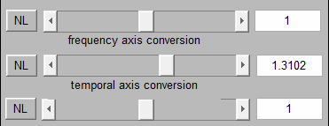
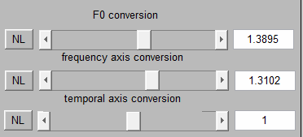
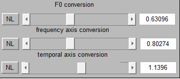
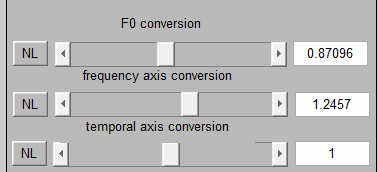
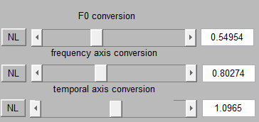
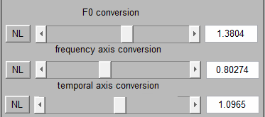
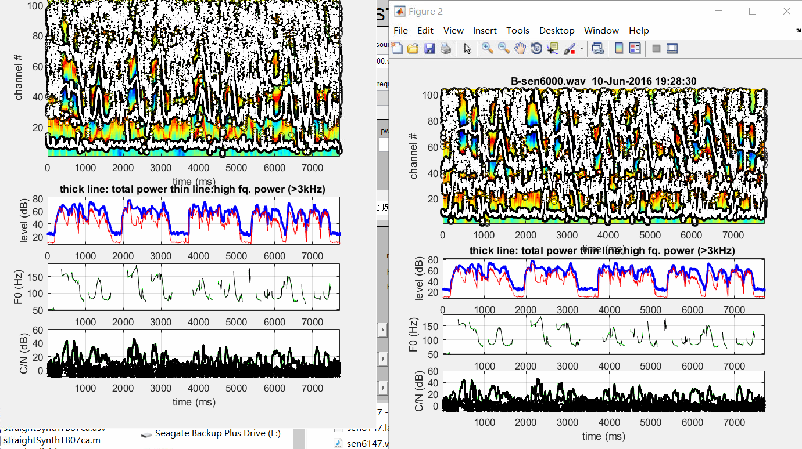
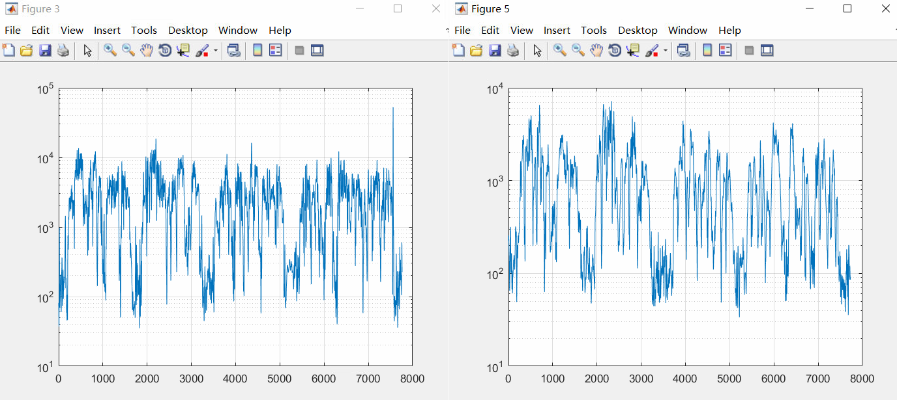
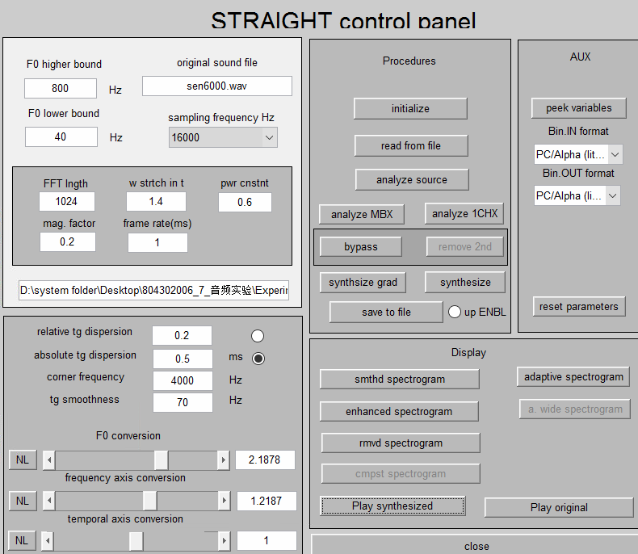

## 实验准备

使用 Matlab_straight 进行此次音频实验，不过在运行源代码时matlab提示出现以下错误
```
WAVWREAD will be removed in a future release. Use AUDIOREAD instead.
```
还有
```
WAVWRITE will be removed in a future release. Use AUDIOWRITE instead.
```
使用 audioread、audiowrite 函数修改相对应的源代码，错误消失后继续实验

## 实验1：A to X声音转换

* 首先是原版郭德纲的音频：`guodegang.wav`

  <audio controls="controls">
  <source src="data/experiment_1/guodegang.wav">
   
  </audio>

  * 使用 Matlab_straight 进行修改
  
    
    保存为`guodegang1.wav`,此时音频为

    <audio controls="controls">
    <source src="data/experiment_1/guodegang1.wav">
     
    </audio>
    
  * 继续修改
        
    
        
    保存为`guodegang2.wav`,此时音频为

    <audio controls="controls">
    <source src="data/experiment_1/guodegang2.wav">
     
    </audio>
    
  * 继续修改
    
    
    
    保存为`guodegang3.wav`,此时音频为

    <audio controls="controls">
    <source src="data/experiment_1/guodegang3.wav">
     
    </audio>


* 然后是著名评书演员单田芳的音频 : `shantianfang.wav`

  <audio controls="controls">
  <source src="data/experiment_1/shantianfang.wav">
   
  </audio>

  使用 Matlab_straight 进行修改

  * 使用 Matlab_straight 进行修改
  
    
    保存为`shantianfang1.wav`,此时音频为

    <audio controls="controls">
    <source src="data/experiment_1/shantianfang1.wav">
     
    </audio>

  * 使用 Matlab_straight 进行修改
  
    
    保存为`shantianfang2.wav`,此时音频为

    <audio controls="controls">
    <source src="data/experiment_1/shantianfang2.wav">
     
    </audio>

  * 使用 Matlab_straight 进行修改
  
    
    保存为`shantianfang3.wav`,此时音频为

    <audio controls="controls">
    <source src="data/experiment_1/shantianfang3.wav">
     
    </audio>


## 实验2：A to B声音转换

* 首先，对于源音频`A/sen6000.wav`
  

<audio controls="controls">
  <source src="data/experiment_2/A/sen6000.wav">
   
  </audio>

  和目标音频`B/sen6000.wav`

<audio controls="controls">
  <source src="data/experiment_2/B/sen6000.wav">
   
  </audio>

  观察它们的声学特征
  
  
  

  然后进行调整
  

  保存为`res/sen6000.wav`

  <audio controls="controls">
  <source src="data/experiment_2/res/sen6000.wav">
   
  </audio>

* 同理，继续对`A/sen6015.wav`进行修改

  <audio controls="controls">
  <source src="data/experiment_2/A/sen6015.wav">
   
  </audio>  

  目标音频`B/sen6015.wav`

  <audio controls="controls">
  <source src="data/experiment_2/B/sen6015.wav">
   
  </audio>  

  修改后音频`res/sen6015.wav`

  <audio controls="controls">
  <source src="data/experiment_2/res/sen6015.wav">
   
  </audio>  


* 对`A/sen6028.wav`进行修改

  <audio controls="controls">
  <source src="data/experiment_2/A/sen6028.wav">
   
  </audio>  

  目标音频`B/sen6028.wav`

  <audio controls="controls">
  <source src="data/experiment_2/B/sen6028.wav">
   
  </audio>  

  修改后音频`res/sen6028.wav`

  <audio controls="controls">
  <source src="data/experiment_2/res/sen6028.wav">
   
  </audio>  


* 对`A/sen6044.wav`进行修改

  <audio controls="controls">
  <source src="data/experiment_2/A/sen6044.wav">
   
  </audio>  

  目标音频`B/sen6044.wav`

  <audio controls="controls">
  <source src="data/experiment_2/B/sen6044.wav">
   
  </audio>  

  修改后音频`res/sen6044.wav`

  <audio controls="controls">
  <source src="data/experiment_2/res/sen6044.wav">
   
  </audio>  


* 对`A/sen6147.wav`进行修改

  <audio controls="controls">
  <source src="data/experiment_2/A/sen6147.wav">
   
  </audio>  

  目标音频`B/sen6147.wav`

  <audio controls="controls">
  <source src="data/experiment_2/B/sen6147.wav">
   
  </audio>  

  修改后音频`res/sen6147.wav`

  <audio controls="controls">
  <source src="data/experiment_2/res/sen6147.wav">
   
  </audio>  


## 实验3：声音转换评价

首先对音频进行傅里叶变换，然后分别计算它们之间的 Euclidean distance 和 Bhattacharyya distance。测试它们的声音距离。在这里直接使用matlab进行距离计算
```matlab
file = 'ttt.wav';
[y,Fs] = audioread(file);
Nsamps = length(y);
t = (1/Fs)*(1:Nsamps);     
y_fft = abs(fft(y));     
y_fft = y_fft(1:Nsamps/2);     
f = Fs*(0:Nsamps/2-1)/Nsamps;    
```
直接做傅里叶变换
距离结果

*	Euclidean distance

	```
	A/sen6000.wav  B/sen6000.wav  9.6655e+03  
	res/sen6000.wav  B/sen6000.wav  4.7692e+03
	A/sen6000.wav  res/sen6000.wav  4.1568e+03
   
	```
	好像做过变换之后差距会小一点，但效果不大

*	Bhattacharyya distance
	```
	A/sen6000.wav  B/sen6000.wav  0.3803 
	res/sen6000.wav  B/sen6000.wav  0.3252
	A/sen6000.wav  res/sen6000.wav  0.3351
	```
  
对于郭德纲音频

*	Euclidean distance

	```
	guodegang.wav  guodegang1.wav  1.1593e+04 
	guodegang.wav  guodegang2.wav  1.2155e+04
	guodegang.wav  guodegang3.wav  1.3041e+04
   
	```

*	Bhattacharyya distance
	```
	guodegang.wav  guodegang1.wav  0.3138
	guodegang.wav  guodegang2.wav  0.3276
	guodegang.wav  guodegang3.wav  0.2863
	```