当彩色图片转换为灰度图的时候，人类看起来比较重要的视觉信息经常会消失。color2gray算法就是用来通过保持彩色图像显著性特征的方法来减少这种人类视觉特征上的损失。

如图，对于左边彩色图像做灰度图转换，中间图像使用传统方法转换后的效果，右边是使用color2gray算法转换后的效果。可以看出，考虑了色度变化的color2gray算法能更有效的反映出人的视觉特征来。

传统的灰度算法可以作为平坦光谱来记录光强度，不过对于人来说，图像有一个更好的视觉体验是更加重要的，有些例子可以说明这一点，比如有时候黑白线条会比彩色线条更加富有表现力，并且阴影的渲染会使得物体的形状、位置和反射率等比较重要的视觉特征显得更加地明显。

使用color2gray算法与之前地算法进行比较，原图如下

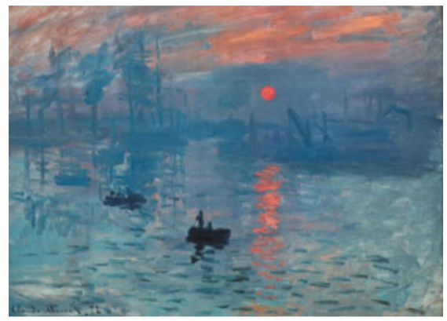

不同的灰度图算法效果如下

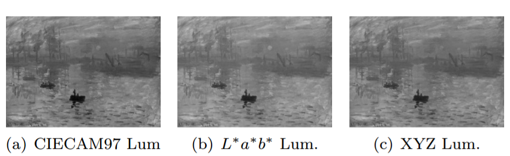
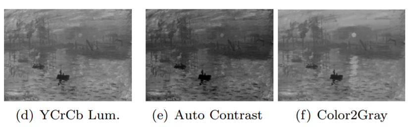

人类视觉研究者假设人类视觉系统不是感知绝对值，而是通过相对值来进行感知的，所以作者建议保留图像中附近像素之间的关系比表示更加重要。Color2Gray算法主要是通过将源图像中的色度和亮度变化映射到灰度图像中的变化，从而创建保持彩色图像的显着性的图像。这时，找到最适合的方法来描绘灰度中的颜色差异就成为了本次研究中的核心。

color2gray算法的主要步骤有三步，第一步，将彩色图像转换为感知均匀的色彩空间；第二步，计算目标差异从而组合亮度和色度差异；第三步，使用最小二乘法优化选择性地调制源亮度差异，从而反应原图像地色度变化。

color2gray算法将彩色图像中的差异编码为灰度图像中的亮度差异。不过，产生令人满意的结果有时需要人们做出一些手动的调整，color2gray算法允许用户通过三个简单的参数来控制色差到灰度差的映射。这三个参数如下：

* θ：用来控制色差映射到亮度值的增加或减少的数值，效果如下
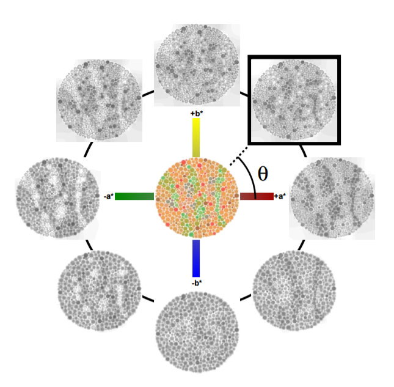

* α：多少色度变化可以对应的亮度变化值，效果如下
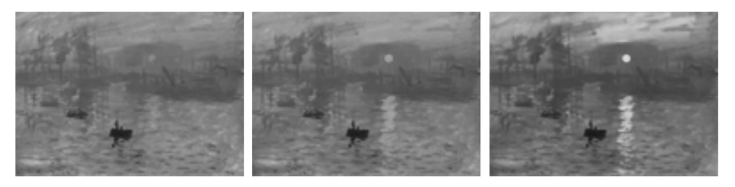

其中α分别为5，10，25。
μ：设置用于色度估计和亮度梯度的邻域大小，效果如下

接下来是算法的流程：
1. 将彩色图转换到CIE L ∗ a ∗ b ∗色彩空间。
2. 对于图中所有像素，按照下面公式计算出差值
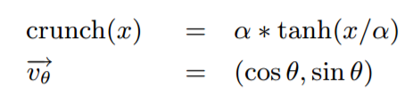
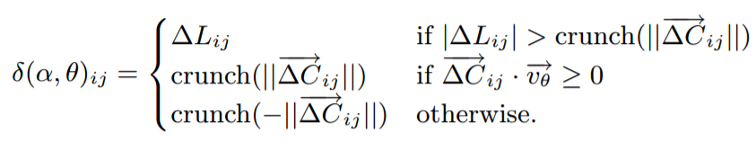
其中，ΔLij是（Li-Lj）的简写，ΔAij和ΔBij指一对像素之间的a *和b *通道差，ΔCij指（ΔAij，ΔBij）像素i与其相邻像素j之间的色差矢量。

3.	求解以下方程的最小值
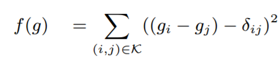
其中K是有序像素对(i, j)的集合，初始化g为源图像的亮度通道，然后使用共轭梯度法迭代下降到最小。

4.	对求得的g进行平移，使得求得的图像与源图像亮度最接近。

算法的运行时间与K的大小成比例，默认情况下，算法将每个像素与每个其他像素进行比较，此时K包含所有像素对。也可以使用临近的μ×μ邻域，对于正方形图S×S，时间复杂度分别为O(μ^2 * S^2)和O(S^4)。使用Althon 64 3200处理器运行，计算具有完整邻域的100x100图像需要12.7秒，对于150x150的图像需要65.6秒，对于200x200的图像需要204.0秒，和O(S^4)的时间复杂度相符。

其实可以通过使用GPU的方法来批量执行像素比较，从来提升算法性能。理论上来说同时处理SxS的块的能力能使算法的时间复杂度从O(S^4)降低到O(S^2)，在实际实验中，实际的性能改变更接近于O(S^3)。使用NVIDIA GT6800显卡，处理100x100的图像需要2.8秒，处理150x150的图像需要9.7秒，处理200x200的图像需要25.7秒。

使用Color2Gray算法与Photoshop的灰度模式在各种图像上进行比较。
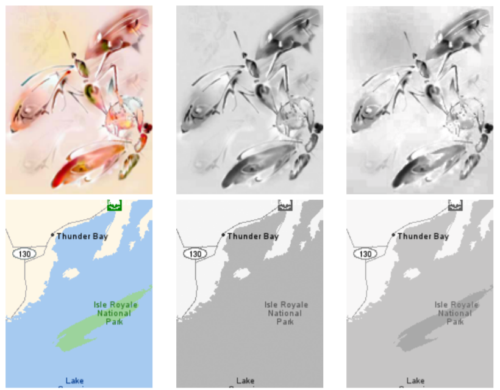
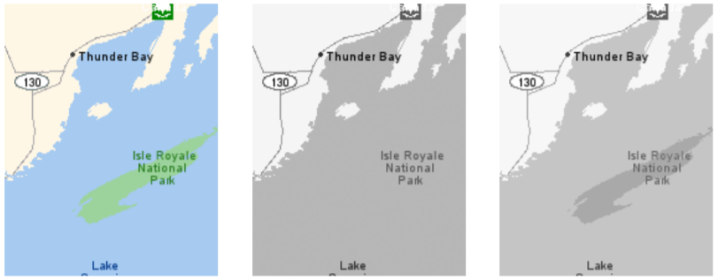
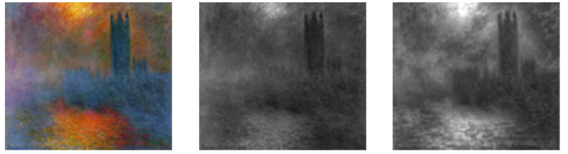
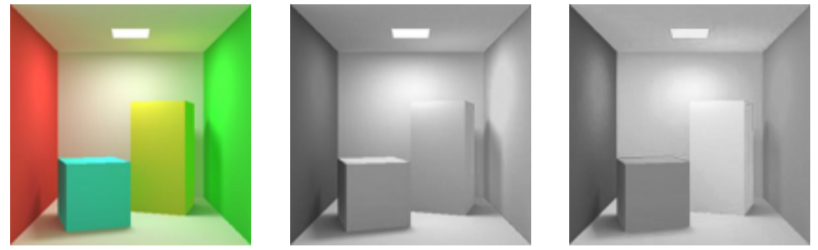
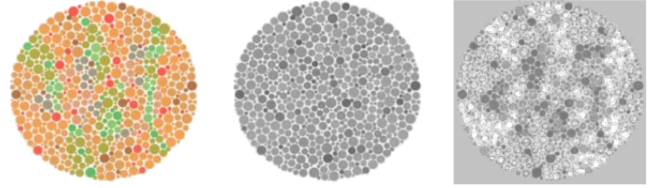
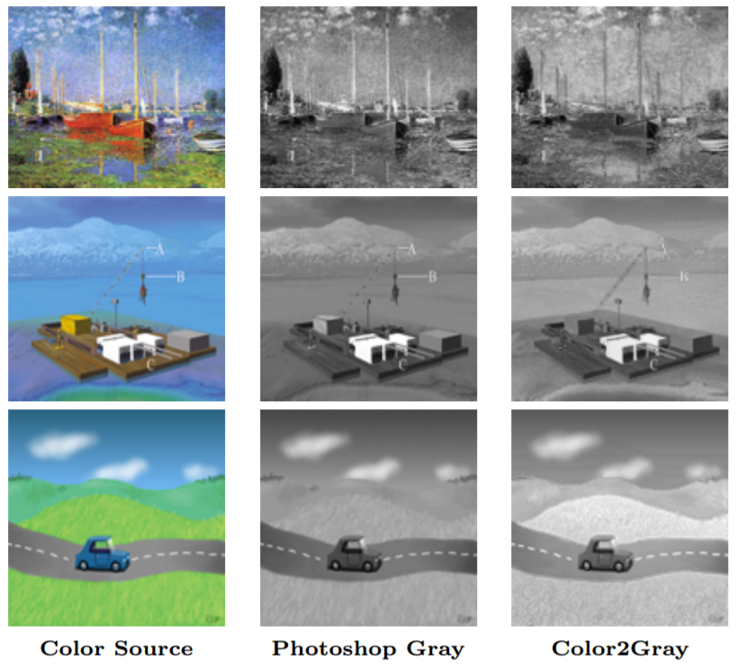

通过观察可以发现，第二幅图中水中的岛在ps的灰度图中消失不见了，在color2gray中可以看到，在第一幅和第四幅图中，昆虫的翅膀部分和立方体的正面部分被明显亮化。color2gray不太适合具有高动态范围的场景，比如具有宽范围的亮度变化的自然场景提供较大的改进。不过color2gray的确适合于具有少量不同色度值的有较大分隔区间的图像。比如最后一幅图，color2gray使得小车后面的山丘清晰可见。

color2gray算法还有一些可以改进的地方，比如说可以去除手动指定θ值的需要，自动匹配θ值。或许有一些多尺度方法，可以提高算法速度，从而应用到更高分辨率的图案。

最终，color2gray算法可以使用彩色图像生成灰度图，虽然color2gray不能对所有种类的源图像都有所改善，但是还是可以在很多情况下提升灰度图的质量。在高质量的灰度打印机上或许会有一些更好的效果。

