利用组合范畴语法进行餐饮问答的语义分析，把自然语言转化成逻辑表达式，在知识库上生成答案

#### 逻辑表达式

逻辑表达式是由知识库中名词常量、关系和变量组成的表达式，能够表现自然语句中出现的各个成分以及成分之间的关系。

使用lambda calculus标注逻辑表达式

    Sentence：五道口哪里有麻辣小龙虾
    Logic form： λx.zone(x, 五道口) ∧ hasCuisine(x, 麻辣小龙虾)

#### 组合范畴语法（CCG）
用于语义分析的组合范畴语法（CCG）由两部分组成：
词典（短语，句法成分，逻辑表达式，权重）
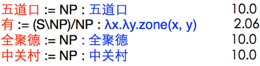

语法规则 (Steedman, 2000; Steedman & Baldridge, 2005; )

    X/Y : f   Y : g ⇒ X : f(g) 	(>) 
    Y : g   X\Y : f ⇒ X : f(g) 	(<)
    X/W : f   W/Y : g ⇒ X/Y : λx.f(g(x)) 	(>B) 
    W\Y : g   X\W : f ⇒ X\Y : λx.f(g(x)) 	(<B)

对相邻的两个短语应用对应的语法规则就可以生成一个新的词典项，直到完成对整个句子的解析。

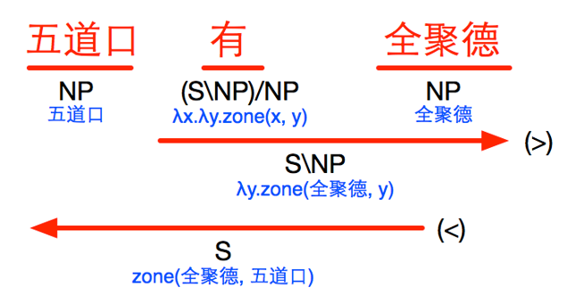
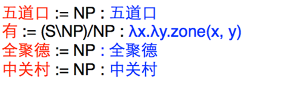

一个完整的语义分析器包含一个词典和词条权重。
对句子x的一种解析树y的得分为解析过程中使用的词条权重之和。
我们使用对数线性模型来处理概率问题。
对句子x经过解析树y，生成逻辑表达式z的概率的对数正比于它的得分
句子x对应逻辑表达式z的概率为生成z的所有解析树概率之和。
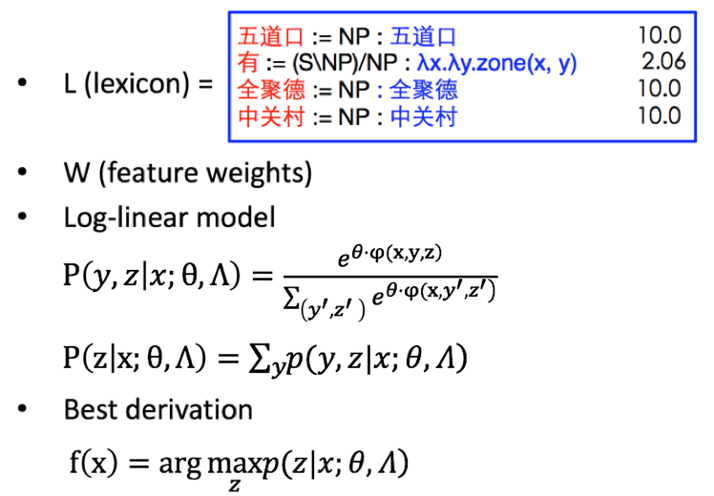
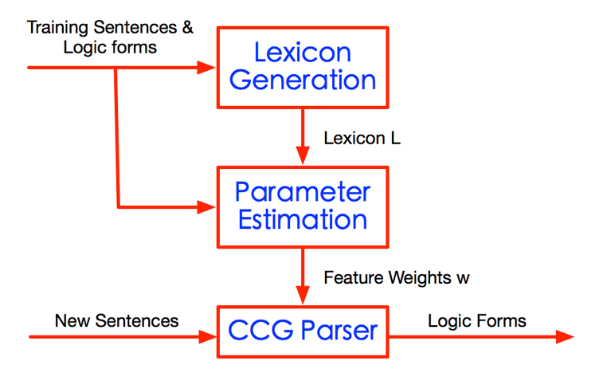
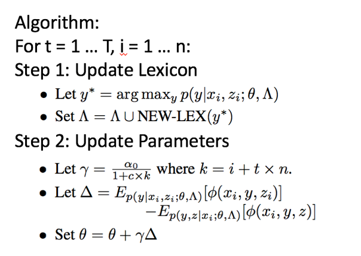


拆分当前得分最高的解析树，生成新词典项加入词典
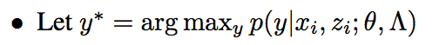

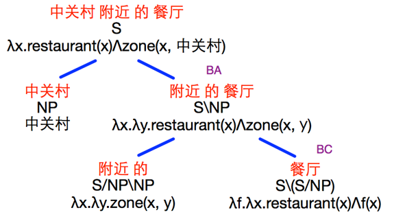

拆分规则，即四条语法组合规则的逆过程：
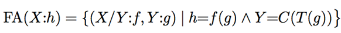
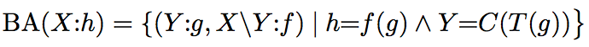
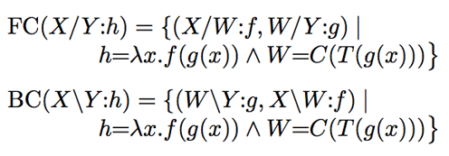

    X/Y : f   Y : g ⇒ X : f(g) 	(>) 
    Y : g   X\Y : f ⇒ X : f(g) 	(<)
    X/W : f   W/Y : g ⇒ X/Y : λx.f(g(x)) 	(> B) 
    W\Y : g   X\W : f ⇒ X\Y : λx.f(g(x)) 	(< B)


#### 知识库查询
对于知识库中的一个知识实例，可以用一个三元组来表示
*（实体，关系，属性值）
*（实体1，关系，实体2） 
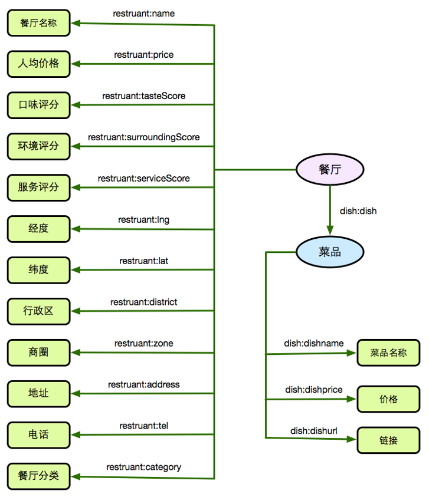

在知识库上生成答案
* 将逻辑表达式按规则转化成SPARQL查询语句
* 执行SPARQL语句，在知识库中查询答案


逻辑表达式：
    λx.zone(x, 五道口)∧label(x, 日本菜) ∧(price(x)>100)


SPARQL查询语句：
```sparql
PREFIX 略
SELECT ?s ?name 
WHERE { 
    ?s restruant:zone ?x125490038 . 
    FILTER regex(?x125490038, “五道口” ) . 
    ?s restruant:category ?x787707848 . 
    FILTER regex(?x787707848, “日本菜” ) . 
    ?s restruant:price ?x413926721 . 
    FILTER (xsd:float(?x413926721) > 100) . 
    ?s restruant:name ?name . 
}
```

查询结果：

    { http://RestrauntName/512591 月卿云客日本料理 } 
    { http://RestrauntName/6148589 寿司道场 }
    { http://RestrauntName/13864416 居酒屋のんべい(酒鬼金) }

交叉验证

| | Precision  | Recall  |  F1 | 
|--- |---|---|---|
| Mid | 88.9%  |  53.6% | 66.5% |  
| End | 93.7%  |  81.3% |  86.9% |  

随着迭代周期增加，在训练集上F1逐步上升；在测试集上F1先上升，在迭代周期达到12后开始下降，出现过拟合趋势。最终选择迭代12个周期。
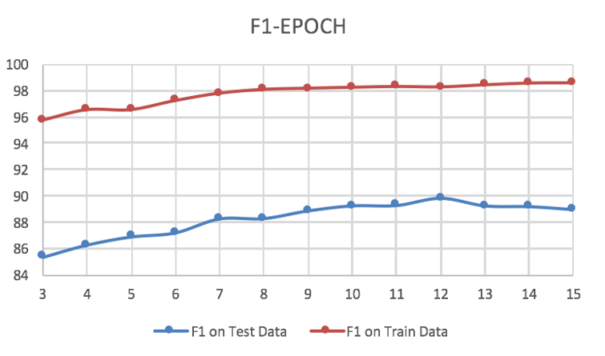

#### parser界面
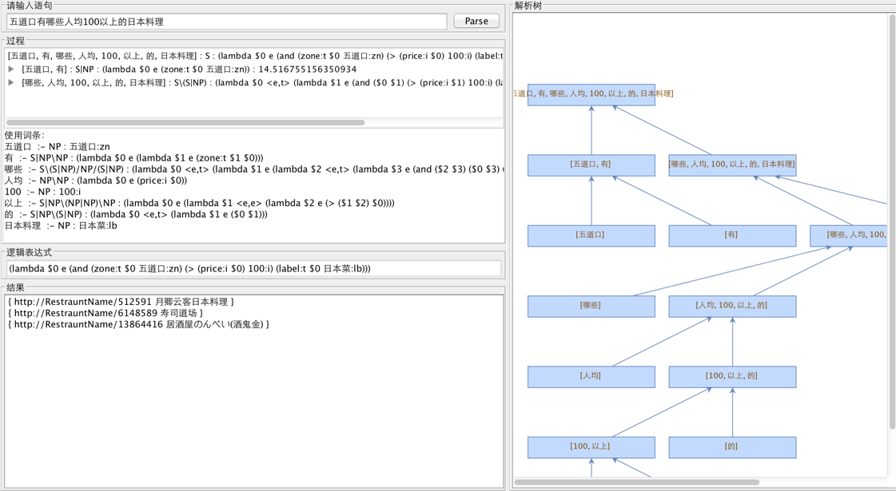

