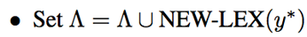

利用组合范畴语法进行餐饮问答的语义分析，把自然语言转化成逻辑表达式，在知识库上生成答案

#### 逻辑表达式

逻辑表达式是由知识库中名词常量、关系和变量组成的表达式，能够表现自然语句中出现的各个成分以及成分之间的关系。

使用lambda calculus标注逻辑表达式

    Sentence：五道口哪里有麻辣小龙虾
    Logic form： λx.zone(x, 五道口) ∧ hasCuisine(x, 麻辣小龙虾)

#### 组合范畴语法（CCG）
用于语义分析的组合范畴语法（CCG）由两部分组成：
词典（短语，句法成分，逻辑表达式，权重）

语法规则 (Steedman, 2000; Steedman & Baldridge, 2005; )

    X/Y : f   Y : g ⇒ X : f(g) 	(>) 
    Y : g   X\Y : f ⇒ X : f(g) 	(<)
    X/W : f   W/Y : g ⇒ X/Y : λx.f(g(x)) 	(>B) 
    W\Y : g   X\W : f ⇒ X\Y : λx.f(g(x)) 	(<B)

对相邻的两个短语应用对应的语法规则就可以生成一个新的词典项，直到完成对整个句子的解析。

一个完整的语义分析器包含一个词典和词条权重。
对句子x的一种解析树y的得分为解析过程中使用的词条权重之和。
我们使用对数线性模型来处理概率问题。
对句子x经过解析树y，生成逻辑表达式z的概率的对数正比于它的得分
句子x对应逻辑表达式z的概率为生成z的所有解析树概率之和。

拆分当前得分最高的解析树，生成新词典项加入词典

拆分规则，即四条语法组合规则的逆过程：

    X/Y : f   Y : g ⇒ X : f(g) 	(>) 
    Y : g   X\Y : f ⇒ X : f(g) 	(<)
    X/W : f   W/Y : g ⇒ X/Y : λx.f(g(x)) 	(> B) 
    W\Y : g   X\W : f ⇒ X\Y : λx.f(g(x)) 	(< B)

