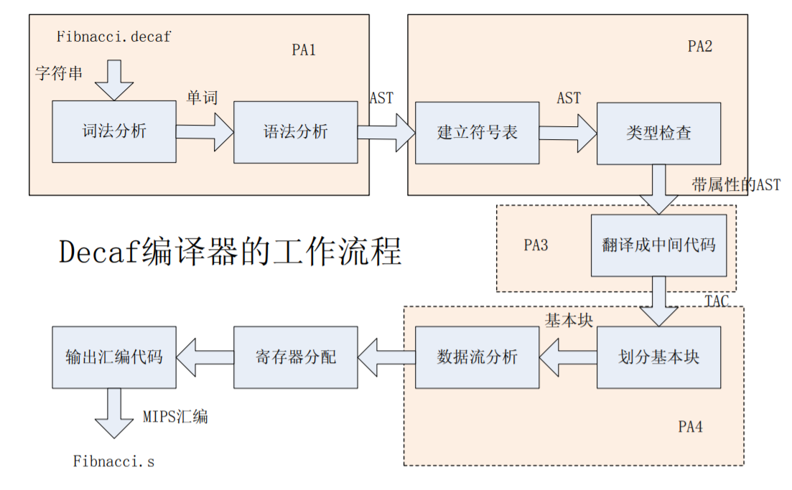

#### Decaf 简介

Decaf 是一种非常简单的面向对象编程语言。它是一种强类型的、面向对象的、支持
单继承和对象封装的语言。实验用的 Decaf 更加类似 Java，与 C++有比较大的差别。学
会用 Decaf 写程序是非常简单的一件事情，但是请记住 Decaf 跟现实中使用的编程语言并
不完全相同，它是经过简化且面向编译器教学的需要构造的。下面是一段 Decaf 程序：

```java
class Main {
    static void main() {
        class Fibonacci f;
        f = new Fibonacci();
        Print(f.get(ReadInteger()));
    }
}

class Fibonacci {
    int get(int i) {
        if (i < 2)  {
            return 1;
        }
        return get(i - 1) + get(i - 2);
    }
}
```

这段代码的大意是从键盘读取一个整数，然后把下标为这个整数的 Fibonacci 数打印
到屏幕上。从中可以看出：

1、Decaf 程序有一个叫做 Main 的类，并且含有一个静态的，返回值为 void，参数
列表为空的 main 函数，这是整个程序的入口。main 函数必须是静态函数，返回类型为
void，参数列表为空。

2、Decaf 程序中引用类名、函数名等等不需要有事先声明，但是所引用到的符号在整
个程序中必须有适当的定义（这一点跟 Java 是一样的）

#### 目标

实现一个非常简单的 Decaf 编译器。这个编译器的输入是 Decaf 源语言程
序，输出是 MIPS R2000/R3000 伪指令汇编程序。

Decaf 编译器的大致工作流程：




#### 词法分析、语法分析及抽象语法树生成

词法分析的功能是从左到右扫描 Decaf 源程序，从而识别出标识符、保留字、整数常
量、算符、分界符等单词符号（即终结符），把识别结果返回到语法分析器，以供语法分析
器使用。在识别的过程中，我们还需要检测词法相关的错误，例如字符@并非 Decaf 程序
中的合法符号，若这个字符在注释以外出现，则需要向用户提示一个词法错误。

语法分析是在词法分析的基础上对词法分析得到的终结符串建立语法树，并对不符合语
法规则的 Decaf 程序报错。比如常见的少写分号的问题，就属于语法错误，会在这个阶段
被发现。

Decaf 语言的单词符号主要有以下 5 类：

1. 关键字：是预先设定的一组字符串，在 Decaf 中关键字同时也是保留字，因此这
些字符串不能用作标识符，也不能被重新定义。
2. 标识符：是以字母开头，后跟若干字母、数字和下划线字符的串。例如，“int_var”
是合法的标识符。需要注意的是 Decaf 语言区分大小写，例如，if 是关键字，而 IF 则
是标识符。
3. 常量：包括整数、布尔常数、字符串三种。
4. 算符和界符（operators and delimiters）：包括单字符的和双字符的两种，
其中单字符的算符和界符在词法分析器中直接返回其 ASCII 码即可。
5. 注释：Decaf 中已有单行注释（以“//”开始，至行尾结束，如果在程序结尾，
则最后需要换行）。


增加的语言特性如下：
1. ++，--运算符：实现自增、自减单操作算子，形如 i++,++i,i--,--i。
其语义解释与 C 语言中一致。这些运算符的优先级低于()[].->，高于其他所有运算
符优先级。无须考虑运算符的结合性。本次实验仅考虑变量的自增、自减运算，不
考虑其他左值表达式类型。
参考语法：

    Expr ::= identifier ++
    | ++ identifier
    | identifier --
    | -- identifier
    
2. 三元运算符：实现三操作数算子？：，形如 A ? B : C。
其语义解释与 C 语言的条件表达式一致。其优先级仅高于=，比非赋值运算符的优
先级都低。运算符结合性为右结合。
参考语法：

    Expr ::= BoolExpr ? Expr : Expr

3. 反射运算 numinstances ，形如 numinstances（A）。
其语义解释为：计算结果返回类 A 当前实例对象的个数。
参考语法：

    Expr ::= numinstances ( identifier )

4. 串行条件卫士语句：一般形式如

    if E1 : S1 ||| E2 : S2 ||| ... ||| En : Sn fi

我们将其语义解释为：

(1) 依次判断布尔表达式 E1 ，E2 ，…，En 的计算结果。

(2) 若计算结果为 true 的第一个表达式为 Ek，则执行语句
Sk ；执行后转（4）。

(3) 若 E1 ，E2 ，…，En 的计算结果均为 false ，则直接转（4）。

(4) 跳出该语句。

参考语法：

    Stmt ::= GuardedIfStmt
    GuardedIfStmt ::= if GuardedStmts fi
    GuardedStmts ::= GuardedStmts ||| BoolExpr : Stmt
    GuardedStmts ::= BoolExpr : Stmt

5. 串行循环卫士语句：一般形式如

    do E1 : S1 ||| E2 : S2 ||| ... ||| En : Sn od

我们将其语义解释为：

(1) 依次判断布尔表达式 E1 ，E2 ，…，En 的计算结果。

(2) 若计算结果为 true 的第一个表达式为 Ek，则执行语句
Sk ；转（1）。

(3) 若 E1 ，E2 ，…，En 的计算结果均为 false ，则跳出循环。

参考语法：

    Stmt ::= GuardedDoStmt
    GuardedDoStmt ::= do GuardedStmts od
    GuardedStmts ::= GuardedStmts ||| BoolExpr : Stmt
    GuardedStmts ::= BoolExpr : Stmt


#### 语法规则说明

在 Decaf 语言规范中给出的参考文法是使用扩展的 EBNF（扩展巴氏范式）描述的，
但是 BYACC 并不直接接受 EBNF 方式描述的文法，因此需要首先把 EBNF 形式的参考文法
改写为 BYACC 所接受的上下文无关文法。

在改写 EBNF 为上下文无关文法的时候需要注意一些习惯写法：
1. 如果需要使用递归产生式，首选左递归（原因可以从 BYACC Manual 中找到）。
2. 形如 Stmt*这样的部分，我们将改写为：

StmtList -〉StmtList Stmt | ε

并且用 StmtList 替代原文法中的所有 Stmt*的出现；形如 ClassDef+这样的部分，
则改写为：

ClassDefList -〉ClassDefList ClassDef | ClassDef

3、形如 Expr . 这样的部分，我们将改写为：

Receiver -〉Expr . | ε

并且用 Receiver 替代原文法中的所有 Expr .的出现。

在 parser.y 的模板定义好了终结符的代表码以及其文法名字（单
字符操作符的代表码是其 ASCII 码，文法名字就是字符本身，例如’+’的文法名字就是’+’，
注意有单引号）。在词法分析器中只需要识别出对应单词以后返回预先定义好的代表码
即可（例如==返回的是 EQUAL）。


#### 抽象语法树（Abstract Syntax Tree）

所谓的抽象语法树（Abstract Syntax Tree），是指一种只跟我们关心的内容有关
的语法树表示形式。抽象语法是相对于具体语法而言的，所谓具体语法是指针对字符串形式
的语法规则，而且这样的语法规则没有二义性，适合于指导语法分析过程。抽象语法树是一
种非常接近源代码的中间表示，它的特点是：

1、 不含我们不关心的终结符，例如逗号等（实际上只含标识符、常量等终结符）。

2、 不具体体现语法分析的细节步骤，例如对于 List -> List E|E 这样的规
则，按照语法分析的细节步骤来记录的话应该是一棵二叉树，但是在抽象语法树中我们
只需要表示成一个链表，这样更便于后续处理。

3、 可能在结构上含有二义性，例如加法表达式在抽象语法中可能是 Expr ->
Expr + Expr，但是这种二义性对抽象语法树而言是无害的——因为我们已经有语法
树了。

4、 体现源程序的语法结构。
使用抽象语法树表示程序的最大好处是把语法分析结果保存下来，后面可以反复利用。
在面向对象的语言中描述抽象语法树是非常简单的：我们只需要为每种非终结符创建一
个类。如果存在 A -> B 的规则的话我们就让 B 是 A 的子类（具体实现的时候考虑后面的
处理可能有所不同）。

#### 实现
在 `/src/decaf/frontend/Lexer.l` 中添加
```javascript
SIMPLE_OPERATOR		= ("+"|"-"|"*"|"/"|"%"|"="|"<"|">"|"."|","|";"|"!"|"("|")"|"["|"]"|"{"|"}"|"?"|":")

"numinstances"		{ return keyword(Parser.NUMINSTANCES);	}
"fi"				{ return keyword(Parser.FI);			}
"do"				{ return keyword(Parser.DO);			}
"od"				{ return keyword(Parser.OD);			}

"++"				{ return operator(Parser.INC);			}
"--"				{ return operator(Parser.DEC);			}
"|||"				{ return operator(Parser.GUARDED);		}
```

然后在`/src/decaf/frontend/Parser.y`中，添加PostInc, PreInc, PostDec, PreDec, GuardedIfStmt, GuardedStmts, GuardedDoStmt, NUMINSTANCES等相对的规则，表达式和说明中一样。

```java
%token INC DEC '?' ':' NUMINSTANCES FI GUARDED DO OD

%left ':'
%right '?'

%token INC DEC '?' ':' NUMINSTANCES FI GUARDED DO OD
 
Expr            :	LValue
					{
						$$.expr = $1.lvalue;
					} 
                |	Expr INC
                	{
                		$$.expr = new Tree.PostInc(Tree.POSTINC, $1.expr, $1.loc);
                	}
                    
               |	INC Expr
                	{
                		$$.expr = new Tree.PreInc(Tree.PREINC, $2.expr, $2.loc);
                	}
                
                |	Expr DEC
                	{
                		$$.expr = new Tree.PostDec(Tree.POSTDEC, $1.expr, $1.loc);
                	}
                
                |	DEC Expr
                	{
                		$$.expr = new Tree.PreDec(Tree.PREDEC, $2.expr, $2.loc);
                	} 
                |	Expr '?' Expr ':' Expr
                	{
                		$$.expr = new Tree.CondExpr($1.expr, $3.expr, $5.expr, $1.loc);
                	}
                |	NUMINSTANCES '(' IDENTIFIER ')'
                	{
                		$$.expr = new Tree.Numinstances($3.ident, $1.loc);
                	}
                ;


Stmt		    :	VariableDef
					{
						$$.stmt = $1.vdef;
					}
                |	GuardedIfStmt
                |	GuardedDoStmt
                ;


GuardedIfStmt	:	IF GuardedStmts FI
					{
                		$$.stmt = new GuardedIf($2.stmt, $1.loc);
					}
				;
				
GuardedDoStmt	:	DO GuardedStmts OD
					{
						$$.stmt = new GuardedDo($2.stmt, $1.loc);
					}

GuardedStmts	:	GuardedStmts GUARDED Expr ':' Stmt
					{
						$$.stmt = new Guarded($1.stmt, $3.expr, $5.stmt, $1.loc);
					}
				|	Expr ':' Stmt
					{
						$$.stmt = new Guarded(null, $1.expr, $3.stmt, $1.loc);
					}

```

在`/src/decaf/tree/Tree.java`中，根据上面`Parser.y`里面新加的规则添加了相对应的类，实现方法和其他操作符的实现方法类似。++, -- 实现和!类似，numinstances和print类似，guarded直接使用递归来处理多个项的情况。If fi 规则类似于if。

```java
    public static final int NUMINSTANCES = PRINT + 1;
    public static final int GUARDED = NUMINSTANCES + 1;
    public static final int GUARDEDIF = GUARDED + 1;
    public static final int GUARDEDDO = GUARDEDIF + 1;


    public static class PostInc extends Expr {

    	public Expr ident;

        public PostInc(int kind, Expr ident, Location loc) {
            super(kind, loc);
    		this.ident = ident;
        }

    	@Override
        public void accept(Visitor v) {
            v.visitTree(this);
        }

    	@Override
    	public void printTo(IndentPrintWriter pw) {
    		pw.println("postinc");
    		pw.incIndent();
    		ident.printTo(pw);
    		pw.decIndent();
    	}
   }    

    public static class PreInc extends Expr {

    	public Expr ident;

        public PreInc(int kind, Expr ident, Location loc) {
            super(kind, loc);
    		this.ident = ident;
        }

    	@Override
        public void accept(Visitor v) {
            v.visitTree(this);
        }

    	@Override
    	public void printTo(IndentPrintWriter pw) {
    		pw.println("preinc");
    		pw.incIndent();
    		ident.printTo(pw);
    		pw.decIndent();
    	}
   }        

    public static class PostDec extends Expr {

    	public Expr ident;

        public PostDec(int kind, Expr ident, Location loc) {
            super(kind, loc);
    		this.ident = ident;
        }

    	@Override
        public void accept(Visitor v) {
            v.visitTree(this);
        }

    	@Override
    	public void printTo(IndentPrintWriter pw) {
    		pw.println("postdec");
    		pw.incIndent();
    		ident.printTo(pw);
    		pw.decIndent();
    	}
   }     

    public static class PreDec extends Expr {

    	public Expr ident;

        public PreDec(int kind, Expr ident, Location loc) {
            super(kind, loc);
    		this.ident = ident;
        }

    	@Override
        public void accept(Visitor v) {
            v.visitTree(this);
        }

    	@Override
    	public void printTo(IndentPrintWriter pw) {
    		pw.println("predec");
    		pw.incIndent();
    		ident.printTo(pw);
    		pw.decIndent();
    	}
   }     
    
public static class CondExpr extends Expr {
    	
    	public Expr condition;
    	public Expr left;
    	public Expr right;

        public CondExpr(Expr condition, Expr left, Expr right, Location loc) 
        {
            super(CONDEXPR, loc);
            this.condition = condition;
    		this.left = left;
    		this.right = right;
        }

    	@Override
        public void accept(Visitor v) {
            v.visitTree(this);
        }

    	@Override
    	public void printTo(IndentPrintWriter pw) {
    		pw.println("cond");
    		pw.incIndent();
    		condition.printTo(pw);
    		left.printTo(pw);
    		right.printTo(pw);
    		pw.decIndent();
    	}
    }    
 
	public static class Numinstances extends Expr {

		public String name;

		public Numinstances(String name, Location loc) {
			super(NUMINSTANCES, loc);
			this.name = name;
		}

		@Override
		public void accept(Visitor v) {
			v.visitTree(this);
		}

		@Override
		public void printTo(IndentPrintWriter pw) {
			pw.println("numinstances");
			pw.incIndent();
			pw.println(name);
			pw.decIndent();
		}
	}
	
	public static class Guarded extends Tree {
		
		public Tree preguarded;
		public Expr boolexpr;
		public Tree stmt;
		
		
		public Guarded(Tree preguarded, Expr boolexpr, Tree stmt, Location loc) {
			super(GUARDED, loc);
			this.preguarded = preguarded;
			this.boolexpr = boolexpr;
			this.stmt = stmt;
		}		
		
		@Override
		public void accept(Visitor v) {
			v.visitTree(this);
		}
		
		@Override		
		public void printTo(IndentPrintWriter pw) {
    		if(preguarded != null) {
    			preguarded.printTo(pw);
    		}			
    			
    		pw.println("guardedstmt");
			pw.incIndent();
    		boolexpr.printTo(pw);
    		stmt.printTo(pw);
    		pw.decIndent(); 
    		

		}		
		
	}

	
	public static class GuardedIf extends Tree {
	
		public Tree guard;
		
		public GuardedIf(Tree guard,Location loc) {
			super(GUARDEDIF, loc);
			this.guard = guard;
		}
		 
		@Override
		public void accept(Visitor v) {
			v.visitTree(this);
		}	
		
		@Override		
		public void printTo(IndentPrintWriter pw) {
			pw.println("guardedif");
    		pw.incIndent();
    		guard.printTo(pw);
    		pw.decIndent();			
		}
		
	}
	
	public static class GuardedDo extends Tree {
		
		public Tree guard;
		
		public GuardedDo(Tree guard,Location loc) {
			super(GUARDEDDO, loc);
			this.guard = guard;
		}
		 
		@Override
		public void accept(Visitor v) {
			v.visitTree(this);
		}	
		
		@Override		
		public void printTo(IndentPrintWriter pw) {
			pw.println("guardeddo");
    		pw.incIndent();
    		guard.printTo(pw);
    		pw.decIndent();			
		}
	}
```

