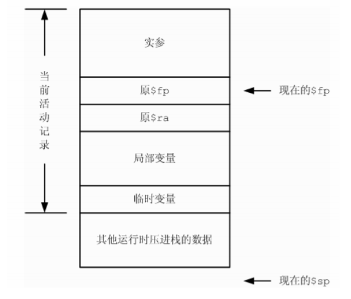
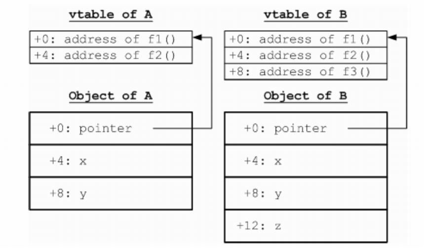

由于源语言和目标语言一般有比较大的差别，因此直接把语法树翻译为目标语言中的合
法程序通常是比较困难的。大多数编译器实现中所采取的做法是首先把源语言的程序翻译成
一种相对接近目标语言的中间表示形式，然后再从这种中间表示翻译成目标代码。


我们已经完成了对输入程序的语义分析工作，此时的输入程序必定是有明
确的语义而且不具有不符合语言规范的语义错误的，接下来，我们将对该输入
程序进行翻译，把使用带属性修饰的抽象语法树（decorated AST）来表示的输入程序翻
译成适合后期处理的另一种中间表示方式。

一般来说，把程序翻译为 AST 以外的中间表示方式是各种编译器前端的最后一步工作，
这步工作以后编译过程便进入了中端处理或者直接进入后端处理部分。为了便于翻译工作的
进行，在实际的编译过程中往往需要反复地从一种中间表示变为另一种中间表示，直到变换
成最终的汇编代码或者机器代码为止，其中后一种中间表示总是更加适合后面所需要进行的
分析和处理。有的时候为了更好地分析程序的需要中间表示之间的变换次数是非常多的，例
如 GCC 4 的编译过程除 AST 以外还有 GENERIC、GIMPLE、RTL 几种中间表示；而
ORC/Open64 的编译过程除 AST 以外还有多达九种的中间表示。

在 Decaf 编译器中，为简单起见，我们在 AST 以外只涉及一种中间表示，这种中间表
示叫做三地址码（Three Address Code, TAC），是一种比较接近汇编语言的表示方式。
我们需要把 AST 表示的程序翻译为跟它在语义上等价的 TAC 中间表示，并在合适的
地方加入诸如检查数组访问越界、数组大小非法等运行时错误的内容。在 TAC 表示的基础
上，经过临时变量的活性分析、生成汇编代码以后，整
个编译过程便告完成。

在语法制导处理的基础上进一步掌握语法制导的中间代码翻
译方法，并且对过程调用协定、面向对象机制的实现方法、存储布局等内容有所了解。

### 运行时存储布局 

一般来说，程序运行时的内存空间从逻辑上分为“代码区”和“数据区”两个主要部分。
顾名思义，代码区用于存放可执行的代码，而数据区用于存放程序运行所需的数据（例如临
时变量、虚函数表的空间等等）。

数据区按照所存放的数据和对应的管理方法分为全局数据区（静态数据区）、栈区、堆
区三部分，这三个区里面的存储空间分配分别遵循三种不同的规则：静态存储分配（Static
Memory Allocation）、栈式存储分配（Stack-based Allocation）和堆式存储分配
（Heap-based Allocation），其中后两种分配方式称为“动态存储分配”，因为这两种
方式中存储空间并不是在编译的时候静态分配好的，而是在运行时才进行的。

#### 1、全局数据区（静态数据区）
全局/静态数据区用于存放各种全局变量、静态变量还有类的虚函数表。静态存储分配
的结果是编译的时候确定的，在进行编译的时候编译器根据全局变量等信息事先计算好所需
的存储空间以及各变量在这个存储空间中的偏移地址。在 C 语言中全局数组的存储分配方
法即为静态存储分配。

静态存储分配并不是总适用的，对于一些动态的数据结构，例如动态数组（C++中使用
new 关键字来分配内存）以及可重入函数的局部变量（例如 Hanoi Tower 问题中递归函
数的局部变量）等最终空间大小必须在运行时才能确定的场合静态存储分配通常无能为力。

#### 2、栈区
栈区顾名思义就是作为“栈”这样一种数据结构来使用的。栈区数据空间的存储管理方
式称为栈式存储分配。与静态存储分配方式不同，栈式存储分配是动态的，也就是说必须是
运行的时候才能确定分配结果的，比方说以下一个计算阶乘的 C 代码片断：
```cpp
int factorial (int n) {
    int tmp;
    if (n <= 1)
        return 1;
    else {
        tmp = n – 1;
    tmp = n * factorial(tmp);
    return tmp;
    }
} 
```
这段代码中，随着 n 的不同，tmp 变量所需要的总内存空间大小是不同的，而且每次
递归的时候 tmp 对应的内存单元都不同。

分析函数调用时候的存储布局情况我们不难发现，进行栈式存储分配的条件是在编译的
时候需要知道一个函数的活动记录有多大（以便在进入函数的时候动态地分配活动记录的空
间），如果这点不能满足，则应该使用堆式存储管理。

一般来说，栈区中的数据通常都是函数的活动记录，活动记录中的数据通常是使用寄存
器偏址寻址方式进行访问的。所谓寄存器偏址寻址方式，即在一个基地址寄存器中存放着活
动记录的首地址，在访问活动记录某一项内容的时候只需要使用该首地址以及该项内容相对
这个首地址的偏移量即可计算出要访问的内容在内存中的实际逻辑地址。这类数据包括了函
数的形式参数以及局部变量。

#### 3、堆区
堆是栈以外的另一种动态存储分配结构，它有两个基本的操作：申请内存和释放内存。
C++的 new 和 delete 两个关键字即对应这两种功能。关于堆式管理在学术界和工业界都
进行了广泛的研究和探索，可以参考 Wikipedia 的这个页面：
http://en.wikipedia.org/wiki/Dynamic_memory_allocation

堆式管理是应用程序在运行的时候通过向操作系统请求分配内存（例如 UNIX 中使用
sbrk 系统函数）和释放内存来实现的，因此分配和销毁都要占用相当的时间。在 Decaf
里面，数组和类对象都是在堆区上来分配内存空间的（因此需要用 ALLOCATE 运行时库函
数）。


### 一般函数调用过程 

以 C 语言中的函数在 MIPS 机器上的调用过程为例（在 x86 上的过程类
似），介绍一般函数的调用过程。对于 C++中的虚函数以及 Decaf 中的函数，其调用过程略
有不同，但基本的原理是相同的。

C 语言程序一个典型的函数调用过程是这样的：

1. （调用方）把函数的实际参数按照参数表中从右到左的顺序压栈
2. （调用方）使用跳转语句跳转到函数入口（并把返回地址保存在$ra寄存器中）
3. （调用方或者被调用方）保存好返回地址
4. （被调用方）保存好原基地值寄存器$fp的值
5. （被调用方）把基地值寄存器$fp指向栈顶指针寄存器$sp所指的位置
6. （被调用方）修改栈顶指针寄存器的值$sp，使得$sp和$fp之间的区域足够存放函
数的联系单元、局部变量和临时变量等
7. （被调用方）执行函数体代码直到函数返回
8. （被调用方）恢复原来的$sp和$fp
9. （被调用方）跳转回保存好的返回地址所指处
10. （调用方）释放之前压进栈的那些实参的空间（通过弹栈操作）

函数执行的时候的内存布局情况如图所示：


所谓活动记录（activity record），就是指当前函数执行所需的局部信息区域，这
个区域包括了：传进函数的实参（在调用函数之前压进栈）、联系单元（动态链2和返回地
址3）、函数的局部变量和各种临时变量，在诸如PL/0这样的支持函数嵌套定义的语言中，
运行时联系单元中还会包括静态链信息。

在函数体中，访问函数的一个形式参数实际上是对实参区域进行访问，此时需要使用当
前的基地值寄存器$fp加上该形参相对于当前栈帧首地址的偏移量进行访问，这是因为虽然
在运行的时候存放着该形参内容的内存单元的地址在编译的时候是不可预先知道的，但是这
个单元在活动记录中的位置在编译的时候是可以预知的。同样的访问方式也适合于对函数的
局部变量以及临时变量的访问中。可见，在这种意义下，函数的参数、局部变量、临时变量
三者并没有实质的区别，因此在Decaf代码框架中我们都使用Temp对象来表示这三种数据
对象，其中唯一不同的是实参相对于当前栈帧首地址的偏移量是需要预先算好的，
而局部变量和临时变量的偏移量都是在进行数据流分析以后才确定（实际上可能使用
寄存器就已经足够了，不需要偏量）。

在这次的decaf tac描述中，我们使用PARM来表示参数的传递，因此在TAC层实际上
隐藏了实际的入栈操作，我们只需要按照从左到右的顺序传递参数即可。需要注意的地方是，
TAC模拟器在执行时会将PARM传递的参数当做这个PARM之后第一次碰到的CALL的参数。

### 面向对象机制的实现 

面向对象机制的重要特点是封装、继承和多态三方面，这三方面在Decaf语言中分别体
现为：类和对象的机制、类的继承机制、成员函数的动态分发机制。这三种机制除了需要通
过语义分析的帮助来实现以外，还需要在运行时存储布局、函数调用等方面来加以实现。其
中类和对象的机制和类的继承机制涉及到对象的内存表示方式，成员函数的动态分发机制涉
及到成员函数的调用方法，在成员函数中访问成员域涉及到this关键字的实现方法。

#### 1、对象的内存表示及成员变量的访问方法
我们考虑如下类定义：
```java
class A {
    int x;
    int y;
    int f1() {...}
    int f2() {...}
}

class B extends A {
    bool z;
    int f3() {...}
} 
```
我们知道，f1、f2、f3的地址都是存放在A或者B的虚函数表中的，现在的问题是x、
y、z是怎么存储的。由于不同的对象可以有不同的x、y和z的值，因此这些成员变量不能像
成员函数那样存放在虚函数表中。一般来说这些域都存放在跟各对象相关联的内存块中，例
如A的对象和B的对象的内存块的可能内容分别如图所示：



从图中可以看出，每一个对象实体都对应着一个记录这个对象状态的内存块，其中包括
了这个对象的虚函数表指针和所有用于说明这个对象状态的成员变量。成员变量的排布顺序
是：“辈分”越高的成员变量越靠前，例如从父类继承而来的成员变量总是在这个内存区域
的前面，而子类特有的成员变量在这个内存区域的最后面，并且父类的成员变量的位置总是
跟一个父类对象所对应的内存区域里面的情况一致的，这样做的目的是为了实现子类的对象
能兼容于父类的对象（继承机制的一个表现）。

当访问一个对象的某个成员变量的时候，首先是通过这个对象的引用（在Decaf中引用
通过指针实现，例如this）找到这块内存区域，然后再根据要访问的成员变量在这片内存
区域中的偏移量对该成员变量进行访问的，由此可见，在Decaf中，访问一个对象的成员变
量需要一次LOAD操作，而访问成员函数则由于需要通过首先按照访问成员变量的方式访问
其虚函数表，然后在虚函数表中再次按照访问成员变量的方式拿到函数的入口指针，从而需
要用两次LOAD操作。

#### 2、this关键字的处理
在Decaf语言中，成员函数的函数体内可以使用this关键字来获得对当前对象的引用。
此外，在成员函数的函数体中对成员变量或者成员函数的访问实际上都隐含着对this的访
问。例如，在writeName的函数体内使用了this关键字，则执行who.writeName()的时
候 this所 引 用的 对象和 变 量 who 所 引用 的 对象 是 相同 的 ，同 样 道理 ， 如果 执 行
you.writeName()的话则writeName里面的this将引用you所指的对象。可见，在不同
的上下文中，调用writeName的时候this所引用的对象是不同的，也就是说不可能在编译
的时候确定下来，那么在一般的C++、Java等语言中是怎么实现这个功能的呢？

这里有一个技巧就是把 who 或者 you 作 为writeName 的 一 个 实 际参数 在 调 用
writeName的时候传进去，这样我们就可以把对this的引用全部转化为对这个参数的引
用。例如，当声明Father.writeName的时候，我们在参数表的开头悄悄地加入一个叫做
this的隐含参数：

int writeName(class Father this) {...}

并且在调用writeName时，在传实参的时候把消息接收方表达式（即you或者who）的
值传进去，即等价于这样的函数调用：

who.writeName() -> call writeName(who);

这样，我们只要把writeName函数体内所有对this关键字的引用都转化为对this隐
含参数的引用即可。这个过程中必须小心注意的是this隐含参数的位置跟调用函数的时候
的传参顺序要相对应。

#### 3、虚函数表及成员方法的调用

虚函数表的目的是实现运行时函数地址绑定，即所谓的动态分发机制，例如以下Decaf
代码：
```java
class Father {
    int writeName() { print(1); ...}
    int smile() { print(2); ...}
}
class Son extends Father {
    int writeName() { print(3); }
    int laugh() { print(4); }
} 
```

这里Father类定义了一个writeName()方法，而其子类Son使用新的writeName()
覆盖了这个方法。然后考虑以下的代码片断：
```java
class Father a;
class Son b;
class Father c;
a = new Father();
b = new Son();
c = b; 
```

明显，执行a.writeName()的结果是输出1，执行b.writeName()的结果是输出3，
但是执行c.writeName()的结果会是什么呢？虽然c被声明为Father的对象，但是实际上
它是一个Son的对象，因此，按照Decaf语言规范，c.writeName()所调用的应当是Son
的writeName()，即输出3（跟C++的虚函数特点是一样的）。

这种行为在二进制层次上是怎么实现的呢？这里我们将采用一种叫做“虚函数表”的结
构。我们为每一个类都创建一个存放成员函数入口地址的数组如下：
```shell
virtual table of Father:
+0: address of function writeName (the version prints 1)
+4: address of function smile
vitural table of Son:
+0: address of function writeName(the version prints 3)
+4: address of function smile
+8: address of function laugh 
```
上图中每个虚函数表中都列出其对应的类的所有可访问的成员函数地址，成员函数地址
前面的+0、+4等等表示这个地址存放在虚表中的位置，例如+4表示存放在离虚表开头4字
节的地方。然后我们在a和b所指向的内存区域的开头分别放有指向Father和Son的虚表的
指针，在每次通过a或者b调用writeName()的时候，我们都首先通过a或b开头的那个虚表
指针找到对应的虚函数表，然后在表中找出偏移地址为+0那一项对应的实际函数地址，调
用之即可。

现在我们考虑c <- b的情况。由于Decaf的对象赋值采用引用赋值，因此这个赋值语
句的效果仅仅是让 c和b指向同一块内存区域。因此，按照上面的过程，当调用
c.writeName()的时候，我们首先通过c所指向的内存区域找到对应的虚函数表（此时是
Son的虚函数表），然后在这个虚函数表内找到writeName偏移量即+0对应的那一项。我
们 发 现 这 一 项 对 应 的 函 数 地 址 是 打 印 3 的那个 writeName() 函 数 的 地 址 ， 因 此
c.writeName()的调用结果是输出3。

注意这里为了实现成员方法的继承，Son的虚函数表继承了Father的虚函数表中的
smile那一项，并且为了保证子类兼容于父类，同名的函数在子类的虚表中的位置跟父类虚
表中的位置是一样的，例如writeName和smile两个函数在Son虚表中处于+0和+4两个位
置，这跟在Father的虚表中的情况一致；而原来Father中writeName的入口地址被Son
版本的writeName的入口地址取代，以此实现成员函数的覆盖。

关于虚函数表的更多内容请参考：
http://en.wikipedia.org/wiki/Virtual_table

从上面关于虚函数表和成员方法的调用过程的介绍可以看出，Decaf中成员方法调用过
程与一般C语言函数的调用过程不同之处仅在于通过虚函数表来查找函数入口地址以及加
入了隐含的Decaf参数。

#### 4、静态方法的调用
静态方法类似C语言的函数，直接得到地址调用，不查询虚表。


### 实现

`/src/translate/TransPass2.java`
```java
	@Override
	public void visitNewClass(Tree.NewClass newClass) {
		newClass.val = tr.genDirectCall(newClass.symbol.getNewFuncLabel(),
				BaseType.INT);
		tr.genIncNuminstances(newClass.className);
	}
	
	@Override
	public void visitPostInc(Tree.PostInc postinc) {
		postinc.ident.accept(this);

		Tree.Ident ident = (Tree.Ident) postinc.ident;
		Temp ident_temp = ident.symbol.getTemp();
		
		Temp pre = Temp.createTempI4();
		tr.genAssign(pre, ident_temp);
		
		Temp const_temp = Temp.createTempI4();
		tr.genAssign(const_temp, Temp.createConstTemp(1));
		Temp inc = tr.genAdd(ident_temp, const_temp);
		tr.genAssign(ident_temp, inc);
		
		postinc.val = pre;
	}
	
	@Override
	public void visitPreInc(Tree.PreInc preinc) {
		preinc.ident.accept(this);

		Tree.Ident ident = (Tree.Ident) preinc.ident;
		Temp ident_temp = ident.symbol.getTemp();
			
		Temp const_temp = Temp.createTempI4();
		tr.genAssign(const_temp, Temp.createConstTemp(1));
		Temp inc = tr.genAdd(ident_temp, const_temp);
		tr.genAssign(ident_temp, inc);
		
		preinc.val = ident.symbol.getTemp();
	}
	
	@Override
	public void visitPostDec(Tree.PostDec postdec) {
		postdec.ident.accept(this);
		
		Tree.Ident ident = (Tree.Ident) postdec.ident;
		Temp ident_temp = ident.symbol.getTemp();
		
		Temp pre = Temp.createTempI4();
		tr.genAssign(pre, ident_temp);
		
		Temp const_temp = Temp.createTempI4();
		tr.genAssign(const_temp, Temp.createConstTemp(1));
		Temp dec = tr.genSub(ident_temp, const_temp);
		tr.genAssign(ident_temp, dec);
		
		postdec.val = pre;
	}
	
	@Override
	public void visitPreDec(Tree.PreDec predec) {
		predec.ident.accept(this);

		Tree.Ident ident = (Tree.Ident) predec.ident;
		Temp ident_temp = ident.symbol.getTemp();
			
		Temp const_temp = Temp.createTempI4();
		tr.genAssign(const_temp, Temp.createConstTemp(1));
		Temp dec = tr.genSub(ident_temp, const_temp);
		tr.genAssign(ident_temp, dec);
		
		predec.val = ident.symbol.getTemp();
	}
	
	@Override
	public void visitCondExpr(Tree.CondExpr condexpr)	{
		Temp result = Temp.createTempI4();
		
		condexpr.condition.accept(this);

		Label falseLabel = Label.createLabel();
		tr.genBeqz(condexpr.condition.val, falseLabel);
		condexpr.left.accept(this);
		tr.genAssign(result, condexpr.left.val);
		Label exit = Label.createLabel();
		tr.genBranch(exit);
		tr.genMark(falseLabel);
		condexpr.right.accept(this);
		tr.genAssign(result, condexpr.right.val);
		tr.genMark(exit);
		
		condexpr.val = result;
	}
	
	@Override
	public void visitNuminstances(Tree.Numinstances numinstances)	{
		numinstances.val = tr.genNuminstancesInMain(numinstances.name);
	}
	
	private void visitGuardIf(Tree.Guarded guard, Label exit)	{
		if(guard.preguarded != null)	{
			visitGuardIf((Tree.Guarded) guard.preguarded, exit);
		}

		guard.boolexpr.accept(this);
		Label falseLabel = Label.createLabel();
		tr.genBeqz(guard.boolexpr.val, falseLabel);
		guard.stmt.accept(this);

		tr.genBranch(exit);
		tr.genMark(falseLabel);
	}
	
	@Override
	public void visitGuardedIf(Tree.GuardedIf guardedif)	{
		Tree.Guarded guard = (Tree.Guarded) guardedif.guard;
		Label exit = Label.createLabel();
		visitGuardIf(guard, exit);
		tr.genMark(exit);
	}
	
	private void visitGuardDo(Tree.Guarded guard, Label start)	{
		if(guard.preguarded != null)	{
			visitGuardIf((Tree.Guarded) guard.preguarded, start);
		}

		guard.boolexpr.accept(this);
		Label falseLabel = Label.createLabel();
		tr.genBeqz(guard.boolexpr.val, falseLabel);
		guard.stmt.accept(this);

		tr.genBranch(start);
		tr.genMark(falseLabel);
	}
	
	@Override
	public void visitGuardedDo(Tree.GuardedDo guardeddo)	{
		Tree.Guarded guard = (Tree.Guarded) guardeddo.guard;
		
		Label start = Label.createLabel();
		Label exit = Label.createLabel();
		tr.genMark(start);
		loopExits.push(exit);
		visitGuardDo(guard, start);		
		loopExits.pop();
		tr.genMark(exit);
	}
```

`/src/translate/Translate.java`
```java
	private Map<String, Temp> mainNuminstances = new HashMap<String, Temp>();
    private boolean isInMain = false;
    
 
	public void beginFunc(Function func) {
		currentFuncty = func.getFuncty();
		currentFuncty.paramMemo = memoOf(func);
		genMark(func.getFuncty().label);
		
		isInMain = func.isMain();
		if(isInMain)	{
			for(VTable v : vtables)	{
				Temp count_temp = Temp.createTempI4();
				genAssign(count_temp, Temp.createConstTemp(0));
				mainNuminstances.put(v.name.substring(1), count_temp);
			}
		}
    }

	public void endFunc() {
		funcs.add(currentFuncty);
		currentFuncty = null;
		
		isInMain = false;
	}
    
	public void genCheckDiv(Temp div)	{
		Label err = Label.createLabel();
		genBeqz(div, err);

		Label exit = Label.createLabel();
		genBeqz(div, err);
		genBranch(exit);
		genMark(err);
		Temp msg = genLoadStrConst(RuntimeError.DIVISION_BY_ZERO);
		genParm(msg);
		genIntrinsicCall(Intrinsic.PRINT_STRING);
		genIntrinsicCall(Intrinsic.HALT);
		genMark(exit);
    }
    
	public Temp genDiv(Temp src1, Temp src2) {
		genCheckDiv(src2);
		Temp dst = Temp.createTempI4();
		append(Tac.genDiv(dst, src1, src2));
		return dst;
	}

	public Temp genMod(Temp src1, Temp src2) {
		genCheckDiv(src2);
		Temp dst = Temp.createTempI4();
		append(Tac.genMod(dst, src1, src2));
		return dst;
    }
    
    
	public void genIncNuminstances(String className)	{
		if(isInMain)	{			
			Temp count_temp = mainNuminstances.get(className);
			Temp const_inc = Temp.createTempI4();
			genAssign(const_inc, Temp.createConstTemp(1));
			Temp inc = genAdd(count_temp, const_inc);
			genAssign(count_temp, inc);
		}
	}
	
	public Temp genNuminstancesInMain(String className)	{
		if(mainNuminstances.containsKey(className))	{
			return mainNuminstances.get(className);
		} else {
			Temp const_num = Temp.createTempI4();
			genAssign(const_num, Temp.createConstTemp(0));
			return const_num;
		}
	}
```

过程中遇到过一些问题。有许多是细心的问题，比如我在做if fi的时候出现问题，找了好长时间没找出来，最后发现是调用accept的变量名写错了，检查的时候一直没注意到。

有一个bug给我留下了比较深的印象，这个bug第一次出现是在我刚写++ --运算符时，运行结果显示在typecheck中有空指针错误，但是在我之后调试的那段时间一直没发现问题。于是我加了一句代码，先把空指针跳过去。测例1通过后，我再把刚才加的代码删掉又试了一下，发现测例1仍然可以通过。这个bug第二次出现是在我写if fi的时候，运行结果显示typecheck中有空指针，之后发现，我从来没有动过的测例5也变得出现了空指针错误，但是程序刚开始时是没有空指针错误出现的，并且检查了代码之后发现与测例5相关的代码还没有任何修改。我尝试注释掉一部分代码然后运行，虽然运行错误，但是没有空指针出现。之后我把do od加上了强制类型转换，也没有空指针出现。然后我把加上的类型转换都删掉，然后把加上的注释都去掉，发现这个bug就突然不再出现了。初步猜测是类型转换时引起的问题，但是之后没能再把这个问题复现出来，我也不清楚具体原因是什么。
