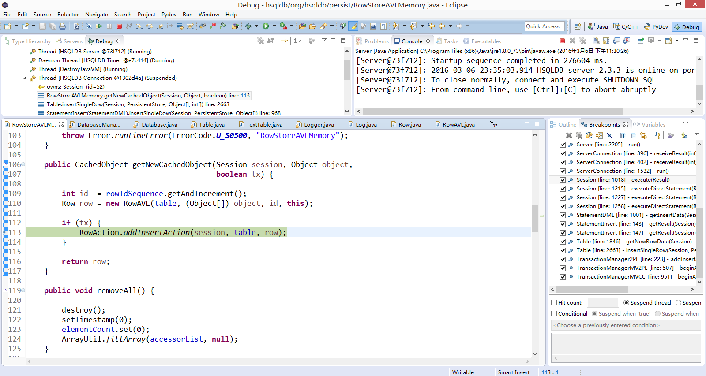

## HSQLDB
HSQLDB (Hyper SQL Database) is a relational database management system written in Java. It has a JDBC driver and supports a large subset of SQL-92, SQL:2008, SQL:2011, and SQL:2016 standards. It offers a fast, small (around 1300 kilobytes in version 2.2) database engine which offers both in-memory and disk-based tables. Both embedded and server modes are available.

## 1)	memory table，text table和cached table在外存是如何存储的？

Main函数中的打开数据库操作

读取script

log信息

memory table对于表结构和内容的任何修改都被写入到script文件中。script 文件在下次数据库打开的时候被 memory读取，里边的所有内容在memory table中重新创建。

cached table只有索引或部分数据驻留在内存。

text table使用CSV或其他分隔符的文本文件作为数据源。

## 2)	各数据文件分别用于存储什么信息？
memory table存储小数据集信息。cached table存储大数据集信息。text table存储需要重新分配数据源的信息。

## 3)	三种表分别是怎样打开的？如何读取数据？

memory table打开时重新运行script文件。读取时直接在内存读取。

cached table打开时读取数据与索引信息，并把索引保存到内存中。读取时在文件和内存中读取。

text table打开时从指定文件读取数据与索引信息，并把索引和部分数据保存在内存中。读取是在文件和内存中读取。

## 4)	数据的操作是怎样实现的？

解析并运行sql语句

创建新对象，添加纪录

输出结果

## 5)	缓存的替换机制是怎样的？缓存的容量是如何维护的？
缓存的容量可以配置，高频查询数据会常驻，低频的将从内存中被替换。 

## 6)	数据是怎样实现内外存交换的？在什么时候进行？
在关闭数据库时，内存数据写入外存。在cached表数据发生变化时直接写到文件中。
