## HSQLDB
HSQLDB (Hyper SQL Database) is a relational database management system written in Java. It has a JDBC driver and supports a large subset of SQL-92, SQL:2008, SQL:2011, and SQL:2016 standards. It offers a fast, small (around 1300 kilobytes in version 2.2) database engine which offers both in-memory and disk-based tables. Both embedded and server modes are available.

## 1)	索引的组织结构是怎样的？

创建索引
 
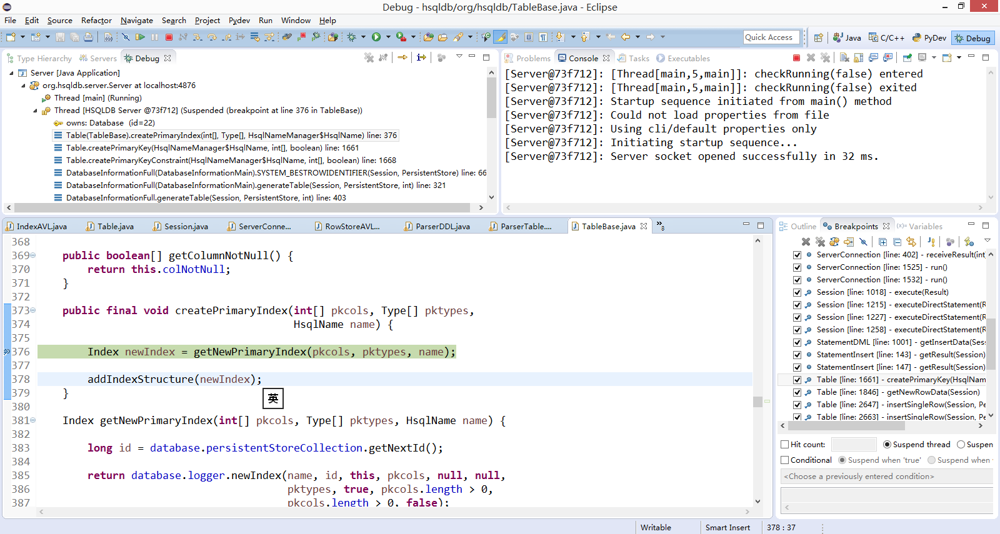

索引的结构为AVL树
 
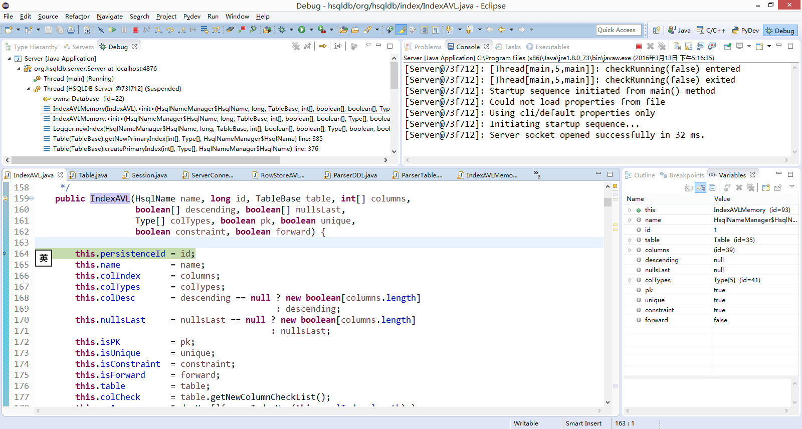
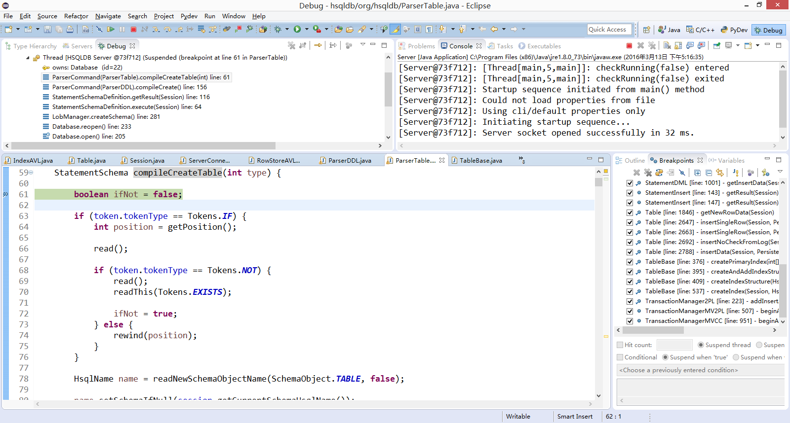

## 2)	增删改记录时索引是怎样变化的？

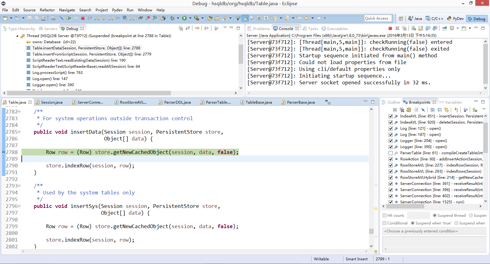
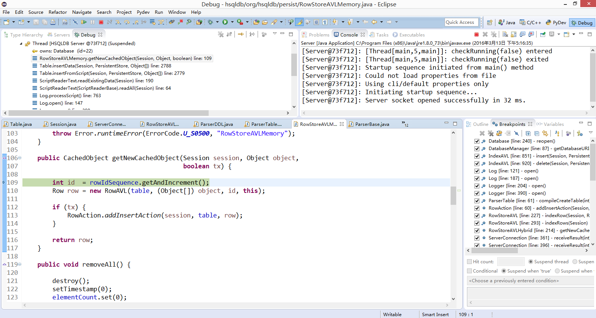

插入数据
 
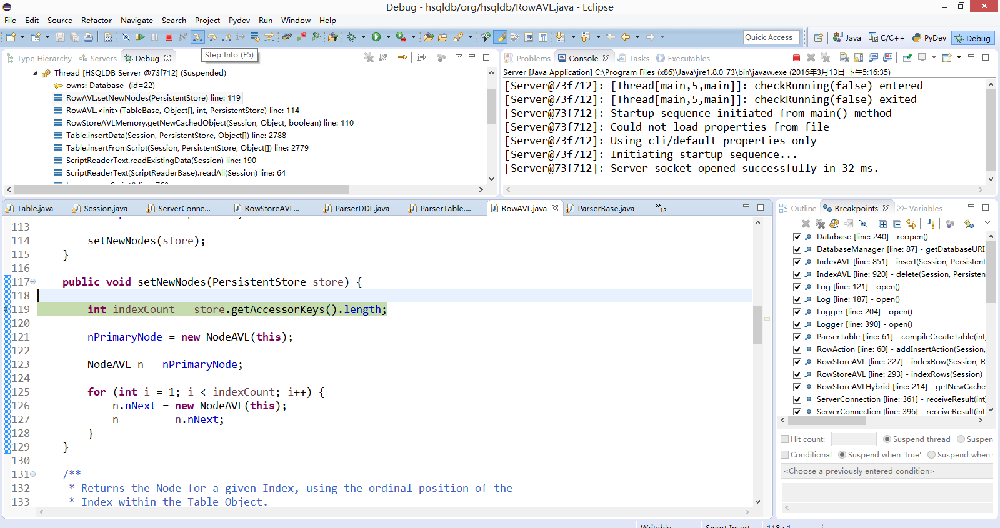

插入索引
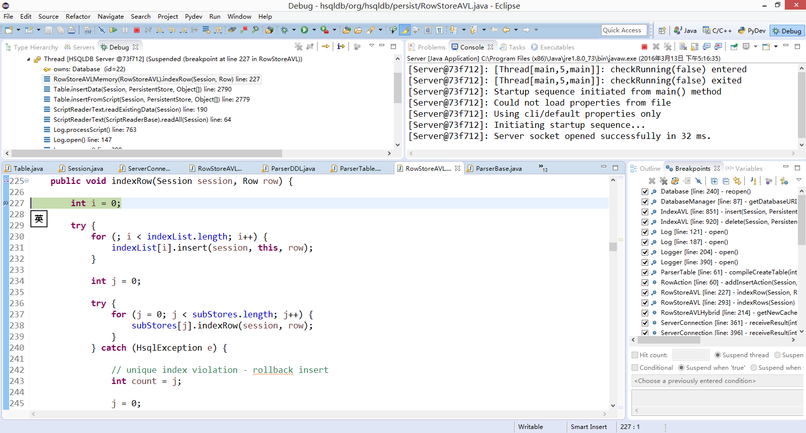

AVL树的平衡操作
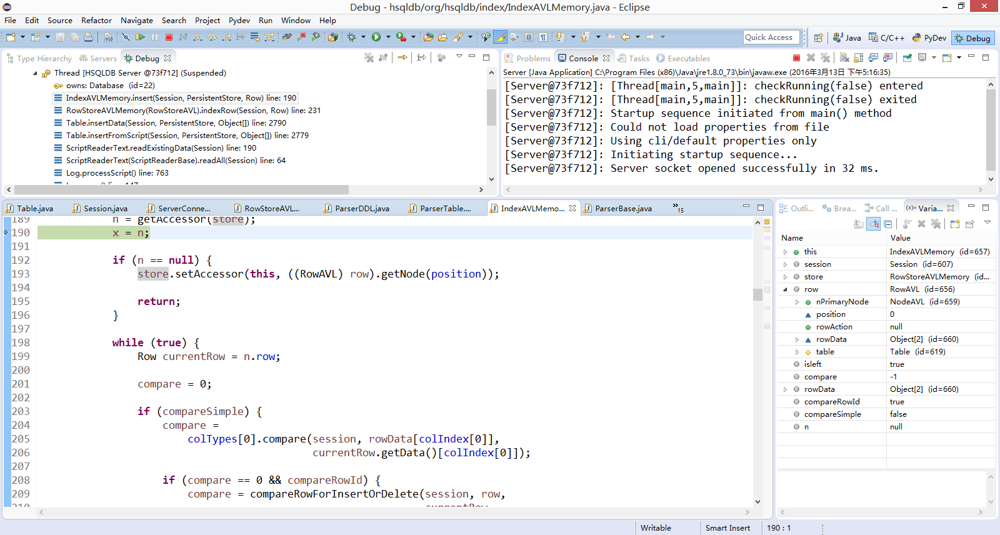

## 3)	索引与记录结点怎样关联在一起？

将indexList 中把当前row作为参数
 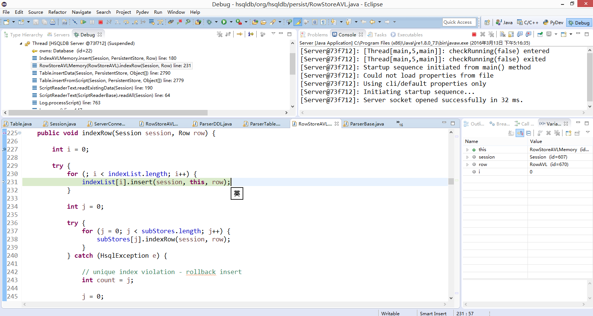

索引与数据关联
 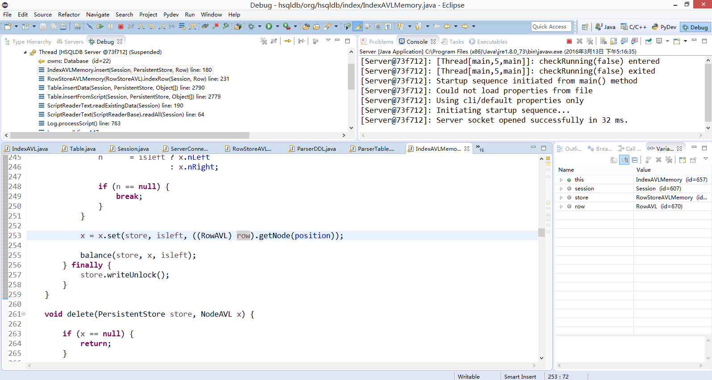

## 4)	索引在外存中的如何存储？

将数据保存在外存
 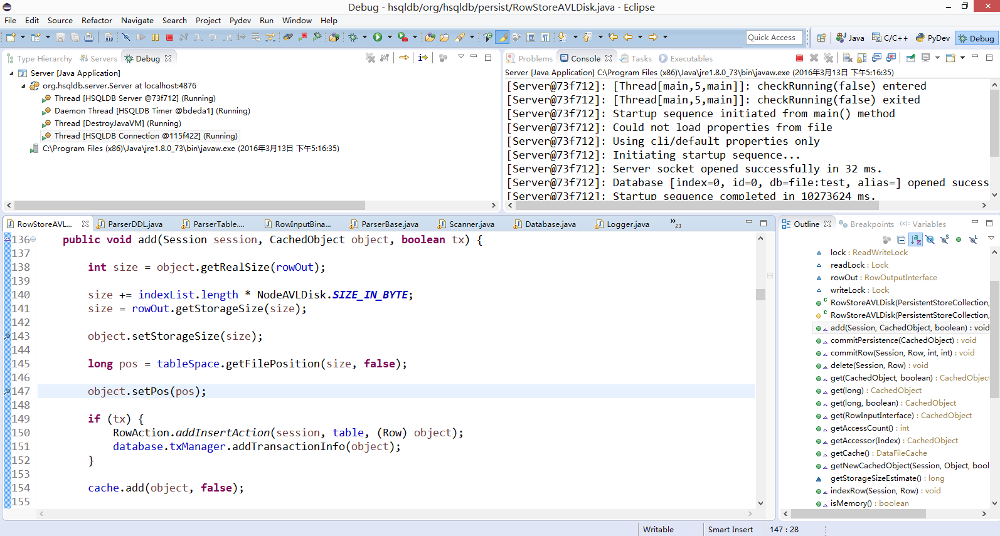

将索引保存在外存
 
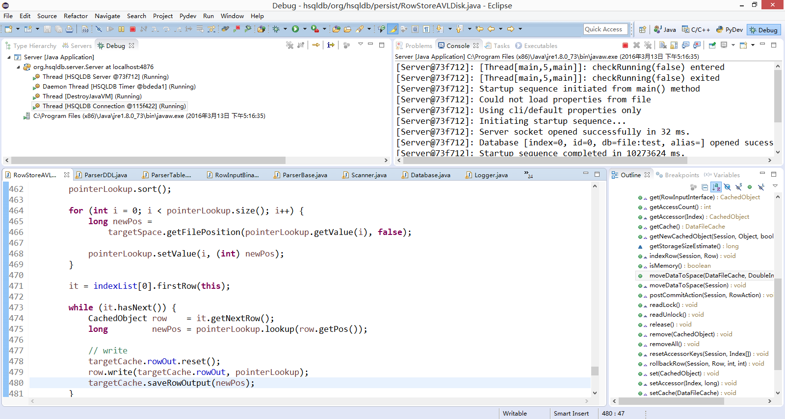

## 5)	索引是怎样实现内外存交换的？

查找时，弱在内存中则直接返回，若不在则去文件中查找
 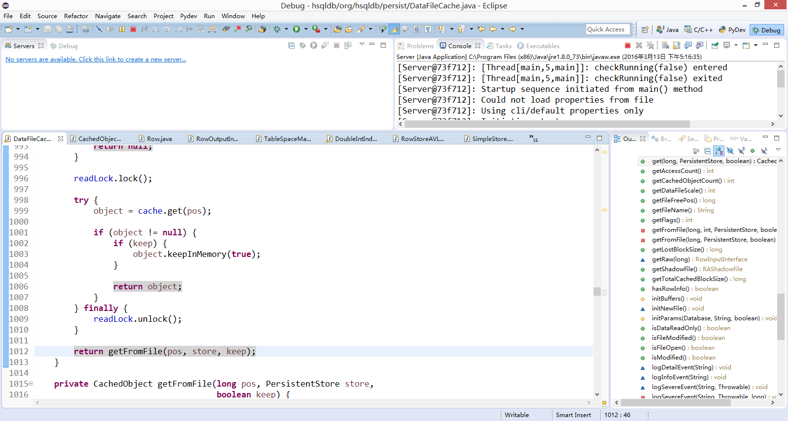

清理没有变化的值
 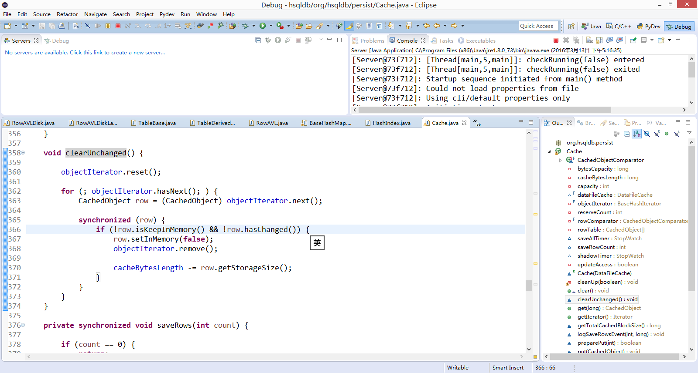

## 6)	散列的存储机制是怎样的？

在HashIndex类中，使用与0x7fffffff按位与然后对长度取模

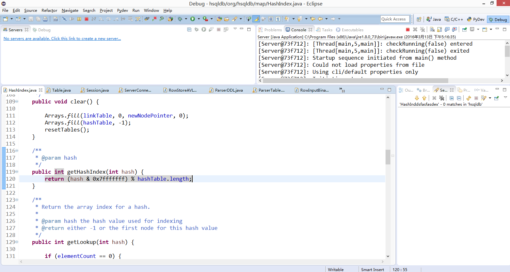 

## 7)	散列机制是如何处理冲突的？

用当前的key与需要找的key比较，如果不相同就使用LinkTable存储连接的索引节点，依次找下去，直到没有连接的索引节点或者找到Key值相同的节点
 
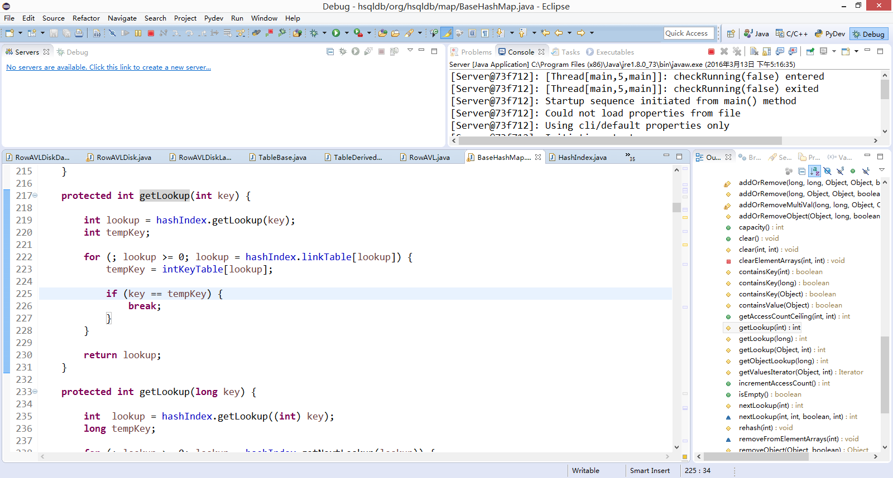

插入时先进行查找，如果没有查找到则在linknode中配置索引。
 
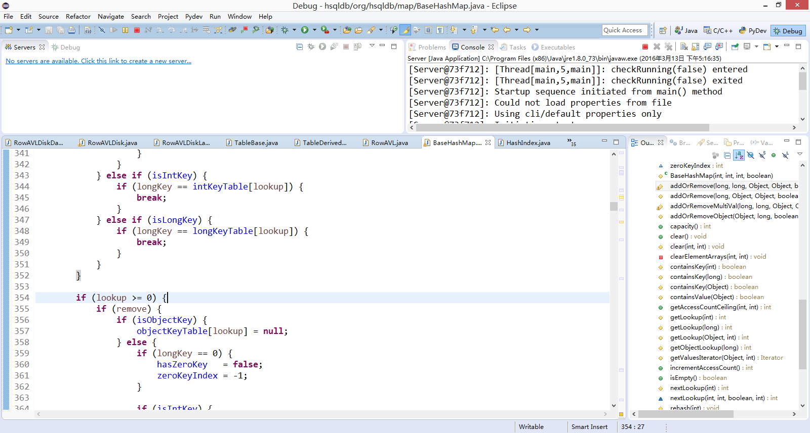
