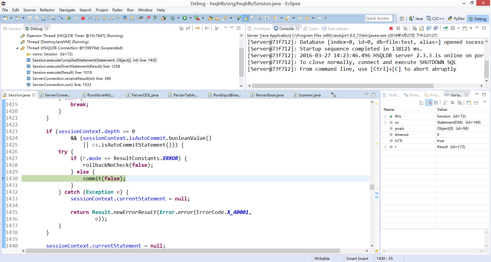

## 1)	HSQLDB 实现了哪几种隔离级别？

在文档中看到HSQLDB实现了two-phase-locking (2PL), multiversion concurrency control (MVCC) which is 2PL plus multiversion rows (MVLOCKS) 三种模式。有READ UNCOMMITTED、READ COMMITTED、REPEATABLE READ三种事务级别。

## 2)	在每一个事务中，数据操作时如何进行的？

 

开始事务

 
加锁

解锁

 
提交

 
 
可以看出，数据操作发生在commit时

 
结束事务

## 3)	如何实现回滚和提交操作？

 
开始回滚操作

 

 
把时间戳大于保存点的操作删除

 
操作存储

 
对于插入和更新操作，将索引移除

 
开始commit

 
结束事务

 
把相应的数据存储

 
解锁

## 4)	保存点是如何实现的？

 
开始保存点操作

 
保存点的名字存在表里

 
保存时间戳

 
开始回滚到保存点位置

 
使用上面存的与保存点名字对应的索引

 
 
和上面回滚相同，将对应时间戳之后的动作删除并移除存储和索引

