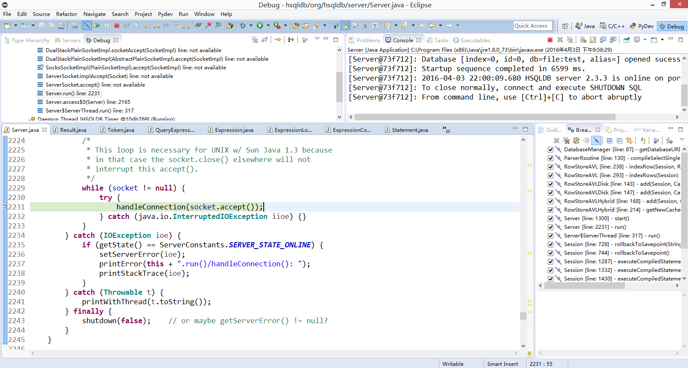
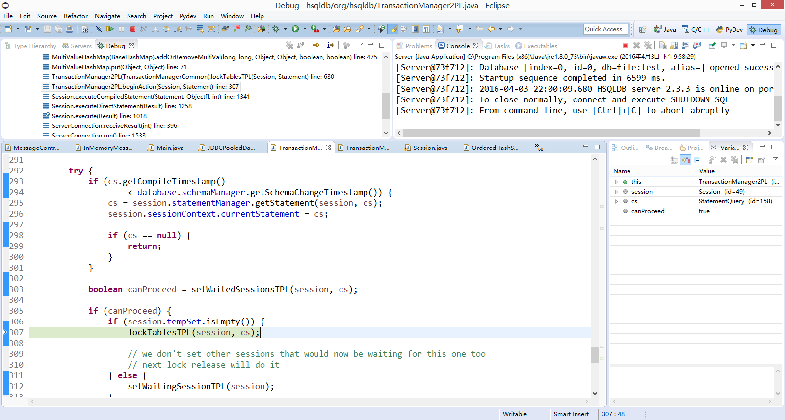

## 1)	Java 是如何实现线程之间的同步和通信的？

Java可以使用Thread类来启动线程
 

通过synchronized关键字实现的锁来保证同步

 
## 2)	HSQLDB 是如何采用多线程机制实现并发的？

Hsql对每个客户端的连接对应了一个线程
 

Server线程在这里接受连接请求
 

开启一个新线程
 

## 3)	HSQLDB 中的隔离是如何保证的？

HSQLDB 中的每次锁操作的隔离使用读写锁来保证
 

事务由TPL保证隔离
 

## 4)	HSQLDB 的锁协议是怎样实现的？

对于TPL锁
 

 

加锁，使用了一个hash表来存储锁的信息
 

如果请求的目标被锁，就把当前session加入等待队列中
 

## 5)	HSQLDB 中可能出现死锁吗？怎样预防或者解决？

HSQLDB中可能会出现死锁
 

HSQLDB在设置等待的TPL锁时，使用checkDeadlock函数来检查是否有死锁
 

