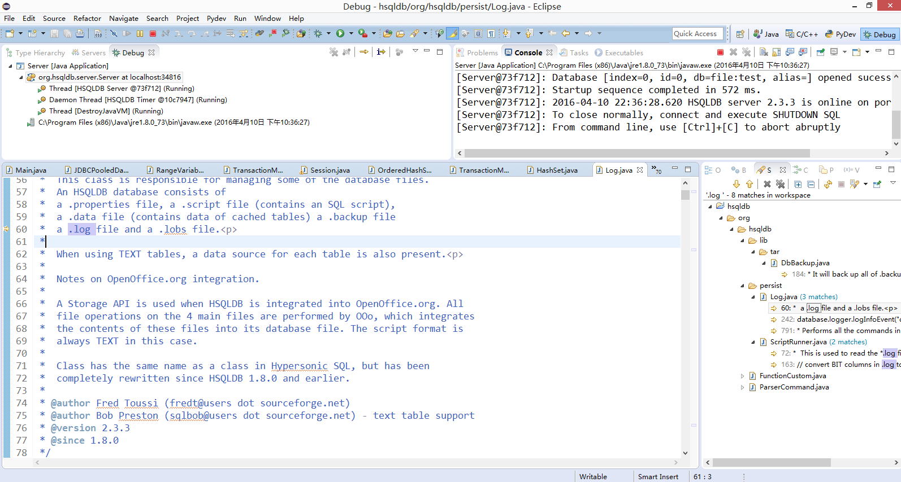
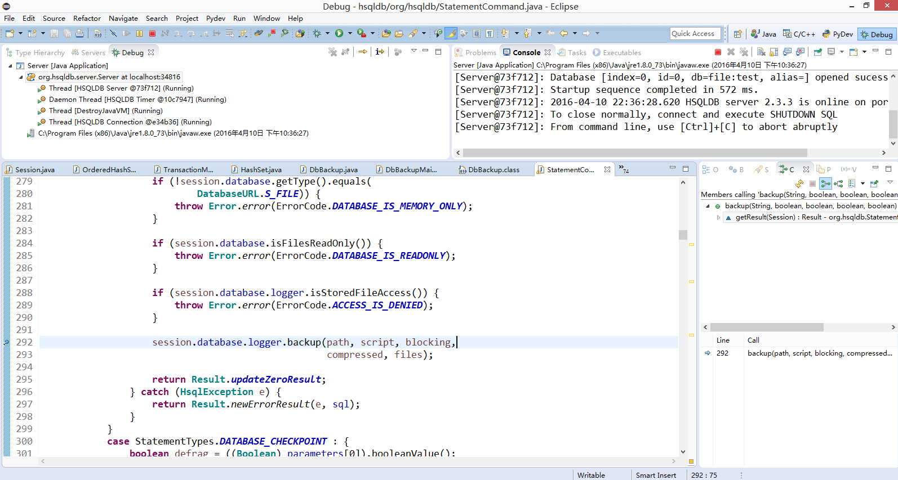
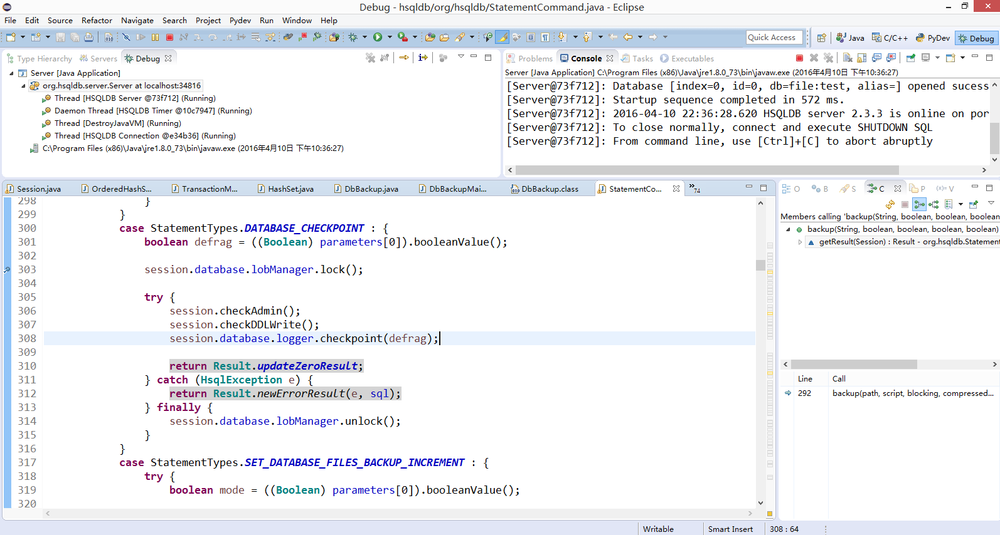
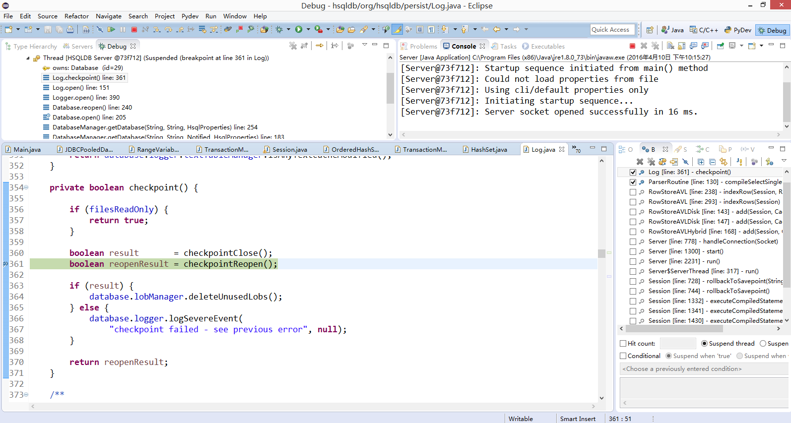

## 1)	五个文件在恢复机制中分别有什么作用？

properties文件包含了数据库的基本配置，script文件包含了Table的定义和其他相关的数据对象,以及non-cached表的数据。log文件记录了数据库最近所做的更新。dat文件包含了cached表的数据，backup文件是上一次数据库持久化后的压缩备份文件
 
 
 
## 2)	在插入或删除数据后，各数据文件有什么变化？

在插入或删除数据时，.log文件用来记录所有的操作记录，并且.log文件将在数据库正常关闭情况下自动删除。在非正常退出的时候将用来在下次启动HSQLDB时恢复.log中记录的更新操作。.lck文件也可以用来记录数据库是否被打开，它在HSQLDB正常退出的时候会被移除
 

## 3)	执行 checkpoint 后，各数据文件有什么变化？

checkpoint重写.script文件，而且清除.log文件
 
 
 

## 4)	cached table 和 memory table 的数据分别是怎样恢复的？

memory table重新运行.scirpt和.log文件
cached table恢复数据时，运行.log，并且之前需要一个虚拟的.data 文件，如果数据备份被还原，数据库引擎将会扩展.backup 文件来替换这个虚拟的文件。如果.data文件没有被备份，在还原之前，.properties文件可能被修改

## 5)	并发的事务如何恢复？

一个单独的连接被用于每个 HTTP session，这样当完成事务或回滚时，工作可以被提交。一个连接状态可以一直保持，当因为网络问题关闭时会重新打开，一个连接属性可用来恢复原来的行为。数据库不会自动关闭一个通过建立连接而保持打开状态的进程内数据库，关闭数据库时需要使用一个显式的 SHUTDOWN 命令

## 6)	未提交的事务是否恢复？
在CHECKPOINT命令执行以后，未授权事务才能继续运行、提交或回滚。然而，如果数据库随后并没有使用SHUTDOWN命令正常的关闭的话，在数据库关闭时仍然是未提交状态的任何这样事务，将被在下次启动数据库时被部分提交

