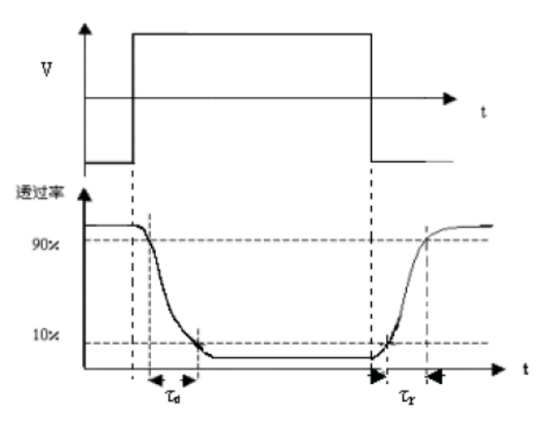
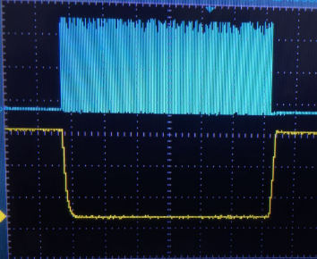
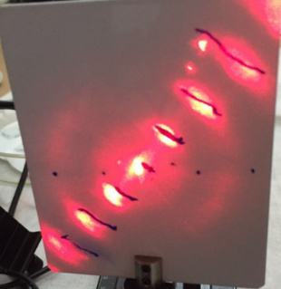
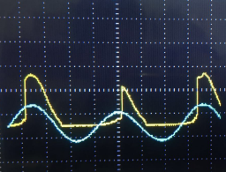
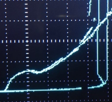
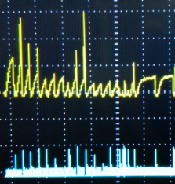
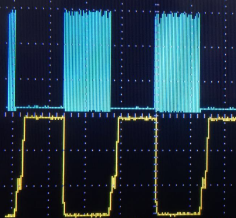
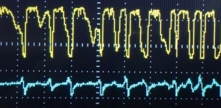
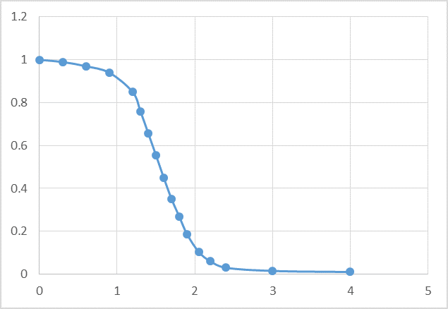

### 摘 要
本实验对标准液晶盒和自制液晶盒, 测量了它们的电光特性,液晶扭曲角、响应时间等参量。通过对液晶电光特性的测量以及对光学双稳、混沌的观测, 使我们对液晶的基本特性有所认识, 并了解光学双稳和混沌的基本原理。

关键词: 液晶 光学双稳态 混沌

### 一．引言
液晶是介于液体与晶体之间的一种物质状态。一般的液体内部分子排列是无序的，而液晶既具有液体的流动性，其分子又按一定规律有序排列，使它呈现晶体的各向异性，是一种兼有晶体和液体的部分性质的中间态，具有特殊的理化与光电特性，又对电磁场敏感，极有实用价值，20 世纪中叶开始被广泛应用在轻薄型的显示技术上。

当光通过液晶时，会产生偏振面旋转，双折射等效应。液晶分子是含有极性基团的极性分子，在电场作用下，偶极子会按电场方向取向，导致分子原有的排列方式发生变化，从而液晶的光学性质也随之发生改变，这种因外电场引起的液晶光学性质的改变称为液晶的电光效应。
通过对液晶电光特性的测量以及对光学双稳、混沌的观测, 使我们认识液晶的基本特性, 并增加对光学双稳和混沌的基本原理的了解。

### 二. 	 实验
实验时使用的标准液晶盒上下表面的液晶分子取向不同,两个取向的夹角称为扭曲角。 由上至下穿过液晶盒,液晶分子取向逐渐扭曲。这样的液晶分子排列具有光波导效应。在施加外电场后液晶分子被拉伸，光波导效应消失。有无光波导效应时透射光强度之比称为对比度,动态范围 DR = 10logC(dB)。

实验时,在搭建并调整好光路后,打开液晶驱动电源,将驱动电压调整到最大,旋转检偏器和液晶盒,找到使系统输出功率最小时检偏器的位置θ_1以及相应的最小功率Tmin。然后将液晶驱动电源的驱动电压调整到最小,此时系统通光功率应当增大,记录此时的通光功率 Tmax。然后再次旋转检偏器, 找到使系统通光功率最小的检偏器的位置θ_2。

可以知道,液晶盒的扭曲角为|θ_2-θ_1 |, 对比度C=Tmin/Tmax。实验测得θ_1=74.0°，θ_2=177.0°，扭曲角为77.0°，Tmin = 7.5uw，Tmax = 1.22mW，对比度C=0.0061。

加上驱动电压可以改变液晶的开光状态,进而改变液晶的通光状态。微观上看,这是驱动电压影响液晶分子的取向导致的。每一次加上驱动电压,分子的排序会发生改变,而这样的重排需要一定时间,宏观上体现在液晶具有一定时间响应特性，如图 

τ_r为上升时间，是透过率由10%升到90%所需时间。τ_d为下降时间，是透过率由90%降到10%所需时间。
为液晶盒施加方波电压, 利用示波器可直接观察液晶驱动电压和时间响应曲线，如图

τ_r=12ms，τ_d=20ms

打开液晶驱动电源,缓慢增加加在液晶上的驱动电压,在合适电压下可以在白屏上观察到光栅衍射的现象。光栅公式给出mλ=dsinθ_m，d是光栅常数，m为条纹级数。

驱动电压U为2.33V，得到衍射图案

白屏到液晶盒的距离D=12.4cm，λ=650nm，x_1=1.35cm，x_2=2.85cm，x_3=4.40cm。可以直线拟合得到，d=5.83um。

入射光通过某一光学系统时光强发生非线性变化, 出射光强随入射光强呈现滞后回线的效应，称为光学双稳态。通过增加反馈系统来实现光学双稳态, 即为液晶盒施加一个反馈电压V, 它是出射光强Io的函数。当反馈系统为线性反馈时, V=kIo, 此时可以证明, 出入射光关系I_o/I_i =1/2(1-cos⁡(π/V_π  (V_b+V+V_s )))，V/(kI_i )=I_o/I_i  。

I_i是入射光强，V_π是半波电压，Vb是初始偏压，V是反馈电压,Vs是附加电压。

当入射光强按I1-I2-I3-I4变化时, 系统状态由A-B-C-D-E变化。 当入射光强按相反的顺序减小时, 系统状态不是按原来的路径演化，而是E-D-F-B-A，可以观察到滞回效应。在激光器和起偏器之间依次加装一个步进电机驱动旋转的偏振片和一个分束镜, 在3.22V的初始偏压下观察双稳态。如图

出现明显的滞回效应。

双稳态在具有一定的延时反馈条件下可以呈现出不稳定性. 液晶光电混合光学双稳态系统的输入输出关系只需延时耦合方程 ，方程组描述的系统里会出现混沌。实验产生的混沌态如图

其实还是有一定周期性，混沌态比较难出现。

利用实验室已有的液晶材料，自制并测量液晶盒。共制作了8个液晶盒，取时间特性最佳的2号进行测量。测得θ_1=78.5°，θ_2=171.0°，扭曲角为87.5°，Tmin = 2.2uw，Tmax = 1.027mW，对比度C=0.0021。

时间响应特性曲线如图

τ_r=100ms，τ_d=20ms

双稳态

混沌态

对于2号液晶盒, 测定其电光特性曲线, 即光线垂直液晶面入射时液晶相对透射率与外加电压的关系曲线, 如图

阈值电压约为 1.04V, 关断电压约为 2.08V。

### 三.  	结论
进行了制作液晶盒的基本步骤，测定标准液晶盒和自制液晶盒的电光特性、观察双稳态和混沌态，对液晶的基本电光性质及其原理有了一些基本的了解。认识了双稳态的来源，对混沌现象有了一些直观的认识。

