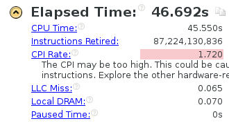

使用第一次实验代码

* 当 `x_dim` `y_dim` `z_dim` = 500，`t_steps` = 3 时


* 使 `x_dim` `y_dim` `z_dim` = 1000 


* 使 `x_dim` `y_dim` `z_dim` = 1500 



* 使 `t_steps` = 30


* 使 `t_steps` = 300


## 初步使用openMP
先直接使用openMP进行测试

```cpp
	for (int t = 0; t < t_steps; t++) {

		for (int x = 1; x < x_dim_add_1; x++) {
			for (int y = 1; y < y_dim_add_1; y++) {
				#pragma ivdep
				#pragma omp parallel for
				for (int z = 1; z < z_dim_add_1; z++) {
					out[x][y][z] = 0.4 * in[x][y][z]
						+ 0.1 * (in[x - 1][y][z] + in[x + 1][y][z]
							+ in[x][y - 1][z] + in[x][y + 1][z]
							+ in[x][y][z - 1] + in[x][y][z + 1]);
				}
			}
		}

		temp = out;
		out = in;
		in = temp;
	}
```

* 当 `x_dim` `y_dim` `z_dim` = 500，`t_steps` = 3 时
  
  可以看到，速度大幅下降，暴力并行不可取
  
再进行修改
```cpp
	for (int t = 0; t < t_steps; t++) {

		for (int x = 1; x < x_dim_add_1; x++) {
			#pragma omp parallel for
			for (int y = 1; y < y_dim_add_1; y++) {
				#pragma ivdep
				for (int z = 1; z < z_dim_add_1; z++) {
					out[x][y][z] = 0.4 * in[x][y][z]
						+ 0.1 * (in[x - 1][y][z] + in[x + 1][y][z]
							+ in[x][y - 1][z] + in[x][y + 1][z]
							+ in[x][y][z - 1] + in[x][y][z + 1]);
				}
			}
		}

		temp = out;
		out = in;
		in = temp;
	}
```
* 当 `x_dim` `y_dim` `z_dim` = 500，`t_steps` = 3 时
  
  速度有所提升  


```cpp
	for (int t = 0; t < t_steps; t++) {
	#pragma omp parallel for
		for (int x = 1; x < x_dim_add_1; x++) {
			for (int y = 1; y < y_dim_add_1; y++) {
				#pragma ivdep
				for (int z = 1; z < z_dim_add_1; z++) {
					out[x][y][z] = 0.4 * in[x][y][z]
						+ 0.1 * (in[x - 1][y][z] + in[x + 1][y][z]
							+ in[x][y - 1][z] + in[x][y + 1][z]
							+ in[x][y][z - 1] + in[x][y][z + 1]);
				}
			}
		}

		temp = out;
		out = in;
		in = temp;
	}
```

* 当 `x_dim` `y_dim` `z_dim` = 500，`t_steps` = 3 时
  
  速度变化不大

可以看出，初始化反而占了大多数时间，修改初始化double数组操作
* 当 `x_dim` `y_dim` `z_dim` = 500，`t_steps` = 3 时
  

* 当 `x_dim` `y_dim` `z_dim` = 1000，`t_steps` = 3 时
  
* 当 `x_dim` `y_dim` `z_dim` = 1000，`t_steps` = 30 时
  
* 当 `x_dim` `y_dim` `z_dim` = 1500，`t_steps` = 30 时
  

## 修改openmp调度

```cpp
		#pragma omp parallel for schedule(static, 1)
		for (int x = 1; x < x_dim_add_1; x++) {	

			for (int y = 1; y < y_dim_add_1; y++) {
				#pragma ivdep
				for (int z = 1; z < z_dim_add_1; z++) {
					out[x][y][z] = 0.4 * in[x][y][z]
						+ 0.1 * (in[x - 1][y][z] + in[x + 1][y][z]
							+ in[x][y - 1][z] + in[x][y + 1][z]
							+ in[x][y][z - 1] + in[x][y][z + 1]);
				}
			}
		}
```
* 当 `x_dim` `y_dim` `z_dim` = 1000，`t_steps` = 30 时
  
  速度有所提升


```cpp
		#pragma omp parallel for schedule(static, 3)
		for (int x = 1; x < x_dim_add_1; x++) {	

			for (int y = 1; y < y_dim_add_1; y++) {
				#pragma ivdep
				for (int z = 1; z < z_dim_add_1; z++) {
					out[x][y][z] = 0.4 * in[x][y][z]
						+ 0.1 * (in[x - 1][y][z] + in[x + 1][y][z]
							+ in[x][y - 1][z] + in[x][y + 1][z]
							+ in[x][y][z - 1] + in[x][y][z + 1]);
				}
			}
		}
```
* 此时
  
  速度下降
  或许是存在空闲cpu的原因

```cpp
		for (int x = 1; x < x_dim_add_1; x++) {	

		#pragma omp parallel for schedule(static, 1)			
		for (int y = 1; y < y_dim_add_1; y++) {
				#pragma ivdep
				for (int z = 1; z < z_dim_add_1; z++) {
					out[x][y][z] = 0.4 * in[x][y][z]
						+ 0.1 * (in[x - 1][y][z] + in[x + 1][y][z]
							+ in[x][y - 1][z] + in[x][y + 1][z]
							+ in[x][y][z - 1] + in[x][y][z + 1]);
				}
			}
		}
```
* 此时
  
  线程空闲时间减少，但是调度时间增加，反而速度下降

进行动态调度
```cpp
		#pragma omp parallel for schedule(dynamic, 1)
		for (int x = 1; x < x_dim_add_1; x++) {	

			for (int y = 1; y < y_dim_add_1; y++) {
				#pragma ivdep
				for (int z = 1; z < z_dim_add_1; z++) {
					out[x][y][z] = 0.4 * in[x][y][z]
						+ 0.1 * (in[x - 1][y][z] + in[x + 1][y][z]
							+ in[x][y - 1][z] + in[x][y + 1][z]
							+ in[x][y][z - 1] + in[x][y][z + 1]);
				}
			}
		}
```
* 此时
  
  速度又有所提升

* 当 `x_dim` `y_dim` `z_dim` = 1500，`t_steps` = 30 时
  
