## 初始代码
基于第一次实验串行代码

* 当 `x_dim` `y_dim` `z_dim` = 500，`t_steps` = 3 时

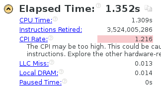

* 使 `x_dim` `y_dim` `z_dim` = 1000 

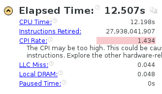

* 使 `x_dim` `y_dim` `z_dim` = 1500 

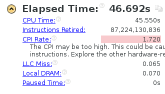

* 使 `t_steps` = 30

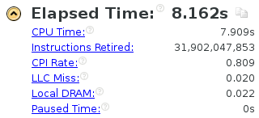


* 使 `t_steps` = 300

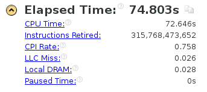

## 初步使用 MPI

首先使用`mpicc main.cpp` 尝试进行编译，但是提示
```
main.cpp:(.text+0x23): undefined reference to `operator new[](unsigned long)'
main.cpp:(.text+0x36): undefined reference to `operator new[](unsigned long)'
main.cpp:(.text+0x138): undefined reference to `operator new[](unsigned long)'
main.cpp:(.text+0x27c): undefined reference to `operator delete[](void*)'
main.cpp:(.text+0x4f5): undefined reference to `operator delete[](void*)'
main.cpp:(.text+0x508): undefined reference to `operator delete[](void*)'
```
看来mpicc不能使用c++中的new 和 delete 操作，于是重新修改代码。并且和第二次实验的openmp不同，多进程编程模型需要对代码进行较大的改动。

```c
#include <stdio.h>
#include <stdlib.h>
#include <memory.h>
#include <mpi.h>


const int x_dim = 200;
const int y_dim = 200;
const int z_dim = 200;

const int t_steps = 3;


int main(int argc, char *argv[])
{
	double(*in)[y_dim + 2][z_dim + 2] = (double(*)[y_dim + 2][z_dim + 2]) malloc(sizeof(double) * (x_dim + 2) * (y_dim + 2) * (z_dim + 2));
	double(*out)[y_dim + 2][z_dim + 2] = (double(*)[y_dim + 2][z_dim + 2]) malloc(sizeof(double) * (x_dim + 2) * (y_dim + 2) * (z_dim + 2));
	double(*temp)[y_dim + 2][z_dim + 2] = NULL;

	const int x_dim_add_2 = x_dim + 2;
	const int y_dim_add_2 = y_dim + 2;
	const int z_dim_add_2 = z_dim + 2;
	const int x_dim_add_1 = x_dim + 1;
	const int y_dim_add_1 = y_dim + 1;
	const int z_dim_add_1 = z_dim + 1;


	long long int n = x_dim_add_2;
	n *= y_dim_add_2;
	n *= z_dim_add_2;
	memset(in, 0, n);
	memset(out, 0, n);

    int rank, tot, i;
    MPI_Status state;
    MPI_Init(&argc, &argv);
    MPI_Comm_rank(MPI_COMM_WORLD, &rank);
    MPI_Comm_size(MPI_COMM_WORLD, &tot);


    if(rank == 0) 	{

   		int size = tot - 1;

    	int* ps = (int*) malloc(sizeof(int) * size);

    	for(int t = 0; t < t_steps; t++)	{
    		for(int x = 1; x < x_dim_add_1; x++)	{
    			for(int i = 0; i < size; i++)
		    		ps[i] = 0;

	    		int y = 1;
	    		int num = 0;
	    		int rec_y = 0;
	 

	    		while(rec_y < y_dim)	{

	    			if(ps[num] != 0)	{
	    				MPI_Recv(&out[x][ps[num]][0], sizeof(double) * z_dim_add_2, MPI_CHAR, num + 1, 0, MPI_COMM_WORLD, &state);
	 					ps[num] = 0;
	    				rec_y++;

	    			} else {
	    				MPI_Send(&in[x - 1][y][0], sizeof(double) * z_dim_add_2, MPI_CHAR, num + 1, 0, MPI_COMM_WORLD);
	       				MPI_Send(&in[x][y - 1][0], sizeof(double) * z_dim_add_2, MPI_CHAR, num + 1, 0, MPI_COMM_WORLD);	   
	       				MPI_Send(&in[x][y][0], sizeof(double) * z_dim_add_2, MPI_CHAR, num + 1, 0, MPI_COMM_WORLD);
	       				MPI_Send(&in[x][y + 1][0], sizeof(double) * z_dim_add_2, MPI_CHAR, num + 1, 0, MPI_COMM_WORLD);	       				
	       				MPI_Send(&in[x + 1][y][0], sizeof(double) * z_dim_add_2, MPI_CHAR, num + 1, 0, MPI_COMM_WORLD);
	    				ps[num] = y;

	    				y++;
	    			}

					num = (num + 1) % size;
	    		}
    		}

    		temp = in;
    		in = out;
    		out = temp;

    	}

    	free(ps);

    } else {

    	while(true)	{
   	    	MPI_Recv(&in[0][1][0], sizeof(double) * z_dim_add_2, MPI_CHAR, 0, 0, MPI_COMM_WORLD, &state);    		
   	    	MPI_Recv(&in[1][0][0], sizeof(double) * z_dim_add_2, MPI_CHAR, 0, 0, MPI_COMM_WORLD, &state);
   	    	MPI_Recv(&in[1][1][0], sizeof(double) * z_dim_add_2, MPI_CHAR, 0, 0, MPI_COMM_WORLD, &state);
   	    	MPI_Recv(&in[1][2][0], sizeof(double) * z_dim_add_2, MPI_CHAR, 0, 0, MPI_COMM_WORLD, &state);
   	    	MPI_Recv(&in[2][1][0], sizeof(double) * z_dim_add_2, MPI_CHAR, 0, 0, MPI_COMM_WORLD, &state);	

	    	int x = 1;
	    	int y = 1;

			#pragma ivdeph
			for (int z = 1; z < z_dim_add_1; z++) {
				out[x][y][z] = 0.4 * in[x][y][z]
					+ 0.1 * (in[x - 1][y][z] + in[x + 1][y][z]
						+ in[x][y - 1][z] + in[x][y + 1][z]
						+ in[x][y][z - 1] + in[x][y][z + 1]);
			}
			
     	   MPI_Send(&out[1][1][0], sizeof(double) * z_dim_add_2, MPI_CHAR, 0, 0, MPI_COMM_WORLD);	
     	  	
    	}
    }


	free(in);
	free(out);

	return 0;
}

```

这里分了一个控制进程和其它工作进程，控制进程负责发送、收集信息，工作进程负责计算。

先使用 `mpiexec -n 4 /home/HPC2016/htest/test/a.out` 进行测试，这里用了4个核

结果

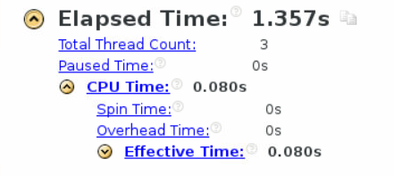

设置为24核试一下 `mpiexec -n 24 /home/HPC2016/htest/test/a.out`

结果

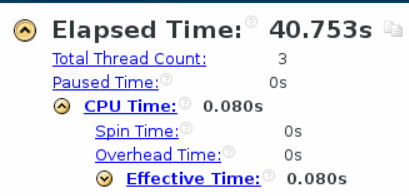

结果慢了好多，应该是代码问题，设置为12核再尝试一下 `mpiexec -n 12 /home/HPC2016/htest/test/a.out`


结果

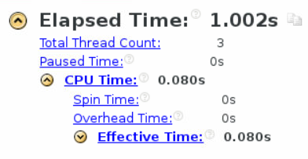

反而又加快了，现在还是不太清楚什么原因。分别设置为8核和16核再尝试一下

8核时

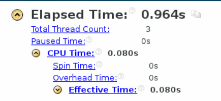

又变快了

16核时

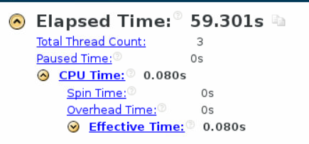

变的比24核时还慢。可以看出来，这个计算效率与所用cpu核数并不是一个线性的关系。并且这个时间有点诡异。于是我们继续修改代码

## MPI代码调试

找到了上一步测试结果如此诡异的原因，修改代码
```c
	    		while(rec_y < y_dim)	{

	    			if(ps[num] != 0)	{
	    				MPI_Recv(&out[x][ps[num]][0], sizeof(double) * z_dim_add_2, MPI_CHAR, num + 1, 0, MPI_COMM_WORLD, &state);
	 					ps[num] = 0;
	    				rec_y++;

	    			} else if(y < y_dim_add_1) {
	    				MPI_Send(&in[x - 1][y][0], sizeof(double) * z_dim_add_2, MPI_CHAR, num + 1, 0, MPI_COMM_WORLD);
	       				MPI_Send(&in[x][y - 1][0], sizeof(double) * z_dim_add_2, MPI_CHAR, num + 1, 0, MPI_COMM_WORLD);	   
	       				MPI_Send(&in[x][y][0], sizeof(double) * z_dim_add_2, MPI_CHAR, num + 1, 0, MPI_COMM_WORLD);
	       				MPI_Send(&in[x][y + 1][0], sizeof(double) * z_dim_add_2, MPI_CHAR, num + 1, 0, MPI_COMM_WORLD);	       				
	       				MPI_Send(&in[x + 1][y][0], sizeof(double) * z_dim_add_2, MPI_CHAR, num + 1, 0, MPI_COMM_WORLD);
	    				ps[num] = y;

	    				y++;
	    			}

					num = (num + 1) % size;
	    		}
```

继续进行测试，在24核时

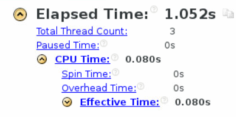

在6核时

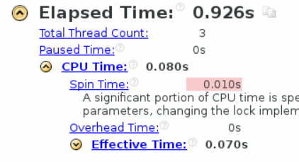

虽然还是核越多越慢，但是没有上一步那么诡异了。并且可能是因为进程太多，初始化用到的时间更多，加大问题规模进行测试

使 `x_dim` `y_dim` `z_dim` = 500

在24核时

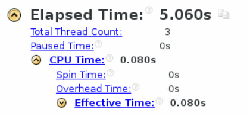

在6核时

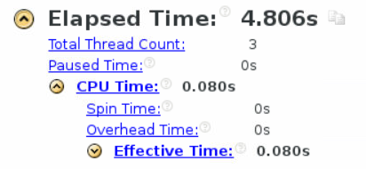

还是差不多，多核反而更慢了，可能是单指挥进程的性能瓶颈，看来需要修改代码架构

## 优化 MPI 代码

由前面的阻塞通信改为非阻塞通信

```c
	    		while(rec_y < y_dim)	{

	    			if(ps[num] != 0)	{
	    				int flag;
	    				MPI_Status status;
	    				MPI_Request handle;

						MPI_Irecv(&out[x][ps[num]][0], sizeof(double) * z_dim_add_2,  MPI_CHAR, num + 1, 0, MPI_COMM_WORLD, &handle);
						MPI_Test (&handle, &flag, &status);

						if(flag != 0) 	{
	 						ps[num] = 0;
	    					rec_y++;
						}

	    			} else if(y < y_dim_add_1) {
	    				MPI_Request handle;
	    				MPI_Isend(&in[x - 1][y][0], sizeof(double) * z_dim_add_2, MPI_CHAR, num + 1, 0, MPI_COMM_WORLD, &handle);
	       				MPI_Isend(&in[x][y - 1][0], sizeof(double) * z_dim_add_2, MPI_CHAR, num + 1, 0, MPI_COMM_WORLD, &handle);	   
	       				MPI_Isend(&in[x][y][0], sizeof(double) * z_dim_add_2, MPI_CHAR, num + 1, 0, MPI_COMM_WORLD, &handle);
	       				MPI_Isend(&in[x][y + 1][0], sizeof(double) * z_dim_add_2, MPI_CHAR, num + 1, 0, MPI_COMM_WORLD, &handle);	       				
	       				MPI_Isend(&in[x + 1][y][0], sizeof(double) * z_dim_add_2, MPI_CHAR, num + 1, 0, MPI_COMM_WORLD, &handle);

	    				ps[num] = y;

	    				y++;
	    			}

					num = (num + 1) % size;
	    		}
    		}
```

在6核情形下进行测试

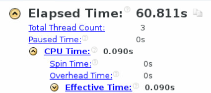

又出现了诡异的结果，在24核下进行测试

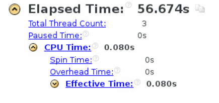

依旧诡异，看来整个代码架构都要重改

## 重构代码结构

重新修改代码，由非对等模式修改为对等模式

```c

#include <stdio.h>
#include <stdlib.h>
#include <memory.h>
#include <mpi.h>


const int x_dim = 200;
const int y_dim = 200;
const int z_dim = 200;

const int t_steps = 3;


int main(int argc, char *argv[])
{
	double(*in)[y_dim + 2][z_dim + 2] = (double(*)[y_dim + 2][z_dim + 2]) malloc(sizeof(double) * (x_dim + 2) * (y_dim + 2) * (z_dim + 2));
	double(*out)[y_dim + 2][z_dim + 2] = (double(*)[y_dim + 2][z_dim + 2]) malloc(sizeof(double) * (x_dim + 2) * (y_dim + 2) * (z_dim + 2));
	double(*temp)[y_dim + 2][z_dim + 2] = NULL;

	const int x_dim_add_2 = x_dim + 2;
	const int y_dim_add_2 = y_dim + 2;
	const int z_dim_add_2 = z_dim + 2;
	const int x_dim_add_1 = x_dim + 1;
	const int y_dim_add_1 = y_dim + 1;
	const int z_dim_add_1 = z_dim + 1;


	long long int n = x_dim_add_2;
	n *= y_dim_add_2;
	n *= z_dim_add_2;
	memset(in, 0, n);
	memset(out, 0, n);

    int rank, tot, i;
    MPI_Status state;
    MPI_Init(&argc, &argv);
    MPI_Comm_rank(MPI_COMM_WORLD, &rank);
    MPI_Comm_size(MPI_COMM_WORLD, &tot);


    int step = x_dim / tot + 1;


	int start_x = 1 + rank * step;
	int end_x = start_x + step;
	end_x = end_x < x_dim_add_1 ? end_x : x_dim_add_1;


    for (int t = 0; t < t_steps; t++) {


    	if(t != 0 && rank != 0)	{
    		MPI_Recv(&in[start_x -1][0][0], sizeof(double) * y_dim_add_2 * z_dim_add_2, MPI_CHAR, rank -1, 0, MPI_COMM_WORLD, &state);
    	}

    	if(t != 0 && rank != tot - 1)	{
			MPI_Recv(&in[end_x + 1][0][0], sizeof(double) * y_dim_add_2 * z_dim_add_2, MPI_CHAR, rank + 1, 0, MPI_COMM_WORLD, &state);
    	}

		for (int x = start_x; x < end_x; x++) {	
			for (int y = 1; y < y_dim_add_1; y++) {
				#pragma ivdep
				for (int z = 1; z < z_dim_add_1; z++) {
					out[x][y][z] = 0.4 * in[x][y][z]
						+ 0.1 * (in[x - 1][y][z] + in[x + 1][y][z]
							+ in[x][y - 1][z] + in[x][y + 1][z]
							+ in[x][y][z - 1] + in[x][y][z + 1]);
				}
			}
		}


		if(rank != 0)	{
    		MPI_Send(&out[start_x][0][0], sizeof(double) * y_dim_add_2 * z_dim_add_2, MPI_CHAR, rank - 1, 0, MPI_COMM_WORLD);	
    	}

    	if(rank != tot - 1)	{
    		MPI_Send(&out[end_x][0][0], sizeof(double) * y_dim_add_2 * z_dim_add_2, MPI_CHAR, rank + 1, 0, MPI_COMM_WORLD);	
     	}

		temp = out;
		out = in;
		in = temp;
	}


	free(in);
	free(out);


	return 0;
}
```
但是直接运行这个代码会直接卡住，不知道什么具体原因，猜测是一次发送的数据太多。继续修改代码

```c
   for (int t = 0; t < t_steps; t++) {


    	if(t != 0 && rank != 0)	{
			for(int y = 0; y < y_dim_add_2; y++)
    			MPI_Recv(&in[start_x -1][y][0], sizeof(double) * z_dim_add_2, MPI_CHAR, rank -1, 0, MPI_COMM_WORLD, &state);
    	}

    	if(t != 0 && rank != tot - 1)	{
			for(int y = 0; y < y_dim_add_2; y++)
				MPI_Recv(&in[end_x + 1][y][0], sizeof(double) * z_dim_add_2, MPI_CHAR, rank + 1, 0, MPI_COMM_WORLD, &state);
    	}
    	

		for (int x = start_x; x < end_x; x++) {	
			for (int y = 1; y < y_dim_add_1; y++) {
				#pragma ivdep
				for (int z = 1; z < z_dim_add_1; z++) {
					out[x][y][z] = 0.4 * in[x][y][z]
						+ 0.1 * (in[x - 1][y][z] + in[x + 1][y][z]
							+ in[x][y - 1][z] + in[x][y + 1][z]
							+ in[x][y][z - 1] + in[x][y][z + 1]);
				}
			}
		}


		if(rank != 0)	{

			for(int y = 0; y < y_dim_add_2; y++)	
    			MPI_Send(&out[start_x][y][0], sizeof(double) * z_dim_add_2, MPI_CHAR, rank - 1, 0, MPI_COMM_WORLD);	
    	}

    	if(rank != tot - 1)	{
    		for(int y = 0; y < y_dim_add_2; y++)
    			MPI_Send(&out[end_x][y][0], sizeof(double) * z_dim_add_2, MPI_CHAR, rank + 1, 0, MPI_COMM_WORLD);	
     	}
     	

		temp = out;
		out = in;
		in = temp;
	}
```

改为了多次发送，此时终于不会再卡住，结果

在6核情况下

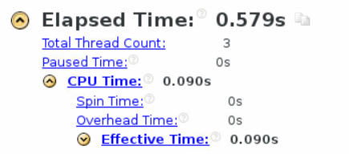

在24核情况下

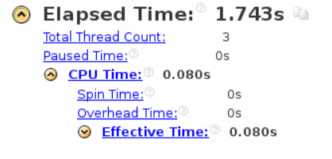

反而慢了，可能是进程初始化的问题，加大问题规模进行尝试

当 `x_dim` `y_dim` `z_dim` = 500，`t_steps` = 3, 24核时

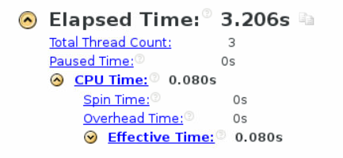

当 `x_dim` `y_dim` `z_dim` = 1000，`t_steps` = 3, 24核时

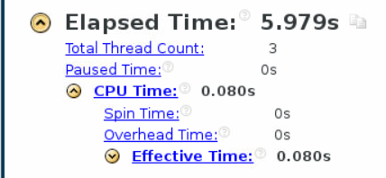

再测试一下6核

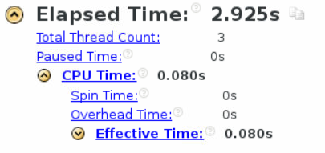

竟然又快了，再继续扩大问题规模试试


当 `x_dim` `y_dim` `z_dim` = 1500，`t_steps` = 3, 6核时

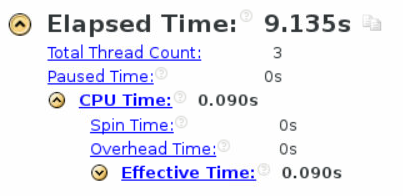

在测试24核时卡住了，尝试使用12核

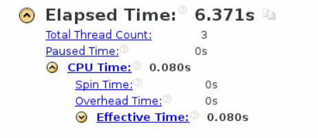
速度提升了

使用18核

此时又卡住了

果然还是使用12核，继续加大问题规模

当 `x_dim` `y_dim` `z_dim` = 1500，`t_steps` = 30, 12核时

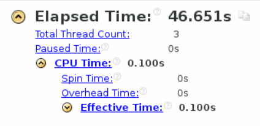


