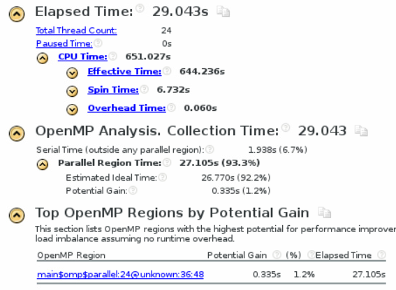

## 初始代码

基于OpenMP、MPI实验代码

### OpenMP

* 当 `x_dim` `y_dim` `z_dim` = 1000，`t_steps` = 30 时
  

* 当 `x_dim` `y_dim` `z_dim` = 1500，`t_steps` = 30 时
  

### MPI

* 当 `x_dim` `y_dim` `z_dim` = 1500，`t_steps` = 3，12核时
  

* 当 `x_dim` `y_dim` `z_dim` = 1500，`t_steps` = 30, 12核时
  

## 尝试混合mpi和openmp

直接进行混合
```cpp
#include <stdio.h>
#include <stdlib.h>
#include <memory.h>
#include <mpi.h>


const int x_dim = 200;
const int y_dim = 200;
const int z_dim = 200;

const int t_steps = 3;


int main(int argc, char *argv[])
{
	double(*in)[y_dim + 2][z_dim + 2] = (double(*)[y_dim + 2][z_dim + 2]) malloc(sizeof(double) * (x_dim + 2) * (y_dim + 2) * (z_dim + 2));
	double(*out)[y_dim + 2][z_dim + 2] = (double(*)[y_dim + 2][z_dim + 2]) malloc(sizeof(double) * (x_dim + 2) * (y_dim + 2) * (z_dim + 2));
	double(*temp)[y_dim + 2][z_dim + 2] = NULL;

	const int x_dim_add_2 = x_dim + 2;
	const int y_dim_add_2 = y_dim + 2;
	const int z_dim_add_2 = z_dim + 2;
	const int x_dim_add_1 = x_dim + 1;
	const int y_dim_add_1 = y_dim + 1;
	const int z_dim_add_1 = z_dim + 1;

	long long int n = x_dim_add_2;
	n *= y_dim_add_2;
	n *= z_dim_add_2;
	memset(in, 0, n);
	memset(out, 0, n);

    int rank, tot, i;
    MPI_Status state;
    MPI_Init(&argc, &argv);
    MPI_Comm_rank(MPI_COMM_WORLD, &rank);
    MPI_Comm_size(MPI_COMM_WORLD, &tot);

    int step = x_dim / tot + 1;

	int start_x = 1 + rank * step;
	int end_x = start_x + step;
	end_x = end_x < x_dim_add_1 ? end_x : x_dim_add_1;

    for (int t = 0; t < t_steps; t++) {


    	if(t != 0 && rank != 0)	{
			for(int y = 0; y < y_dim_add_2; y++)
    			MPI_Recv(&in[start_x -1][y][0], sizeof(double) * z_dim_add_2, MPI_CHAR, rank -1, 0, MPI_COMM_WORLD, &state);
    	}

    	if(t != 0 && rank != tot - 1)	{
			for(int y = 0; y < y_dim_add_2; y++)
				MPI_Recv(&in[end_x + 1][y][0], sizeof(double) * z_dim_add_2, MPI_CHAR, rank + 1, 0, MPI_COMM_WORLD, &state);
    	}
    	
    	#pragma omp parallel for schedule(dynamic, 1)
		for (int x = start_x; x < end_x; x++) {	
			for (int y = 1; y < y_dim_add_1; y++) {
				#pragma ivdep
				for (int z = 1; z < z_dim_add_1; z++) {
					out[x][y][z] = 0.4 * in[x][y][z]
						+ 0.1 * (in[x - 1][y][z] + in[x + 1][y][z]
							+ in[x][y - 1][z] + in[x][y + 1][z]
							+ in[x][y][z - 1] + in[x][y][z + 1]);
				}
			}
		}

		if(rank != 0)	{

			for(int y = 0; y < y_dim_add_2; y++)	
    			MPI_Send(&out[start_x][y][0], sizeof(double) * z_dim_add_2, MPI_CHAR, rank - 1, 0, MPI_COMM_WORLD);	
    	}

    	if(rank != tot - 1)	{
    		for(int y = 0; y < y_dim_add_2; y++)
    			MPI_Send(&out[end_x][y][0], sizeof(double) * z_dim_add_2, MPI_CHAR, rank + 1, 0, MPI_COMM_WORLD);	
     	}
     	

		temp = out;
		out = in;
		in = temp;
	}

	free(in);
	free(out);

	return 0;
}
```

使用命令 `mpiexec -n 12 ./a.out` 运行时出现以下错误

```
mpiexec_localhost.localdomain: cannot connect to local mpd (/tmp/mpd2.console_2013012213); possible causes:
  1. no mpd is running on this host
  2. an mpd is running but was started without a "console" (-n option)
```

继续进行修改，将编译的命令改为
```shell
export OMP_NUM_THREADS=2
mpicc -O3 main.cpp -fopenmp
```
此时成功运行


现在是12进程，每个进程两个线程的情况

## 优化 openmp mpi 混合使用

增大问题规模进行测试


* 当 `x_dim` `y_dim` `z_dim` = 500，`t_steps` = 3, 12进程、每个进程2线程时
  


* 当 `x_dim` `y_dim` `z_dim` = 1000，`t_steps` = 3, 12进程、每个进程2线程时
  

* 当 `x_dim` `y_dim` `z_dim` = 1000，`t_steps` = 30, 12进程、每个进程2线程时
  

修改线程、进程数目

* 当 `x_dim` `y_dim` `z_dim` = 1000，`t_steps` = 30, 6进程、每个进程4线程时
  
  好像没什么变化

继续修改

* 当 `x_dim` `y_dim` `z_dim` = 1000，`t_steps` = 30, 4进程、每个进程6线程时
  
  快了一点 

* 当 `x_dim` `y_dim` `z_dim` = 1000，`t_steps` = 30, 2进程、每个进程12线程时
  
  忽然感觉是进程越少越快，下一步直接极端一点，变成一进程进行测试
  
  果然，可能是因为mpi通信比共享内存要慢一些的原因

修改问题规模

* 当 `x_dim` `y_dim` `z_dim` = 1500，`t_steps` = 30, 12进程、每个进程2线程时
  

  
* 当 `x_dim` `y_dim` `z_dim` = 1500，`t_steps` = 30, 6进程、每个进程4线程时
  

* 当 `x_dim` `y_dim` `z_dim` = 1500，`t_steps` = 30, 4进程、每个进程6线程时
  

* 当 `x_dim` `y_dim` `z_dim` = 1500，`t_steps` = 30, 2进程、每个进程12线程时
  

* 当 `x_dim` `y_dim` `z_dim` = 1500，`t_steps` = 30, 1进程、每个进程24线程时
  
  
通过对比发现，上面这种 `openmp + mpi` 的混合实现的效率，比之前纯`mpi`要快，但是比之前纯`openmp`要慢