*	首先将其转为灰度图
	```python
	def gray_scale(img):
	    def gray_rgb(r, g, b):
	        return (r*299 + g*587 + b*114) // 1000
	
	    gray = numpy.zeros((img.shape[0],img.shape[1]), dtype=img.dtype)
	
	    for i in range(img.shape[0]):
	        for j in range(img.shape[1]):
	            gray[i,j] = gray_rgb(img[i,j,0], img[i,j,1], img[i,j,2])
	
	    return gray
	```
	转换效果
	

*	1D-DCT
	使用公式
	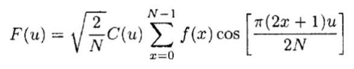
	```python
	def dct_1d(arr):
	    def C(u):
	        if u == 0:
	            return 1 / math.sqrt(2)
	        return 1
	
	    N = len(arr)
	    res = numpy.zeros(N)
	
	    for u in range(N):
	        sum_var = 0
	        for x in range(N):
	            sum_var = sum_var + arr[x] * math.cos(math.pi * (2 * x + 1) * u / (2 * N))
	        res[u] = math.sqrt(2.0/N) * C(u) * sum_var
	
	    return res
	```
	得到输出
	```
	first row
	[  2.65134107e+03  -6.31674477e+01   6.20714540e+01   1.84602898e+02
	  -3.57774391e+01   2.34703032e+02   8.13877704e+01  -1.82167471e+00
	...
	  -1.20049964e+00  -1.66465397e+00  -3.29829066e+00  -5.25334989e+00
	  -2.67329063e+00   4.89008657e-01   1.39333862e+00  -2.11832230e+00]
	first column
	[  1.81779476e+03   5.97185841e+02   1.09031081e+02   1.90568707e+02
	   1.42346997e+02   9.85597307e+01  -6.97990414e+01  -8.49555225e+01
	...
	-1.54346100e+00   7.88274867e-01   7.52136601e-01   1.18425906e+00
	-1.10638153e+00  -8.38384846e-01  -3.58717920e-01  -3.44971891e+00]
	```

*	在整个图片上使用 2D-DCT
	使用公式
	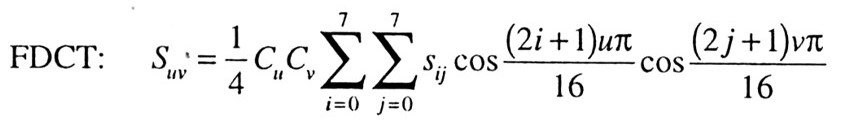
	```python
	def dct_2d(arr):
	    x = arr.shape[0]
	    y = arr.shape[1]
	    def C(u, v):
	        if u == 0 and v == 0:
	            return 1.0 / math.sqrt(2)
	        return 1
	
	    res = np.zeros((x, y))
	
	    for u in range(x):
	        for v in range(y):
	            sum_var_x = 0
	            for i in range(x):
	                sum_var_y = 0
	                for j in range(y):
	                    sum_var_y = (sum_var_y + arr[i,j] *
	                                 math.cos((2*i + 1) * u * pi / (2 * x)) *
	                                 math.cos((2*j + 1) * v * pi / (2 * y)))
	                sum_var_x = sum_var_x + sum_var_y
	            res[u,v] = 1/4 * C(u,v) * sum_var_x
	    return res
	```
	结果为
	```
	[[ 56100.  59925.  64005. ...,      0.      0.      0.]
	 [  2550.   2805.  61710. ...,      0.      0.      0.]
	 [ 64770.   1785.  62985. ...,      0.      0.      0.]
	 ..., 
	 [     0.      0.      0. ...,      0.      0.      0.]
	 [     0.      0.      0. ...,      0.      0.      0.]
	 [     0.      0.      0. ...,      0.      0.      0.]]
	```
	不过因为没有做优化，所以计算速度非常慢，大约半个小时以上。其实可以用先算系数矩阵然后矩阵相乘的方式改善代码

*	在`8*8`块上使用
	代码同上，选取最左上角的`8*8`块
	结果为
	```
	[[ 1020.     0.     0.     0.     0.     0.     0.     0.]
	 [    0.     0.     0.     0.     0.     0.     0.     0.]
	 [    0.     0.     0.     0.     0.     0.     0.     0.]
	 [    0.     0.     0.     0.     0.     0.     0.     0.]
	 [    0.     0.     0.     0.     0.     0.     0.     0.]
	 [    0.     0.     0.     0.     0.     0.     0.     0.]
	 [    0.     0.     0.     0.     0.     0.     0.     0.]
	 [    0.     0.     0.     0.     0.     0.     0.     0.]]

	```

* 分析时间复杂度
  从代码来看，时间复杂度为`O(u^2*v^2)`

*	PSNR after reconstruction by IDCT
	首先实现IDCT
	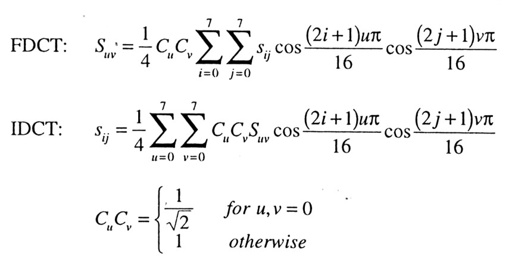
	在dct的基础上修改一下即可
    ```python
	def idct_2d(arr):
	
	    x = arr.shape[0]
	    y = arr.shape[1]
	
	    def C(u, v):
	        if u == 0 and v == 0:
	            return 1.0 / math.sqrt(2)
	        return 1
	
	    res = np.zeros((x, y))
	
	    for u in range(x):
	        for v in range(y):
	            sum_var_x = 0
	            for i in range(x):
	                sum_var_y = 0
	                for j in range(y):
	                    sum_var_y = C(i,j) * (sum_var_y + arr[i,j] *
	                                 math.cos((2*u + 1) * i * pi / (0.1 * 2 * x)) *
	                                 math.cos((2*v + 1) * j * pi / (0.1 * 2 * y)))
	                sum_var_x = sum_var_x + sum_var_y
	            res[u,v] = 1.0/4 * sum_var_x
	
	    return res
	```
	使用cv2.imshow看一下效果
	
	直接看的话，感觉没看出什么差别
	计算一下PSNR
	```python
	def psnr(img1, img2):
		def mse(imageA, imageB):
			err = np.sum((imageA.astype("float") - imageB.astype("float")) ** 2)
			err /= float(imageA.shape[0] * imageA.shape[1])
			return err
		return 10 * math.log(255 ** 2 / mse(img1, img2))
	```
	结果为
	```
	114.916476293
	```
	相似度很高

*	What if only using 1/4,1/16, 1/64 DCT coefficients
	为了方便，我直接选用了左上角的矩阵
	*	当为1/4时，选取1/2,1/2的矩阵
		按照上一步相同的步骤操作，得到图像
		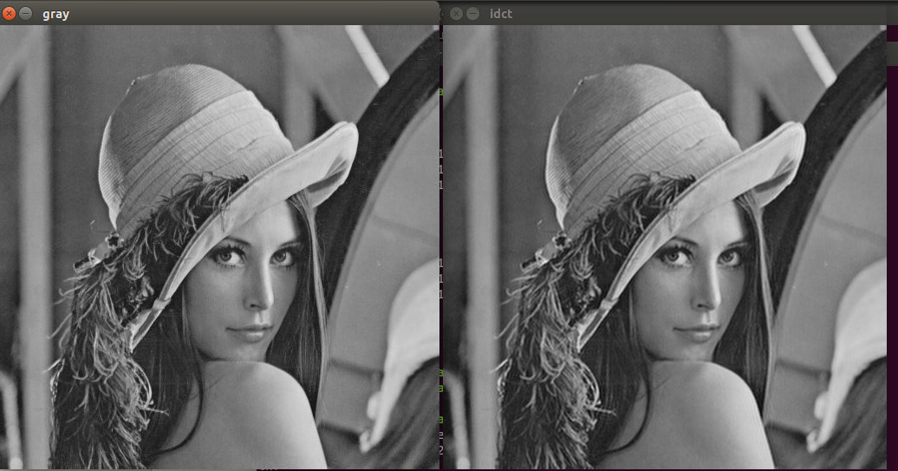
		肉眼上没看出什么区别
		计算一下psnr
		```
		83.1366893938
		```
		虽然肉眼没看出什么区别，不过psnr的值的确下降了一些

	*	当为1/16时，选取1/4,1/4的矩阵
		同上操作，得到图像
		
		肉眼已经可以明显看出区别了，idct后的图片明显要模糊一些
		算一下psnr
		```
		68.8003118691
		```
		psnr有所下降，不过和上一步相比的话并不算多。只单纯从图像上看我还以为要降很多
	
	*	当为1/64时，选取1/8,1/8的矩阵
		同上操作，得到图像
		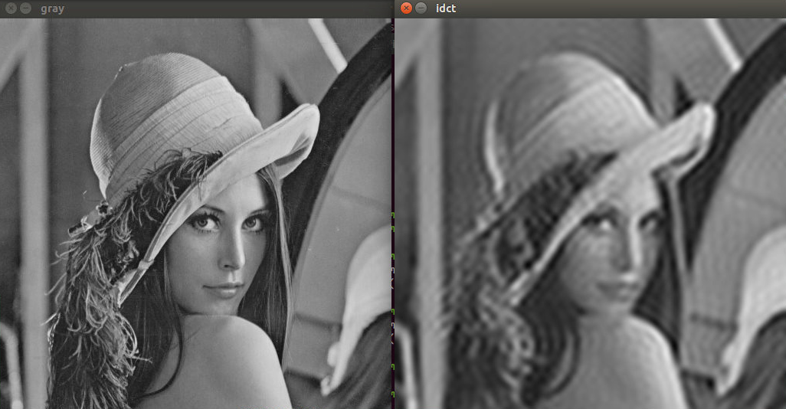
		这时差别已经非常明显了，右边的图像变的非常模糊，不过大致的轮廓都还很清楚。其实也应该是这样，因为左上角对于dct来说对应了低频部分，舍去了高频部分会丢失一些图像细节，不过大致轮廓还会显示出来
		算一下psnr
		```
		59.7402291887
		```
		psnr有所下降，不过并不算多，意外的降得很少。或许psnr值与人眼的直接感受的敏感度有不少差别


为了方便，直接在之前的基础上修改代码
```python
arr = np.float32(gray)
dst = np.zeros((512,512))
for i in range(512 // 8):
    for j in range(512 // 8):
        dst[i*8 : (i+1)*8, j*8 : (j+1)*8] = dct_2(arr[i*8:(i+1)*8,j*8:(j+1)*8])

...

idct = np.zeros((512, 512))
for i in range(512 // 8):
    for j in range(512 // 8):
        idct[i*8:(i+1)*8,j*8:(j+1)*8] = idct_2(dst[i*8:(i+1)*8,j*8:(j+1)*8],(8,8))
idct = idct * 255
```

先生成一下图像看一下结果
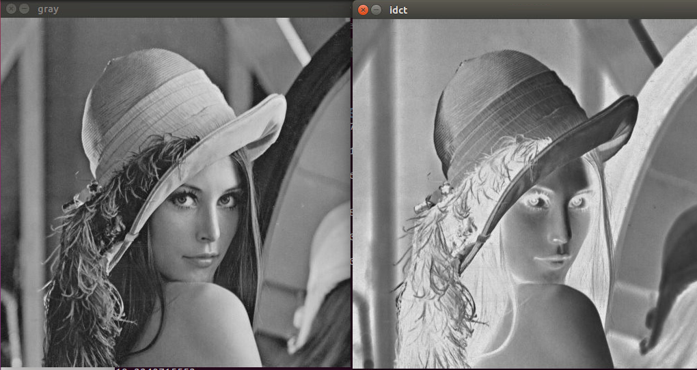
好像哪里不对，psnr也只有`19.2240715552`，应该是代码bug。继续修改代码

```python
arr = np.float32(gray) / 255.0
dst = np.zeros((512,512))
for i in range(512 // 8):
    for j in range(512 // 8):
        dst[i*8 : (i+1)*8, j*8 : (j+1)*8] = dct_2(arr[i*8:(i+1)*8,j*8:(j+1)*8])

...

idct = np.zeros((512, 512))
for i in range(512 // 8):
    for j in range(512 // 8):
        idct[i*8:(i+1)*8,j*8:(j+1)*8] = idct_2(dst[i*8:(i+1)*8,j*8:(j+1)*8],(8,8))
idct = idct * 255
```
图像为
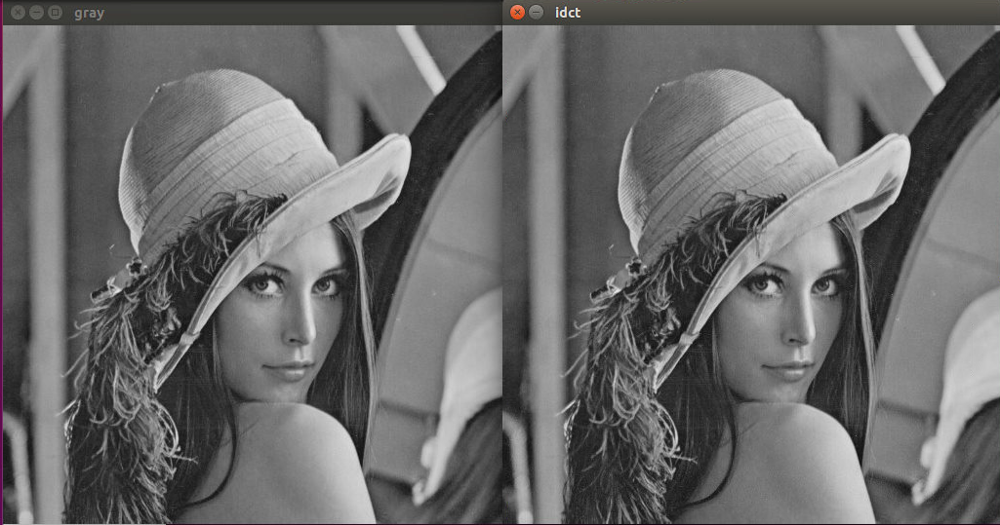
看来这样是正常了，看一下psnr
```
121.015204859
```
比之前全局dct的时候还要高，虽然肉眼没看出什么区别

计算每一块的psnr，并计算平均值
```python
psnr_list = []
for i in range(512 // 8):
    for j in range(512 // 8):
        temp_psnr = psnr(idct_res[i*8:(i+1)*8,j*8:(j+1)*8],gray[i*8:(i+1)*8,j*8:(j+1)*8])
        psnr_list.append(temp_psnr)
        print "i : ", i, " j : ", j, "psnr : ", temp_psnr

print "average psnr : ", sum(psnr_list) / len(psnr_list)
```
结果为

```
i :  0  j :  0 psnr :  126.023528441
i :  0  j :  1 psnr :  114.127687772
i :  0  j :  2 psnr :  118.074229692
i :  0  j :  3 psnr :  117.756742709
i :  0  j :  4 psnr :  114.80210058
i :  0  j :  5 psnr :  134.496507044
i :  0  j :  6 psnr :  123.510384158
i :  0  j :  7 psnr :  126.023528441
i :  0  j :  8 psnr :  122.456779001
i :  0  j :  9 psnr :  127.565035239
i :  0  j :  10 psnr :  131.61968632
i :  0  j :  11 psnr :  inf
i :  0  j :  12 psnr :  116.578912352

...

i :  63  j :  51 psnr :  125.333599726
i :  63  j :  52 psnr :  116.578912352
i :  63  j :  53 psnr :  115.525307196
i :  63  j :  54 psnr :  127.565035239
i :  63  j :  55 psnr :  123.510384158
i :  63  j :  56 psnr :  124.081968296
i :  63  j :  57 psnr :  111.983589058
i :  63  j :  58 psnr :  129.388250807
i :  63  j :  59 psnr :  114.127687772
i :  63  j :  60 psnr :  118.074229692
i :  63  j :  61 psnr :  141.42797885
i :  63  j :  62 psnr :  128.435149009
i :  63  j :  63 psnr :  131.61968632
average psnr :  inf
```
不过看来其中有inf，去除inf再次计算平均值
```python
for i in range(512 // 8):
    for j in range(512 // 8):
        temp_psnr = psnr(idct_res[i*8:(i+1)*8,j*8:(j+1)*8],gray[i*8:(i+1)*8,j*8:(j+1)*8])
        if temp_psnr != float('inf')
			psnr_list.append(temp_psnr)
        print "i : ", i, " j : ", j, "psnr : ", temp_psnr
```
结果
```
average psnr :  123.177068712
```

进行量化
```python
Q = np.array([[16, 11, 10, 16, 24, 40, 51, 61],
			  [12, 12, 14, 19, 26, 58, 60, 55],
			  [14, 13, 16, 24, 40, 57, 69, 56],
			  [14, 17, 22, 29, 51, 87, 80, 62],
			  [18, 22, 37, 56, 68,109,103, 77],
			  [24, 35, 55, 64, 81,104,113, 92],
			  [49, 64, 78, 87,103,121,120,101],
			  [72, 92, 95, 98,112,100,103, 99]])

Q = 0.1 * Q
Q = Q / 255.0

arr = np.float32(gray) / 255.0
dst = np.zeros((512,512))
for i in range(512 // 8):
    for j in range(512 // 8):
        dst[i*8 : (i+1)*8, j*8 : (j+1)*8] = dct_2(arr[i*8:(i+1)*8,j*8:(j+1)*8]) // Q * Q
```

看一下效果 
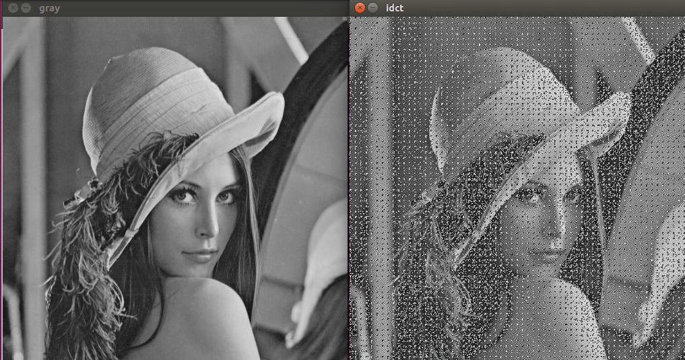
好像不怎么好
psnr为
```
31.0463837901
average psnr :  32.0848558543
```
使用 `a*Q` 量化，使`a=0.1`时

看起来不错，肉眼没看出什么差别
对于psnr
```
80.2997218444
average psnr :  80.453595816
```
使`a=0.5`
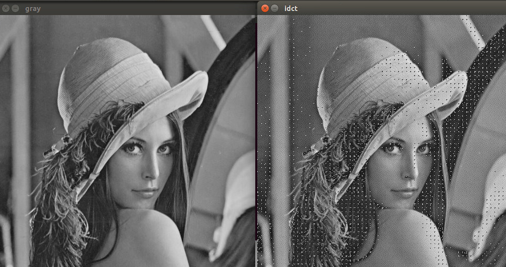
图像开始不清晰
psnr为
```
43.7616530849
average psnr :  45.26357418
```

使`a=0.3`
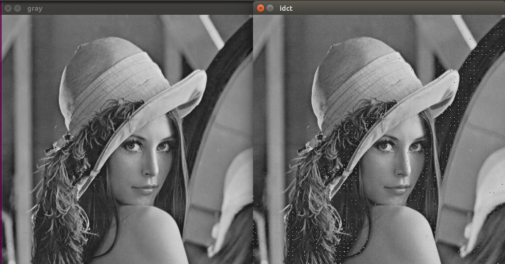
psnr为
```
55.4620216976
average psnr :  57.1084289312
```
感觉细节丰富的地方容易产生不清晰，可能是因为高频信息被量化的比较狠的缘故，或者是代码bug

现在看来还是a = 0.1时最好，量化矩阵可以取`a*Q`，适当减轻了高频信息，保留低频信息，并且也不显得整体模糊

对于别的图片进行尝试
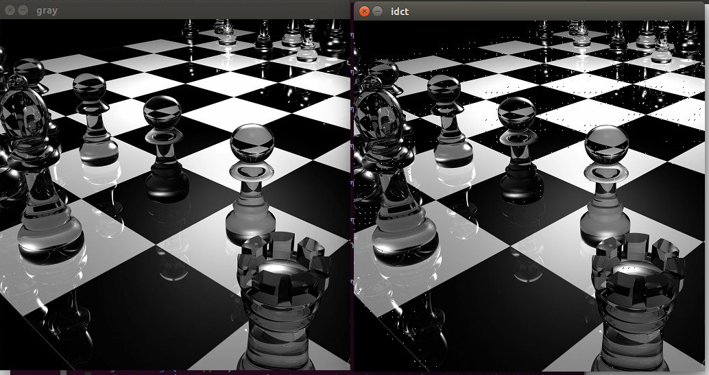
psnr
```
62.1518847038
average psnr :  107.223096725
```
细节地方还是有些模糊，继续调节
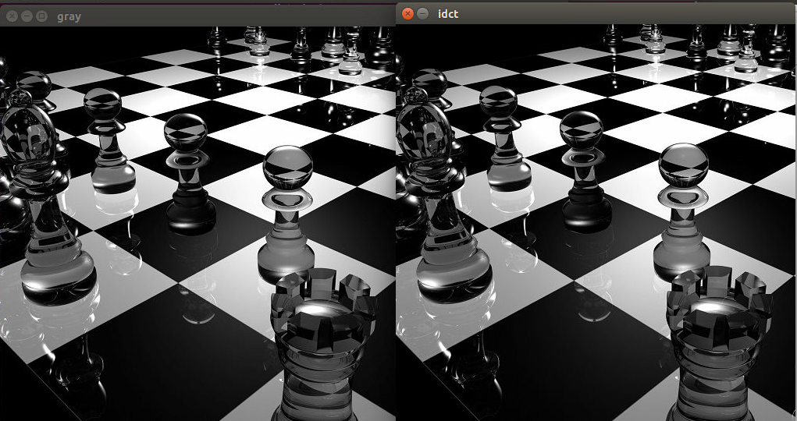
psnr为
```
119.861063688
average psnr :  118.77862201
```
全局psnr忽然就升了上来，已经很清晰了

