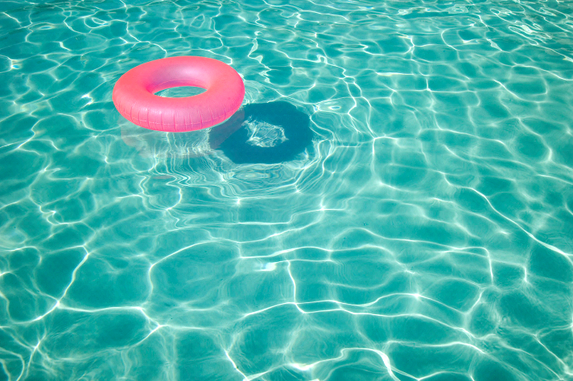

基于样本的图像补全，主要是利用邻域关系，匹配最合适的像素补充到空洞区域。

```python
# coding:utf-8

import cv2 as cv

img = cv.imread('2.png')
print img.shape
x1 = 30
y1 = 70
x2 = 100
y2 = 170
img[x1:x2, y1:y2] = (0, 0, 0)
SIZE = 5

def E(x1, y1, x2, y2):
    s = 0
    b = SIZE // 2

    for x in xrange(b):
        for y in xrange(SIZE):
            var_f = img[x1 + x - b, y1 + y - b] - img[x2 + x - b, y2 + y - b]
            var_s = var_f[0] ** 2
            var_s += var_f[1] ** 2
            var_s += var_f[2] ** 2

            s += var_s
    return s


def find_pixel(px, py):
    var_p = img[SIZE, SIZE]
    min_E = E(px, py, SIZE, SIZE)
    var_x = var_y = SIZE

    for x in xrange(SIZE, img.shape[0] - SIZE):
        for y in xrange(SIZE, img.shape[1] - SIZE):
            if x1 <= x and x <= x2 and y1 <= y and y <= y2:
                continue

            temp_E = E(px, py, x, y)

            if temp_E < min_E:
                min_E = temp_E
                var_p = img[x, y]
                var_x = x
                var_y = y

    print var_x, var_y
    return var_p

for x in xrange(x1, x2 + 1):
    for y in xrange(y1, y2 + 1):
        img[x, y] = find_pixel(x, y)
        print 'y.', y
    print 'x......', x

cv.imwrite('res-size-' + str(SIZE) +'.jpg', img)
cv.waitKey(0)
```

原图像


不过该算法复杂度较高，并且我使用的python，运行速度较慢，所以对于原图像进行压缩，压缩后图像


尝试把游泳圈部分移除，邻域窗口大小为3时，


发现效果不好，代码中有一些问题，进行修改


调整邻域窗口大小为5


调整邻域窗口大小为7


调整邻域窗口大小为9


调整邻域窗口大小为11


调整邻域窗口大小为13


因为python的运行速度较慢，每次都需要40分钟左右。大概可以看出，所取的邻域窗口越大，补全效果越好。