## 文件结构 
```
以服务为中心.zip

	代码  （这个文件夹里是全部的代码）
		www  （这个文件夹里是所有用在apache上的html和php代码）
		imgnosm-master  （这个文件夹使用的是 java 的 spring-boot 后端框架写的一个微服务，用来查询截图所对应的具体时间位置）
		bili  （这个文件夹是使用 python　的　django 后端框架写的一个微服务，用来调用百度以图搜图api）
	文档.html 
 	以服务为中心ppt.pptx  (当时展示用的ppt）
	img  （这个文件夹可以不用看，这是为了让html显示图片用的文件夹）
```

## 功能架构
初始架构
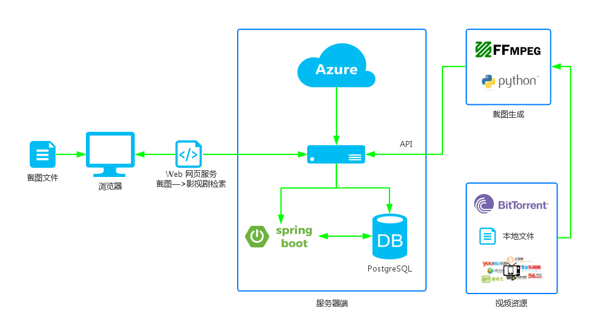

最终架构
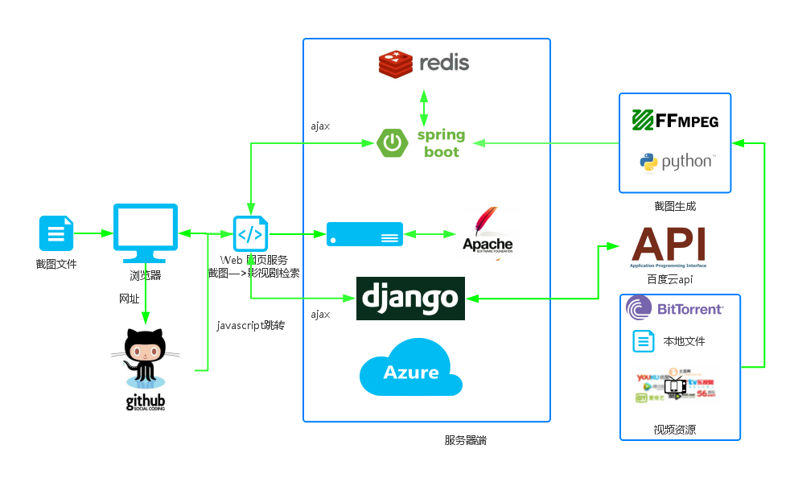

## 进度计划
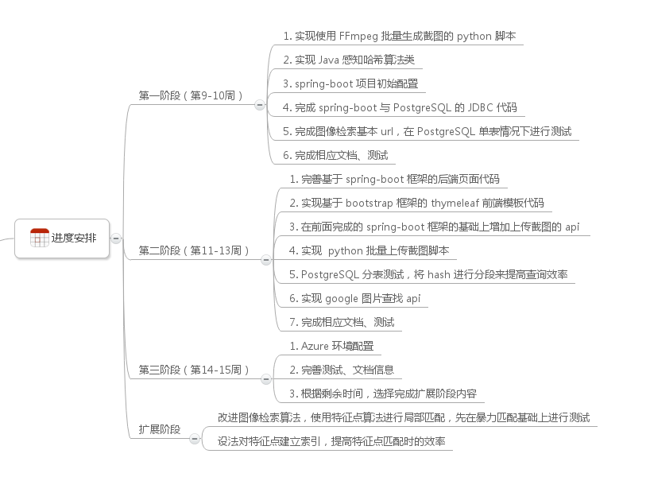

## 算法说明
* 感知哈希算法
 * 缩小图片尺寸
 * 转为灰度图片
 * 计算灰度平均值
 * 比较像素的灰度
 * 计算哈希值
 * 对比图片指纹
 
    ->  -> 8f373714acfcf4d0

* 离散余弦变换
  离散余弦变换（英语：DCT for Discrete Cosine Transform）是与傅里叶变换相关的一种变换，类似于离散傅里叶变换，但是只使用实数。离散余弦变换相当于一个长度大概是它两倍的离散傅里叶变换，这个离散傅里叶变换是对一个实偶函数进行的（因为一个实偶函数的傅里叶变换仍然是一个实偶函数），在有些变形里面需要将输入或者输出的位置移动半个单位
  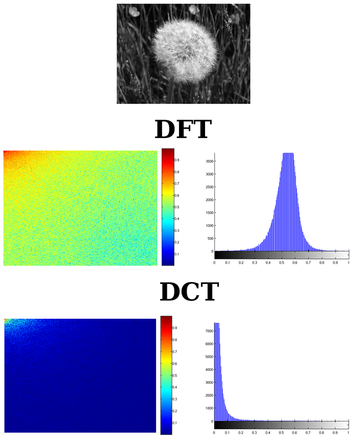
  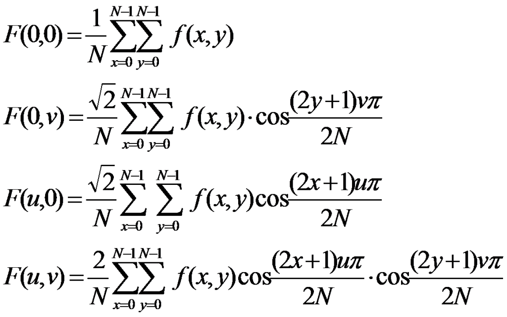


* 通过索引加快汉明距离匹配速度
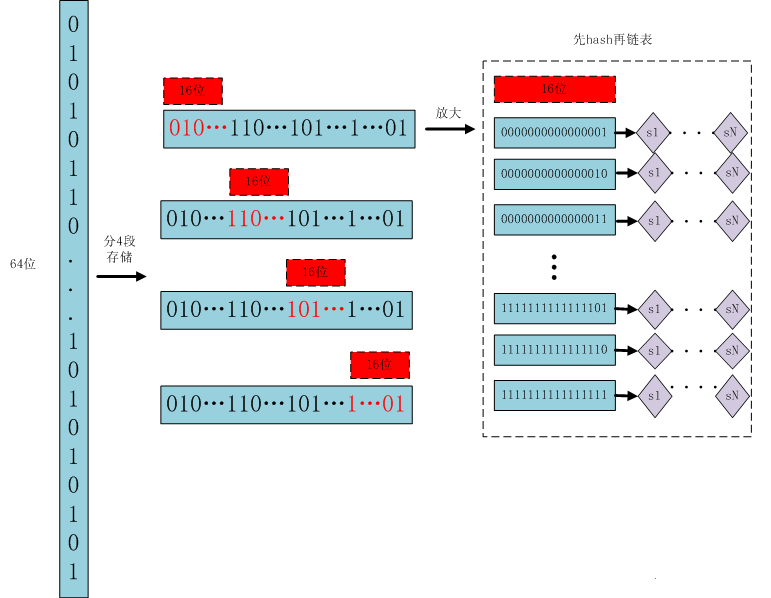

## 操作示例
* 首先，进入浏览器输入网址

* 然后进入主页面
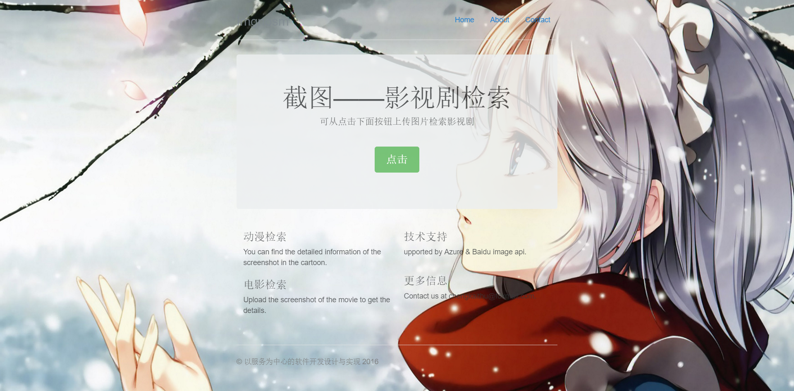
* 再点击选择截图进行上传

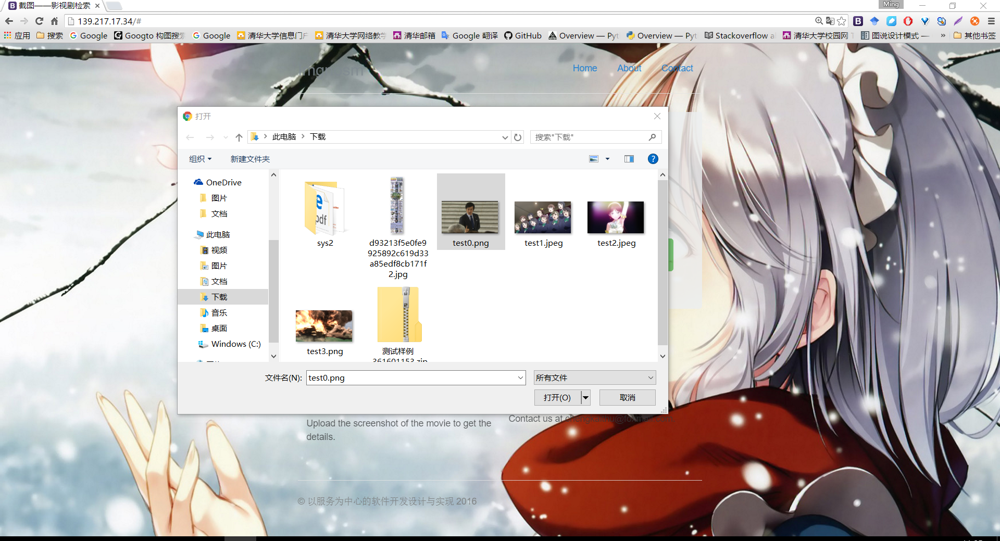
* 等待一段时间，就可以得到图片检索的结果(如果视频在服务器中，就从服务器中检索得到该截图在视频具体的位置)
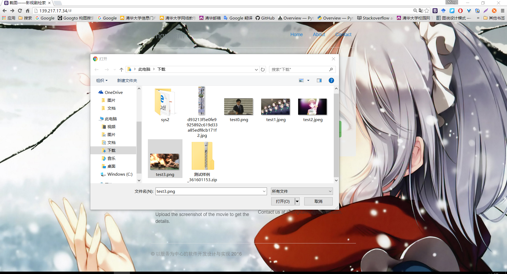
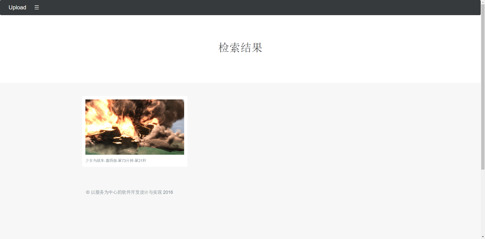
* 同时也会调用百度识图的api进行检索
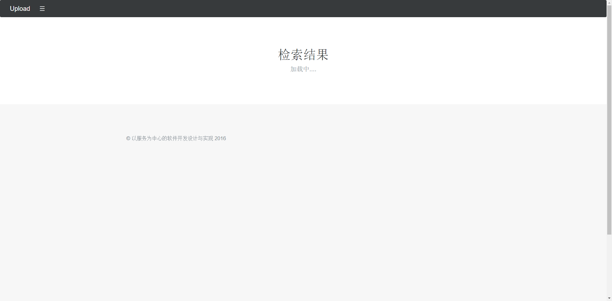
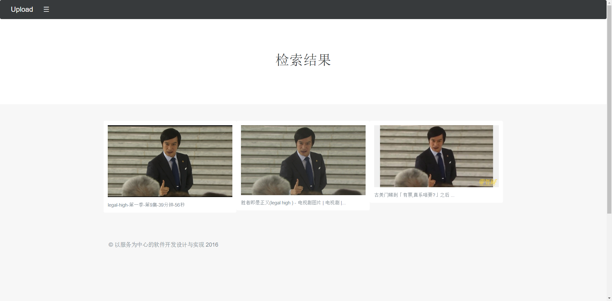

## 运行环境
```
Ubuntu 14.04
java jdk 1.8.0_73 
python 2.7.6
apache2
PHP 5.5.9
Redis server 2.8.4
Maven 3.0.5
django 1.9.6
```

## 运行方式
* 将 `代码/www` 文件夹里的文件放在apache的网页根目录下
* 在 `代码/bili` 文件夹里，使用命令 `python manage.py runserver 0.0.0.0:7777`
* 在 `代码/imgnosm-master` 文件夹里，使用命令 `mvn spring-boot:run`

## 代码结构

*	`代码/www`
	*	index.html 主页面
	*	upload.php  上传页面
	*	其余  静态资源文件，不重要
*	`代码/bili`
	*	data 主要文件夹
		*	views.py
			*	`def baiduapi(request)`  主要函数，调用baidu的图像搜索api
		*	其余 django默认文件，不重要
	*	其余 django默认文件，不重要
*	`代码/imgnosm-master`
	*	pom.xml  spirng-boot 的 maven 配置文件
	*	src  主要代码文件
		*	java/imgnosm
			*	imghash  用来计算图像hash的工具类文件夹，调用方法可以在web文件夹中直接看到
			*	web/ui/mvc spring-boot 服务文件夹
				*	`MessageController.java/public class MessageController`
					*	`@RequestMapping(value = "search") public String imgSearchName`  用来搜索视频截图位置
			*	其余 不重要	
		*	resources
			*	application.properties  spring-boot 配置
			*	其余  不重要
	*	script  用来存放截图时临时运行的脚本 
	*	其余  默认文件夹，不重要

## 技术细节

* Spring Boot后端框架
 * 直接运行
 
	```
	java -jar spring-boot.jar
	```
 * 快速启动
	```java
	package hello;
	
	import org.springframework.boot.*;
	import org.springframework.boot.autoconfigure.*;
	import org.springframework.stereotype.*;
	import org.springframework.web.bind.annotation.*;
	
	@Controller
	@EnableAutoConfiguration
	public class SampleController {
	
	    @RequestMapping("/")
	    @ResponseBody
	    String home() {
	        return "Hello World!";
	    }
	
	    public static void main(String[] args) throws Exception {
	        SpringApplication.run(SampleController.class, args);
	    }
	}
	```

 * 简单配置
	```xml
	<parent>
	    <groupId>org.springframework.boot</groupId>
	    <artifactId>spring-boot-starter-parent</artifactId>
	    <version>1.3.3.RELEASE</version>
	</parent>
	<dependencies>
	    <dependency>
	        <groupId>org.springframework.boot</groupId>
	        <artifactId>spring-boot-starter-web</artifactId>
	    </dependency>
	</dependencies>
	```
 * 本地调试
 
	```
	mvn spring-boot:run
	```

 * 快速打包
	```
	mvn package
	```

* Django
	* 介绍	
	
	Django框架的核心包括：一个 面向对象 的映射器，用作数据模型（以Python类的形式定义）和关系性数据库间的媒介；一个基于正则表达式的URL分发器；一个视图系统，用于处理请求；以及一个模板系统。
	
	核心框架中还包括：
	
	一个轻量级的、独立的Web服务器，用于开发和测试。
	一个表单序列化及验证系统，用于HTML表单和适于数据库存储的数据之间的转换。
	一个缓存框架，并有几种缓存方式可供选择。
	中间件支持，允许对请求处理的各个阶段进行干涉。
	内置的分发系统允许应用程序中的组件采用预定义的信号进行相互间的通信。
	一个序列化系统，能够生成或读取采用XML或JSON表示的Django模型实例。
	一个用于扩展模板引擎的能力的系统。
	

* bootstrap
  * 介绍
	
	Bootstrap采用模块化设计，并且用LESS样式表语言来实现各种组件和工具。一个名为bootstrap.less的文件包括了这些组件和工具，开发者可以修改这个文件，自行决定项目需要哪些组件。
	
	通过一个基本配置文件可以进行有限的定制，此外也可以进行更加深入的定制。
	
	LESS语言支持变量、函数、运算符、组合选择器和一个叫做Mixin（混入）的功能。
	
	从Bootstrap 2.0开始，Bootstrap文档包括一个叫做“自定义”的特别选项，开发者可以根据自己的实际需要来选择包含的组件和效果，然后生成和下载已经编译好的包。
	
	网格系统和响应式设计以1170像素宽为基准。此外开发者也可以自定义基准。这两种情况下，Bootstrap都能提供四种变体：手机竖屏、手机横屏和平板电脑、PC低分辨率、高分辨率，每个变体都会自动调整网格宽度。
	
	CSS
	Bootstrap对一系列HTML组件的基本样式进行了定义，并且为文本、表格和表单元素设计了一套独特的、现代化的样式。
	
	可重用组件
	除了基本HTML元素，Bootstrap还包括了其他常用的界面元素，例如带有高级功能的按钮（例如按钮组合、带有下拉菜单选项的按钮、导航栏、水平和垂直标签组、导航、分页等等）、标签、高级排版、缩略图、警告信息、进度条等。
	
	这些组件都使用CSS的类实现。在页面中需要将其对应到特定的HTML元素上面。
	
	JavaScript组件
	通过jQuery，Bootstrap加入了一些JavaScript组件。它们提供了例如对话框、工具提示、轮播等功能。此外还增强了一些用户界面元素的功能，例如输入框的自动完成。Bootstrap 2.0支持以下JavaScript插件：Modal（模态对话框）、Dropdown（下拉菜单）、Scrollspy（滚动监听）、Tab（标签页）、Tooltip（工具提示）、Popover（浮动提示）、Alert（警告）、Button（按钮）、Collapse（折叠）、Carousel（轮播）、Typeahead（输入提示）、Affix（附加导航）.
	
	
* 阿里云域名
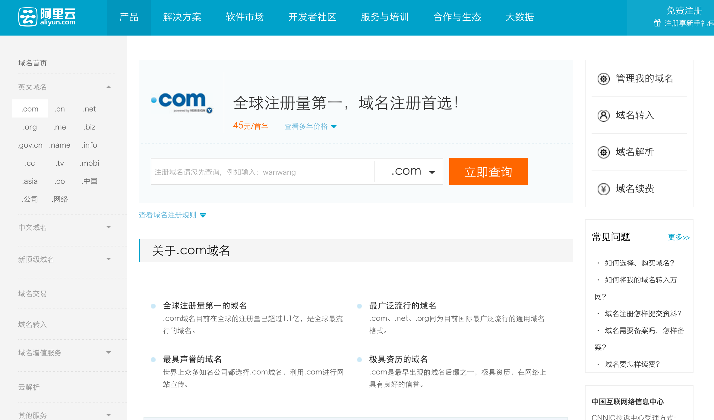

* github静态页面
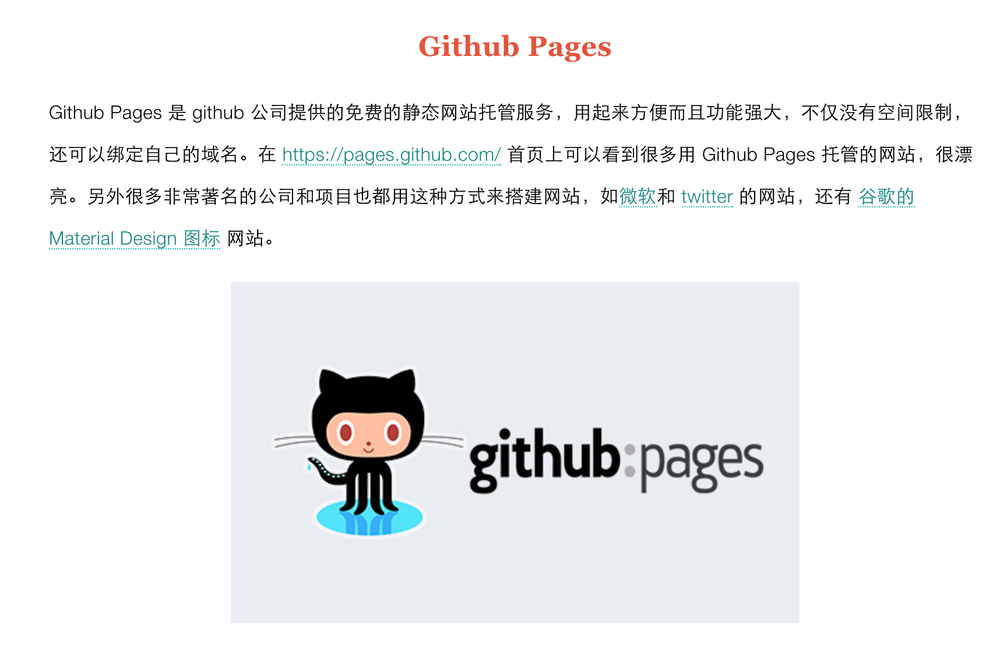

* apache2

	Apache HTTP Server（简称Apache）是Apache软件基金会的一个开放源代码的网页服务器软件，可以在大多数电脑操作系统中运行，由于其跨平台和安全性[注 1]。被广泛使用，是最流行的Web服务器软件之一。它快速、可靠并且可通过简单的API扩充，将Perl／Python等解释器编译到服务器中。
	Apache支持许多特性，大部分通过编译的模块实现。这些特性从服务器端的编程语言支持到身份认证方案。一些通用的语言接口支持Perl，Python，Tcl， 和PHP。流行的认证模块包括mod_access，mod_auth和mod_digest。其他的例子有SSL和TLS支持（mod_ssl），代理服务器（proxy）模块，很有用的URL重写（由mod_rewrite实现），定制日志文件（mod_log_config），以及过滤支持（mod_include和mod_ext_filter）。Apache日志可以通过网页浏览器使用免费的脚本AWStats或Visitors来进行分析。


* PHP

	PHP（全称：PHP：Hypertext Preprocessor，即“PHP：超文本预处理器”）是一种开源的通用计算机脚本语言，尤其适用于网络开发并可嵌入HTML中使用。PHP的语法借鉴吸收C语言、Java和Perl等流行计算机语言的特点，易于一般程序员学习。PHP的主要目标是允许网络开发人员快速编写动态页面，但PHP也被用于其他很多领域。
	
	PHP最初是由勒多夫在1995年开始开发的；现在PHP的标准由the PHP Group维护。PHP以PHP License作为许可协议，不过因为这个协议限制了PHP名称的使用，所以和开放源代码许可协议GPL不兼容。
	
	PHP的应用范围相当广泛，尤其是在网页程序的开发上。一般来说PHP大多运行在网页服务器上，通过运行PHP代码来产生用户浏览的网页。PHP可以在多数的服务器和操作系统上运行，而且使用PHP完全是免费的。根据2013年4月的统计数据，PHP已经被安装在超过2亿4400万个网站和210万台服务器上。
	
	PHP on Microsoft Windows PHP 5.5.22 / PHP 5.6.6 是由 Microsoft VC11 所编译；其将不支持旧有的 Windows XP 系统。支持 Windows XP 系统的最新版为 PHP 5.4.38，采用 Microsoft VC9 编译。


* Redis

	Redis是一个开源、支持网络、基于内存、键值对存储数据库，使用ANSI C编写。从 2015 年 6 月开始，Redis 的开发由Redis Labs赞助，在 2013 年 5 月至 2015 年 6 月期间，其开发由Pivotal赞助。在2013年5月之前，其开发由VMware赞助。根据月度排行网站DB-Engines.com的数据显示，Redis是最流行的键值对存储数据库。
	
	支持语言
	许多语言都包含Redis支持，包括：
	```
	ActionScript
	C
	C++
	C#
	Clojure
	Common Lisp
	Dart
	Erlang
	Go
	Haskell
	Haxe
	Io
	Java
	Node.js
	Lua
	Objective-C
	Perl
	PHP
	Pure Data
	Python
	R[6]
	Ruby
	Scala
	Smalltalk
	Tcl
	```

* python简单示例
	```python
	import redis
	
	r=redis.Redis(host='localhost',port=6379,db=0)
	
	r.set('test','aaa')
	print r.get('test');
	
	x=0
	for x in range(0,11):
		r.lpush('list',x)
		x=x+1
	print r.lrange('list','0','10')
	
	dict_hash={'name':'tang','password':'tang_passwd'}
	r.hmset ('hash_test',dict_hash)
	print r.hgetall('hash_test')
	
	r.sadd('set_test','aaa','bbb')
	r.sadd('set_test','ccc')
	r.sadd('set_test','ddd')
	print r.smembers('set_test')
	
	r.zadd('zset_test','aaa',1,'bbb',1)
	r.zadd('zset_test','ccc',1)
	r.zadd('zset_test','ddd',1)
	print r.zrange('zset_test',0,10)
	```