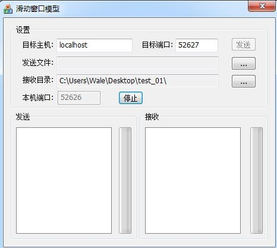
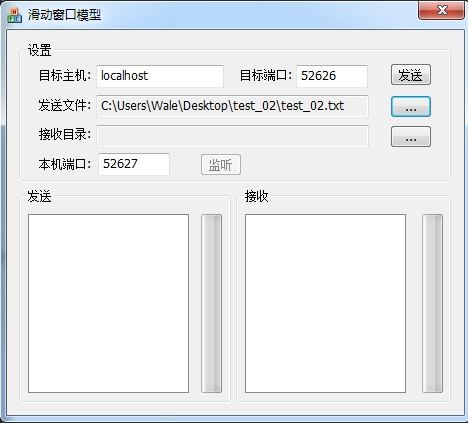
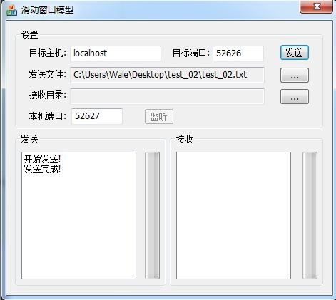
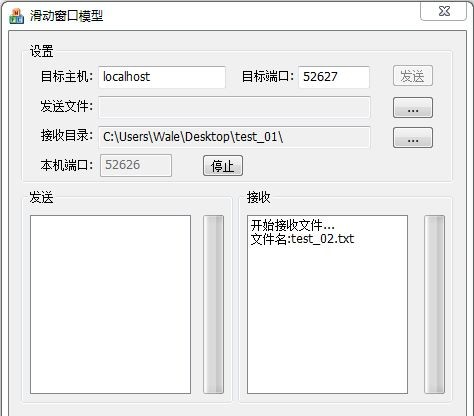

滑动窗口协议（Sliding Window Protocol）是计算机网络中为保证流控制和可靠传输而常用的一种协议，一般在传输层TCP协议中实现，有些情况下也在数据链路层实现。窗口机制是重传、 流控、 拥塞控制的基本方法， 它在发送方和接收方分别设定发送窗口和接收窗口，发送窗口和接收窗口按照某种规律不断的向前滑动， 滑动窗口协议由此得名。

1. 窗口机制
滑动窗口协议的基本原理就是在任意时刻，发送方都维持了一个连续的允许发送的帧的序号，称为发送窗口；同时，接收方也维持了一个连续的允许接收的帧的序号，称为接收窗口。发送窗口和接收窗口的序号的上下界不一定要一样，甚至大小也可以不同。不同的滑动窗口协议窗口大小一般不同。发送方窗口内的序列号代表了那些已经被发送，但是还没有被确认的帧，或者是那些可以被发送的帧。
2. 1比特滑动窗口协议
当发送窗口和接收窗口的大小固定为1时，滑动窗口协议退化为停等协议（stop-and-wait）。该协议规定发送方每发送一帧后就要停下来，等待接收方已正确接收的确认（acknowledgement）返回后才能继续发送下一帧。由于接收方需要判断接收到的帧是新发的帧还是重新发送的帧，因此发送方要为每一个帧加一个序号。由于停等协议规定只有一帧完全发送成功后才能发送新的帧，因而只用一比特来编号就够了。
3. 后退n协议
由于停等协议要为每一个帧进行确认后才继续发送下一帧，大大降低了信道利用率，因此又提出了后退n协议。后退n协议中，发送方在发完一个数据帧后，不停下来等待应答帧，而是连续发送若干个数据帧，即使在连续发送过程中收到了接收方发来的应答帧，也可以继续发送，且发送方在每发送完一个数据帧时都要设置超时定时器，只要在所设置的超时时间内仍收到确认帧，就要重发相应的数据帧。如：当发送方发送了N个帧后，若发现该N帧的前一个帧在计时器超时后仍未返回其确认信息，则该帧被判为出错或丢失，此时发送方就不得不重新发送出错帧及其后的N帧。


`SlidingWindowDlg.h`
```cpp
#pragma once
#include "protocol.h"
#include "afxwin.h"
#include "afx.h"
#include "afxcmn.h"

// CSlidingWindowDlg对话框
class CSlidingWindowDlg : public CDialog
{
// 构造
public:
	CSlidingWindowDlg(CWnd* pParent = NULL);	// 标准构造函数
// 对话框数据
	enum { IDD = IDD_SLIDINGWINDOW_DIALOG };
	protected:
	virtual void DoDataExchange(CDataExchange* pDX);	// DDX/DDV 支持

// 实现
protected:
	HICON m_hIcon;

	// 生成的消息映射函数
	virtual BOOL OnInitDialog();
	afx_msg void OnSysCommand(UINT nID, LPARAM lParam);
	afx_msg void OnPaint();
	afx_msg HCURSOR OnQueryDragIcon();
	DECLARE_MESSAGE_MAP()
public:
	CStringm_szDestination;
	CStringm_szSendFile;
	CStringm_szSavePath;
	afx_msg void OnBnClickedButtonSavePath();
	afx_msg void OnBnClickedButtonSendFile();

public:
	afx_msg void OnBnClickedButtonListen();
private:
	CProtocolm_myProtocol;
public:
	afx_msg void OnTimer(UINT_PTR nIDEvent);
	void OnReceive(void * buf , UINT nBytes);
private:
	UINT m_nDestPort;
	CListBoxm_listSend;
	CListBoxm_listReceive;
	UINT m_nLocalPort;

public:
	afx_msg void OnBnClickedButtonSend();
private:
	static UINT SendThread(LPVOID p);
	CFilem_fileSave;
	ULONGLONG m_nRecvFileSize;
	ULONGLONG m_nRecvNow;
	CProgressCtrlm_proSend;
	CProgressCtrlm_proReceive;
};
```


`SlidingWindowDlg.cpp`
```cpp
#include "stdafx.h"
#include "SlidingWindow.h"
#include "SlidingWindowDlg.h"
#include "Protocol.h"

#ifdef _DEBUG
#define new DEBUG_NEW
#endif

typedefstruct
{
	CHAR szIdentify[8];
	TCHAR szName[MAX_PATH];
	ULONGLONG nLength;
} HEADE;

// 用于应用程序“关于”菜单项的CAboutDlg对话框
class CAboutDlg : public CDialog
{
public:
	CAboutDlg();
// 对话框数据
	enum { IDD = IDD_ABOUTBOX };
	protected:
	virtual void DoDataExchange(CDataExchange* pDX);    // DDX/DDV 支持
// 实现
protected:
	DECLARE_MESSAGE_MAP()
};

CAboutDlg::CAboutDlg() : CDialog(CAboutDlg::IDD)
{
}

void CAboutDlg::DoDataExchange(CDataExchange* pDX)
{
	CDialog::DoDataExchange(pDX);
}

BEGIN_MESSAGE_MAP(CAboutDlg, CDialog)
END_MESSAGE_MAP()

// CSlidingWindowDlg对话框
CSlidingWindowDlg::CSlidingWindowDlg(CWnd* pParent /*=NULL*/)
	: CDialog(CSlidingWindowDlg::IDD, pParent)
	, m_szDestination(_T("localhost"))
	, m_szSendFile(_T(""))
	, m_szSavePath(_T(""))
	, m_nDestPort(52520)
	, m_nLocalPort(52520)
	, m_nRecvFileSize(0)
	, m_nRecvNow(0)
{
	m_hIcon = AfxGetApp()->LoadIcon(IDR_MAINFRAME);
}

void CSlidingWindowDlg::DoDataExchange(CDataExchange* pDX)
{
	CDialog::DoDataExchange(pDX);
	DDX_Text(pDX, IDC_DESTINATION, m_szDestination);
	DDX_Text(pDX, IDC_SEND_FILE, m_szSendFile);
	DDX_Text(pDX, IDC_SAVE_PATH, m_szSavePath);
	DDX_Text(pDX, IDC_DESTINATION_PORT, m_nDestPort);
	DDV_MinMaxUInt(pDX, m_nDestPort, 1, 65535);
	DDX_Control(pDX, IDC_LIST_SEND, m_listSend);
	DDX_Control(pDX, IDC_LIST_RECEIVE, m_listReceive);
	DDX_Text(pDX, IDC_OWN_PORT, m_nLocalPort);
	DDV_MinMaxUInt(pDX, m_nLocalPort, 1, 65535);
	DDX_Control(pDX, IDC_PROGRESS_RECEIVE, m_proReceive);
	DDX_Control(pDX, IDC_PROGRESS_SEND, m_proSend);
}

BEGIN_MESSAGE_MAP(CSlidingWindowDlg, CDialog)
	ON_WM_SYSCOMMAND()
	ON_WM_PAINT()
	ON_WM_QUERYDRAGICON()
	//}}AFX_MSG_MAP
	ON_BN_CLICKED(IDC_BUTTON_SAVE_PATH, &CSlidingWindowDlg::OnBnClickedButtonSavePath)
	ON_BN_CLICKED(IDC_BUTTON_SEND_FILE, &CSlidingWindowDlg::OnBnClickedButtonSendFile)
	ON_BN_CLICKED(IDC_BUTTON_LISTEN, &CSlidingWindowDlg::OnBnClickedButtonListen)
	ON_WM_TIMER()
	ON_BN_CLICKED(IDC_BUTTON_SEND, &CSlidingWindowDlg::OnBnClickedButtonSend)
END_MESSAGE_MAP()

// CSlidingWindowDlg消息处理程序
BOOL CSlidingWindowDlg::OnInitDialog()
{
	CDialog::OnInitDialog();
	// 将“关于...”菜单项添加到系统菜单中。
	// IDM_ABOUTBOX 必须在系统命令范围内。
	ASSERT((IDM_ABOUTBOX & 0xFFF0) == IDM_ABOUTBOX);
	ASSERT(IDM_ABOUTBOX < 0xF000);
	CMenu* pSysMenu = GetSystemMenu(FALSE);
	if (pSysMenu != NULL)
	{
		CStringstrAboutMenu;
		strAboutMenu.LoadString(IDS_ABOUTBOX);
		if (!strAboutMenu.IsEmpty())
		{
			pSysMenu->AppendMenu(MF_SEPARATOR);
			pSysMenu->AppendMenu(MF_STRING, IDM_ABOUTBOX, strAboutMenu);
		}
	}

	// 设置此对话框的图标。当应用程序主窗口不是对话框时，框架将自动
	//  执行此操作
	SetIcon(m_hIcon, TRUE);			// 设置大图标
	SetIcon(m_hIcon, FALSE);		// 设置小图标
	// TODO: 在此添加额外的初始化代码
	m_myProtocol.SetParent(this);
	return TRUE;  // 除非将焦点设置到控件，否则返回 TRUE
}

void CSlidingWindowDlg::OnSysCommand(UINT nID, LPARAM lParam)
{
	if ((nID& 0xFFF0) == IDM_ABOUTBOX)
	{
		CAboutDlgdlgAbout;
		dlgAbout.DoModal();
	}
	else
	{
		CDialog::OnSysCommand(nID, lParam);
	}
}

// 如果向对话框添加最小化按钮，则需要下面的代码
//  来绘制该图标。对于使用文档/视图模型的 MFC 应用程序，
//  这将由框架自动完成。

void CSlidingWindowDlg::OnPaint()
{
	if (IsIconic())
	{
		CPaintDC dc(this); // 用于绘制的设备上下文
		SendMessage(WM_ICONERASEBKGND, reinterpret_cast<WPARAM>(dc.GetSafeHdc()), 0);
		// 使图标在工作区矩形中居中
		intcxIcon = GetSystemMetrics(SM_CXICON);
		intcyIcon = GetSystemMetrics(SM_CYICON);
		CRectrect;
		GetClientRect(&rect);
		int x = (rect.Width() - cxIcon + 1) / 2;
		int y = (rect.Height() - cyIcon + 1) / 2;
		// 绘制图标
		dc.DrawIcon(x, y, m_hIcon);
	}
	else
	{
		CDialog::OnPaint();
	}
}

//当用户拖动最小化窗口时系统调用此函数取得光标
//显示。
HCURSOR CSlidingWindowDlg::OnQueryDragIcon()
{
	return static_cast<HCURSOR>(m_hIcon);
}


void CSlidingWindowDlg::OnBnClickedButtonSavePath()
{
	// TODO: 在此添加控件通知处理程序代码
	UpdateData(TRUE);
	PIDLIST_ABSOLUTE   pIDL; 
	TCHAR szPath[_MAX_PATH];
	BROWSEINFO bo;
	ZeroMemory(&bo,sizeof(bo));
	bo.hwndOwner = this->m_hWnd;
	bo.ulFlags = BIF_USENEWUI|BIF_RETURNFSANCESTORS|BIF_RETURNONLYFSDIRS;
	bo.lpszTitle = _T("请选择保存目录");
	pIDL = SHBrowseForFolder(&bo);
	SHGetPathFromIDList(pIDL,szPath);
	m_szSavePath.Format(_T("%s"),szPath);

	if (m_szSavePath.GetLength() != 0)
	{
		if (m_szSavePath.GetAt(m_szSavePath.GetLength() - 1) != _T('\\'))
		{
			m_szSavePath.AppendChar(_T('\\'));
		}
		GetDlgItem(IDC_BUTTON_LISTEN)->EnableWindow(TRUE);
	}
	CoTaskMemFree(pIDL);
	UpdateData(FALSE);
}

void CSlidingWindowDlg::OnBnClickedButtonSendFile()
{
	// TODO: 在此添加控件通知处理程序代码
	CFileDialog fd(TRUE,_T("*.*"),NULL,OFN_FILEMUSTEXIST|OFN_HIDEREADONLY,_T("All Files (*.*)|*.*||"),this);
	fd.m_ofn.lStructSize = 88;
	if (fd.DoModal() == IDOK)
	{
		UpdateData(TRUE);
		m_szSendFile = fd.GetPathName();
		UpdateData(FALSE);
		GetDlgItem(IDC_BUTTON_SEND)->EnableWindow(TRUE);
	}
}

void CSlidingWindowDlg::OnBnClickedButtonListen()
{
	// TODO: 在此添加控件通知处理程序代码
	UpdateData(TRUE);
	CString tem;
	GetDlgItem(IDC_BUTTON_LISTEN)->GetWindowText(tem);

	if (tem == _T("监听"))
	{
		if (m_myProtocol.Create(m_nLocalPort) == FALSE)
		{
			m_listSend.AddString(_T("错误:无法开启!"));
			return;
		}
		m_myProtocol.Start();
		GetDlgItem(IDC_BUTTON_LISTEN)->SetWindowText(_T("停止"));
		GetDlgItem(IDC_OWN_PORT)->EnableWindow(FALSE);
	}
	else
	{
		GetDlgItem(IDC_BUTTON_LISTEN)->SetWindowText(_T("监听"));
		GetDlgItem(IDC_OWN_PORT)->EnableWindow(TRUE);
		m_myProtocol.Stop();
	}
	UpdateData(FALSE);
}

void CSlidingWindowDlg::OnTimer(UINT_PTR nIDEvent)
{
	// TODO: 在此添加消息处理程序代码和/或调用默认值
	m_myProtocol.Timeout(nIDEvent - 1);
}

void CSlidingWindowDlg::OnReceive(void * buf , UINT nBytes)
{
	if (nBytes == sizeof(HEADE))
	{
		HEADE * pHeader;
		pHeader = (HEADE *)buf;
		if (memcmp(pHeader->szIdentify,"@HEADZGF",8) == 0)
		{
			m_fileSave.Open(m_szSavePath + pHeader->szName,CFile::modeCreate|CFile::modeWrite);
			m_nRecvFileSize = pHeader->nLength;
			m_nRecvNow = 0;
			m_listReceive.AddString(_T("开始接收文件..."));
			m_listReceive.AddString(_T("文件名:") + CString(pHeader->szName) );
			return;
		}
	}

	m_fileSave.Write(buf,nBytes);
	m_nRecvNow += nBytes;
	m_proReceive.SetPos((int)((m_nRecvNow/(double)m_nRecvFileSize)*100));
	if (m_nRecvNow == m_nRecvFileSize)
	{
		m_fileSave.Close();
		m_proReceive.SetPos(100);
		m_listReceive.AddString(_T("接收完成!"));
		m_proReceive.SetPos(0);
	}
}

void CSlidingWindowDlg::OnBnClickedButtonSend()
{
	// TODO: 在此添加控件通知处理程序代码
	UpdateData(TRUE);
	if (m_myProtocol.SetDestination(m_szDestination,m_nDestPort) == FALSE)
	{
		m_listSend.AddString(_T("错误:找不到目标主机"));
		return;
	}
	if (m_myProtocol.Create(0) == FALSE)
	{
		m_listSend.AddString(_T("错误:无法创建套接字"));
		return;
	}
	m_myProtocol.Start();
	AfxBeginThread(SendThread,this);
}

UINT CSlidingWindowDlg::SendThread(LPVOID p)
{
	CSlidingWindowDlg *my = (CSlidingWindowDlg *)p;
	CFile file;
	CString name;
	BYTE buf[MAX_PKT];
	HEADE header;
	UINT nRead;
	ULONGLONG nTotal;
	ULONGLONG nNow = 0;
	if (file.Open(my->m_szSendFile,CFile::modeRead) == FALSE)
	{
		my->m_listSend.AddString(_T("错误:无法打开文件"));
		return 1;
	}
	(my->GetDlgItem(IDC_BUTTON_SEND))->EnableWindow(FALSE);
	my->m_listSend.AddString(_T("开始发送!"));

	name = file.GetFileName();
	memcpy(header.szIdentify,"@HEADZGF",8);
	lstrcpy(header.szName,name);
	header.nLength = file.GetLength();
	nTotal = header.nLength;
	my->m_myProtocol.SendPacket(&header,sizeof(HEADE));
	
	while(nNow<nTotal)
	{
		nRead = file.Read(buf,MAX_PKT);
		my->m_myProtocol.SendPacket(buf,nRead);
		nNow += nRead;
		my->m_proSend.SetPos((int)((nNow/(double)nTotal)*100));
	}
	my->m_proSend.SetPos(100);
	my->m_listSend.AddString(_T("发送完成!"));
	(my->GetDlgItem(IDC_BUTTON_SEND))->EnableWindow(TRUE);
	my->m_proSend.SetPos(0);
	return 0;
}
```

1. 开启一个客户端（作为实验的接收端），并确立监听端口与目标端口：

2. 开启一个客户端（作为实验的发送端），并确立监听端口与目标端口：

3. 发送文件：

4. 接收文件：



##  
* 采用滑动窗口中的选择重发协议实现了一个文件传输程序。
* 由于UDP协议与数据链路层有一个重要不同就是先发不一定先到，所以若用UDP模拟链路层滑动窗口协议，较理想的就是选择重发协议（我也实现了返回n，实际测试速度远不如选择重发）而且序号应很大，否则可能出错。由于实际文件传输基本不会双向同时传输，故我取消了捎带回复机制，选择单独发送ACK，以加快速度。
* 程序的使用方法就是，打开两个客户端，一个发送一个接收。收端先选择保存路径然后点监听，发送端选择文件然后点发送。
