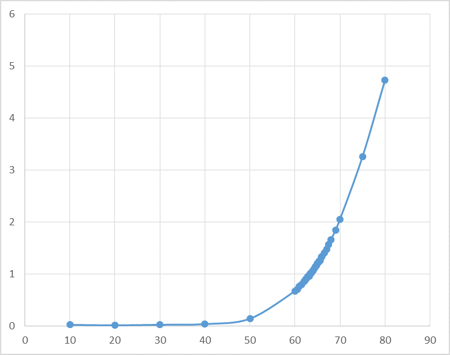
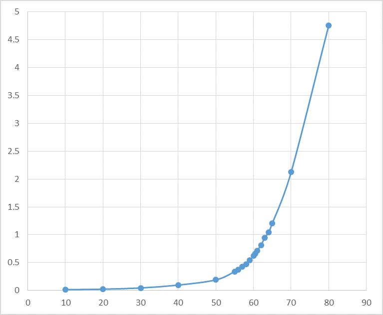
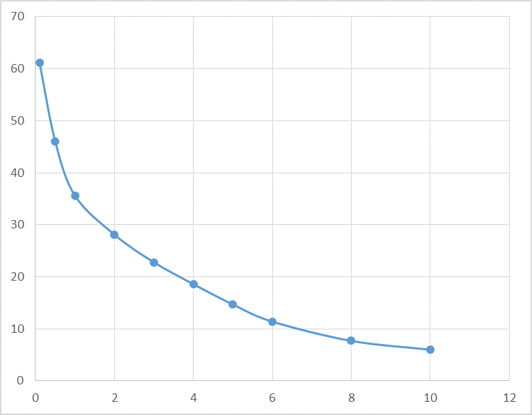
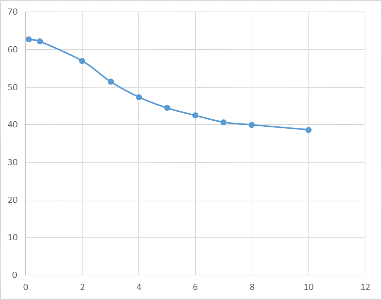
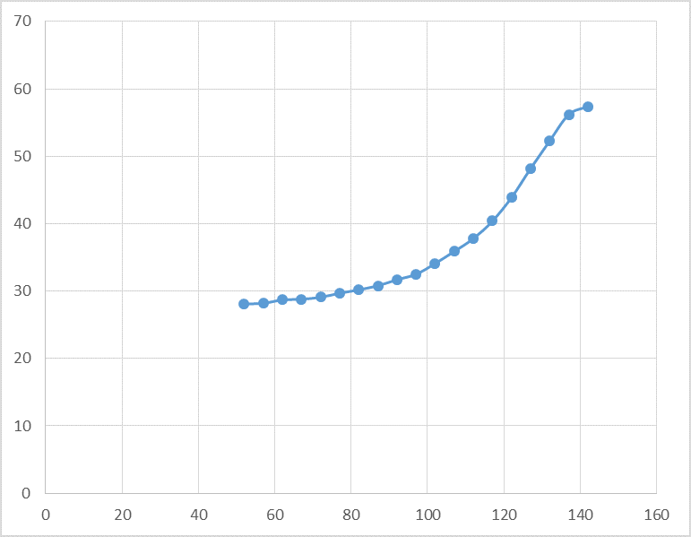
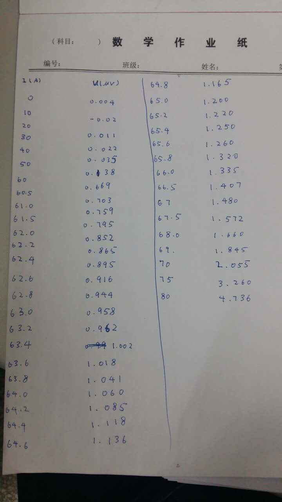
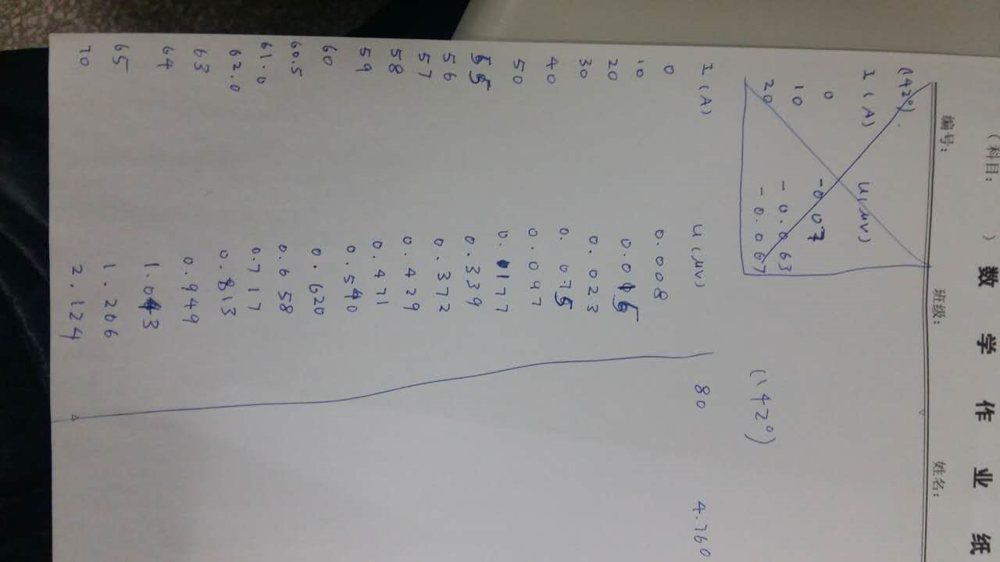
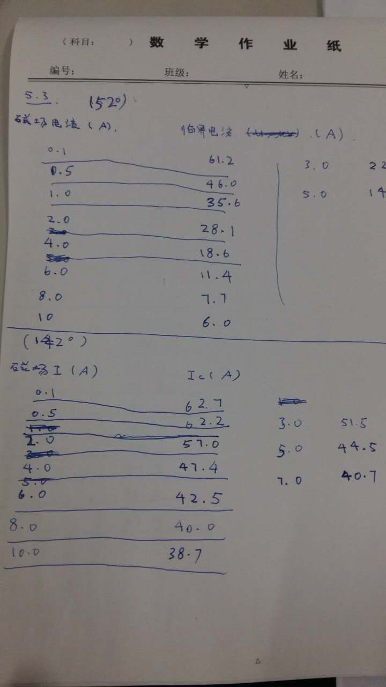
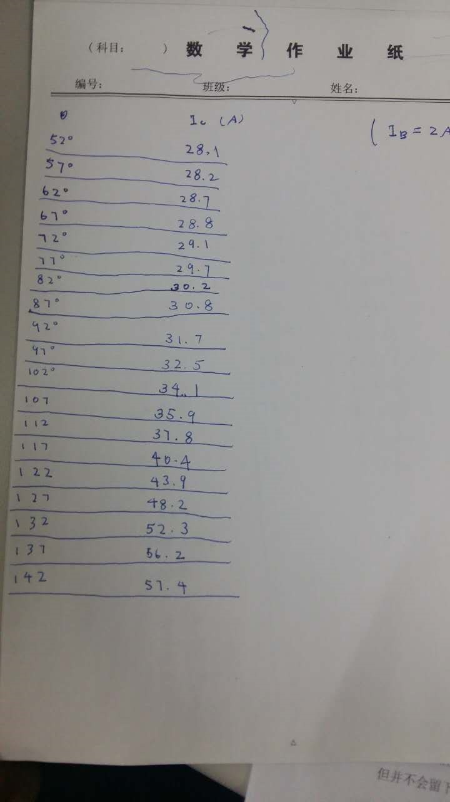

### 摘 要
 本实验研究了高温超导导线的性质。实验在液氮环境下, 使用四点法测定了B = 0时高温超导导线的U–I曲线, B ≠ 0 时导线平面垂直/平行于磁场情况下的临界电流 Ic–B 曲线, 以及 B 恒定时的Ic–θ曲线 (θ是导线平面和磁场的夹角)。通过实验初步了解了高温超导导线的性质。

关键词: 高温超导

### 一．	引言
超导是近代物理学中有重要地位的物理现象。 高温超导更是近年物理研究的重要领域。 超导指的是导体在一定环境下电阻变为 0, 且具有完全抗磁性的现象。1911 年, 昂内斯及其助手发现Hg的超导电性,这是人类首次发现超导现象;1933年, 迈斯纳和奥森菲尔德发现超导体的完全抗磁性, 这是超导体的一个重要性质,也是超导体的判据之一;1935 年 伦敦兄弟提出伦敦方程, 给出了超导体内部电磁规律的唯象结果, 这样的理论取得了成功, 但也有不足之处; 皮帕尔德修正了伦敦方程, 指出超导体中电子是相干的; 1950 年, 朗道和金茨堡提出G-L理论, 从另一唯象角度解释了超导现象, 由这一理论阿布里科索夫于1957 年发现了第二类超导体的存在; 1957年巴丁、库珀和施威孚提出 BCS 理论, 从微观机制对超导体作出了解释。

第二类超导体比第一类超导体展现出更多的物理现象。其中重要的一点是, 第二类超导体可以用于制作高温超导导线。根据G-L理论, 第二类超导体穿透深度大于相干长度, 具有负界面能。理想的第二类超导体在外场由 0 增大时,导体先内没有磁场, 磁场增至下临界场时磁感线进入超导体,导体变为混合态;再增大至上临界场1后则会转变成正常态。在非理想情形下,超导体中有杂质/缺陷, 它们构成钉扎中心,阻碍磁感线的运动, 从而可以提升临界电流和临界磁场值. 这便是第二类超导体制成的高温超导导线可以在无电阻的状态下传输较大电流的原因。

### 二、  实验
将固定了待研究的高温超导导线的测量架置于盛有液氮的杜瓦箱里,并插入直流磁体磁路的气隙中。实验使用直流稳压电源为高温超导导线通电流,使用另一直流磁体电源为磁体供电。实验使用四点法测定临界电流,即将超导线样品置于直流匀强磁场中,在样品中通入直流电,测量超导线样品中某一段的电势差。这里临界电流规定为样品上相距 1cm 的两点间电势差为1V时通过超导导线样品的电流。四点法测量电压使用高灵敏度纳伏电压表, 两个测量接点相距 1cm。

实验内容主要为以下三个部分:
1. 测定B=0下高温超导导线的U–I曲线
2. 在导线平面垂直/平行于磁场时测定临界电流Ic–B曲线
3. B恒定时,旋转样品,测定Ic–θ曲线

### 三．	实验结果及讨论
实验没有施加外磁场时,在导线表面垂直和平行于磁场方向两种情况下分别向高温超导导线通过不同大小的电流I,记录相距1cm的接点间的电压降落U。分别作出导线在其表面垂直和平行于磁场方向两种情况下的U–I曲线。

导线平面垂直于磁场方向时的U–I曲线如图

导线平面平行于磁场方向时的U–I曲线如图

两者图像非常相似。临界电流Ic约为63A。

在导线平面垂直时测定超导导线的临界电流Ic–B曲线如图

在导线平面平行时测定超导导线的临界电流Ic–B曲线如图

可以看出, 随着外磁场值的增大, 超导导线的临界电流Ic会逐渐减小, 最终Ic会减小至0。在传输同样大小的电流时,有外磁场比没有外磁场、外磁场大比外磁场小时穿过超导体的磁感线多,磁感线之间排斥更强,能量损耗也就越高,临界电流会更低。

B增加时,导线平面垂直于磁场方向的情况下Ic减小得比导线平面平行于磁场方向的情况要快一些。这是因为导线平面垂直于磁场方向时穿过导体的磁感线更多, 其互相排斥更大, 因而更容易造成能量损耗、然后失超。

固定磁场B，改变超导导线平面和磁场B的夹角θ，作出Ic–θ曲线，如图

随着导线平面由垂直于磁场逐渐变化至平行于磁场, 导线的临界电流Ic也逐渐增大。也说明了导线平面垂直于磁场方向时穿过导体的磁感线更多, 其互相排斥更大, 因而更容易造成能量损耗、然后失超。

### 四．	结论
实验测量了高温超导导线的特性曲线. 在没有外场时, 高温超导导线的伏安特性曲线为指数型曲线。导线的临界电流约为 63A. 在有外场时, 固定导线平面和外场的夹角为垂直或者平行, 导线的临界电流随磁感应强度增强而减小, 且在导线平面垂直于外场时减小得更快。在固定磁场B下, 改变导线平面和外场的夹角, 导线平面由平行于外磁场到垂直于外磁场的过程中, 导线临界电流逐渐减小。

### 实验数据
导线平面垂直和平行于磁场方向时的U–I数据

在导线平面垂直和平行时测定超导导线的临界电流Ic–B数据

Ic–θ数据
