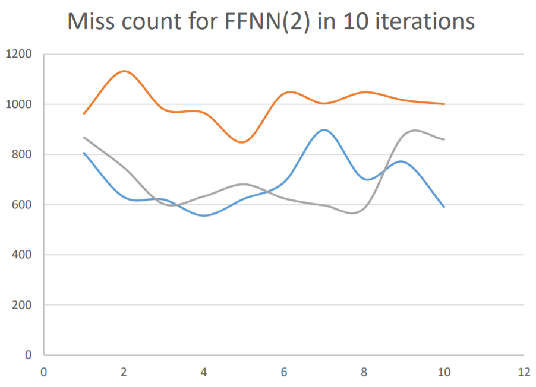

<!-- #### Abstract -->
This article presents an attempt for playing contra on Nintendo Entertainment System (NES) with neural networks. We have tried different network architectures and different strategies of training, but we failed to beat level 1. We mainly focus on the analysis of our failure and possible solutions.

#### Introduction
The Nintendo Entertainment System is one of the most successful commercial video game console. It also has a Chinese counterpart, Subor(小霸王学习机), which is part of the childhood of people born in 80s and 90s. Contra is one of the famous games on both NES and Subor. It is of moderate difficulty, not as hard as Mega Man or Ghosts'n Goblins, which is meant for hardcore gamers, and not as easy as Tetris or Breakout for machine to learn or parameterize the action strategies. Contra is also a game of linear gameplay. Since nonlinear games such as Zelda needs long-term strategy and memory, it is almost impossible for neural networks to be trained for such games. 

#### The NES emulator
There are many NES emulators created and used by nerds who are in favor of old-school 8-bit games. From those NES emulators, we have chosen two of them for the final project, FCEUX and Bizhawk. The two emulator has a lua script interpreter and some built in functions for users to program them, but both has some defects in dueling with socket or dueling with graphics, so we have used them both.

The NES is based on an 8-bit processor and a RAM of 2048 bytes. The RAM contains all the data needed for the game to run. Due to the limitation of RAM size, NES games fix the memory at fixed physical memory location, which is to say, it is reasonable to scratch information from memory. NES has a screen of 256240 pixels, which is consisted of squares, or sprites, of 88 pixels. Trying to capture the information directly from the screen will generate a 32*30 tensor so that not too much information is lost, but to keep information such as momentum (or velocity) will result in higher dimension of input.

#### Training Method
At first, we decided to follow Google Deepmind’s work, using reinforcement learning to
parameterize out network so that it can react to the different circumstances in the game. At the
time, we try to implement Q-learning algorithm in lua, we come over a critical problem. Atari
games, comparing to NES games, are far easier.
When you play an Atari game, you want to get a high score. Not many Atari games have a complicated circumstance and DQN does not perform well on them, such as Ms. Pac-Man.
Unfortunately, when playing an NES game, people do not care about the score, except the
hardcore players. Beating a level is already hard enough. In addition, NES needs more operations
and more strategies. Contra is such a complicated game that needs a more complicated
architecture, so training it with Q-learning will be far slower than an Atari game. Thus, we
decide to train it with supervised learning at first.

#### Network architecture
The best game the DQN network performs on is Video Pinball, which Deepmind team claims to
perform 2539% better than human players do. As far as I am concerned, mastering Video Pinball
is of equal difficulty of mastering Flappy Bird. There was somebody already done the work.
[FlappyBirdRL](https://github.com/SarvagyaVaish/FlappyBirdRL)
An Atari game has a joystick and a button, and for Pinball, it only needs three operations, up,
down and stay.

 For Flappy Bird, two operations are needed, touch and release. Parameterizing
the network focuses mainly on parameterizing the timing of these operations. Deepmind team
claims to have accomplished human-level control through DQN, as they uses only the graphic as
input. The network indeed reaches the human-level, but it is limited by its architecture and
cannot satisfy our need. To duel with the graphic, two convolution layers are used to do down
sampling. Much information are lost and many noises are imported. In addition, these
convolution layers are a great overhead. In the network that plays flappy bird, very simple
network is used to accomplish the task, may be a linear layer to transform the input, which
should be less than 10 nodes, and a sigmoid layer of one dimension to regulate the output. DQN
uses two layers of fully connected linear layer with ReLU gates to do the similar task. The main
difference between DQN and the flappy bird network is that DQN has two convolution layers to
scratch information from screen, while the latter scratch information directly from memory. Thus
the latter can perform far better than human while DQN only reaches a normal standard.

Based on the above reasoning, we use the memory as input instead of the screen. For
performance reasons, we used some of memories instead of all memories.

####  Performance
We have tried different neural network architectures, which performed quite differently. Here is
the detailed description of different networks.
To measure the performance, we train the network with a sequence of 4550 inputs, which are
4550 frames in the game play, and count the times of the network gives different output
compared to the target input. Network architectures are enclosed with this document.

#### Performance of FFNN
###### Grouped Connection from memory


Trained with method that focus on special cases. Here is the pseudo code

```ruby
for i = 1, 4550 do
  calculate loss with input and target
  if loss > threshold(0.3) then
      record input, target
      train with all previous records for 2 times
  end
  train with this case
end
```



#### Related works
There are some other works related to playing NES games by machine, let along the work done
by Google Deepmind group. These works also inspired our work.

####  Lexicographic ordering approach
Dr. Tom Murphy does this work. Here is the homepage for his work.
[mario](http://www.cs.cmu.edu/~tom7/mario/)
Considering the performance, his work is currently the most successful approach toward
automating computer to play an NES game. However, lexicographic ordering the memory of 
NES game is very memory consuming. For linear games, his approach works very well,
especially on Mario and Punch-out. When it comes to non-linear games, such as Zelda, the
algorithm fails to figure out what to do, just as what we would expect.

### Neuroevolution
Software engineer SethBling implemented the neuroevolution algorithm on lua to learn the play
of Super Mario. To be honest, his work outperforms ours a lot. We kind of regret to have
abandoned the neuroevolution approach.
The advantage of neuroevolution is that the network can dynamically grow, adding new neurons
so that it can fit into new circumstances. In other words, these neurons act as memory cells in the
network.

When Deepmind released the paper of DNC, we shifted our focus onto differentiable neural
computer (DNC) and neural Turing machine (NTM). NTM is the ancestor of DNC, while DNC
has improved external memory management mechanism. Unfortunately, the NTM implemented
on lua by other people is unusable and we failed to fix that out, so we did not use these neural
networks. As a result, we did not use a neural network with dynamically allocated memory.

### Further analysis
First, I would like to analyze our goal, automate the playing of Contra.

As far as I am concerned, let the machine learn to play the game by itself, or parameterize the
neural network by reinforcement learning is far more difficult than let it learn by supervised
learning. To train the network by RL, the network should predict or explore a possible suited
target by itself. On the other hand, by supervised learning, human provides the target.

Q-learning, which is the strategy used by DQN to explore a possible target, is shortsighted
inevitably on the long term. Lexicographic ordering provides the best target in short term, but the
memory size limits the future it can search from, thus it is also shortsighted and may lead to a
dead end if no further mechanism is provided. For example, the character in the game may
perform a jump that leads him to death after 20 frames. The penalty for a death may not be
counted if lexicographic ordering limits it depth below 20 frames. Also, the decay in Q-learning
penalty for future time, which is often presented by a hyperparameter gamma, may also leads to
the failure of avoiding such pits.

Playing an NES game is a precise task, many shortsighted behavior leads to failure of the game.
This is quite different than playing an Atari game. when you fail, you still get a score.

Let us put the problem in a mathematical way. We have eight buttons, each is ether pressed or
not pressed. We also has the memory of 2048 bytes. By eliminating the useless data, we still
have 500 bytes to classify the behavior of the eight buttons, which is to say, pressed or released.
Since reinforcement learning often leads to pits, we choose supervised learning. The actions I
provided for the game, altogether for 4500 frames, along with the data we extract from game
memory, consists a policy space:
[0, 255]^500 --> {0, 1}^8

What we try to train is to let the neural network classify 4500 given circumstances to given
actions. To play though the game, only non-critical circumstances are allowed to give an output
of wrong action. Critical circumstances, such as jumping over pits, avoiding an enemy or bullet,
are not allowed to fail. The network is also required to have some special behaviors. For
example, to fire a bullet, it must press and release B button alternatively, given similar
circumstances. This feature is provided by taking previous output as input, but it also makes the
output rely greatly on previous output, thus the original input.

Suppose the number a byte stands for is continuous. Let me explain it this way. Since a byte can
present 256 numbers, when applying linear transformation to it, the discontinuity between
integers can be ignored. Then we can consider [0, 255] as R, to make problem simpler. Is there
always a hyperplane that can split data set of R^255 to two spaces so that 4500 given point in the
space can be classified correctly? From the many trials and errors my team has experienced, my
answer is, in the circumstance of this game, NO. Linear transformation and mappings such as
tanh and sigmoid do not change the basic properties of the space. Adding quadratic function may
be a good idea, but it costs much more computation and will only provide a slightly better shape
of the plane to separate actions. To make problem more difficult, the similar conditions may
need different actions. For example, jumping over a pit of 20 pixels may be okay, but jumping
over a pit 21 pixel-wide may be lethal. Continuous condition leads to discontinuous decision. If
we simply have this pit width pw as input to judge whether to perform a jump, a transformation
of sigmoid(pw-20.5) may serve the problem well, as we just need to parameterize the bias.
However, in the case of contra, with the input space of 500 dimensions, this becomes impossible.

#### Possible solutions
Since it is impossible to train a simple neural network to play through the game, I raised several
possible solutions to the problem.
1. Less input dimensions. 
Input dimensions is the biggest cause of our failure. Just as DQN fails to beat the AI on
Pinball, high dimensions cursed neural networks to scratch critical information to
perform well. Convolution layer is an effective approach to down sample the information,
but it inevitably losses critical information and introduces noises. In addition, since it is
hard for human to judge the quality of convolution layer output, no one really knows
what information the network scratches from that graphic. In our case, we choose several
Linear layer along with Tanh Layer to scratch information from memory. Just as the
result shows, we failed. Information flow through an unknown mysterious and strange
way to subsequent layers. There is an absolute effective method, also the ultimate
solution, using HNN, human neural network. In other words, we would spend more time
on Contra to investigate further into its memory structure and game mechanism. That is
to say, calculate the position of player and distances from enemies and tiles, and then 
send the data directly toward neural network. This will be an input of less than 50
dimensions.
2. Neural network with memory. 
We failed to fix the compatibility problem of torch-ntm with torch-nn. NTM is not a
usual view in machine learning society, so it is not well maintained and well tested.
DQN, the precedent of NTM is not implemented in lua yet. Implementing or maintain
such a module needs further efforts into torch, which we can do only in the future.
Neuroevolution, though mainly consists of simple neurons, has the ability to dynamically
allocate new neuron, thus acquire the ability to hold memory. Other concepts in
neuroevolution, such as mutate, also provide further insights into training neural network.
Our next step will be returning to neuroevolution.

3. Other approach. 
Dr. Tom Murphy’s work has inspired us a lot. Dueling inconsistency in policy space
given similar input space with neural network, especially linear transformation may not
be a good idea. Something like decision tree may do a better job.
Our training method also needs some improvement. Treating a game play through as
sequential input is not the best approach. I once designed an attention system in training,
which resides in some part of the script. It increase the training loss greatly, but it focus
on special cases. After training for certain cases, when the network meets a case that has
a relatively large loss, it records this case, and then it is trained from the recorded cases
for several times and returns to the origin training sequence. On most times, the network
is trained with different circumstances but similar action policies. With this training
strategy, great emphasis is laid on special cases with different action. However, this
method simply fails. We may try it with different architecture in the future.

#### Conclusion
Our team tried and failed to train a neural network to play contra. It is not a total failure; at least
the network learns a "run to right and shoot" strategy. Under more complicated circumstances,
such as avoiding a bullet or jumping over a pit, our neural network fails. From this project, we
have learnt to use some important tools, such as Torch7 and Tensorflow. In addition, we acquire
some more concrete knowledge of basic neural network layers. Machine learning is a powerful
tool for automation, we will pay more endeavor into this subject.