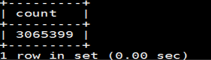
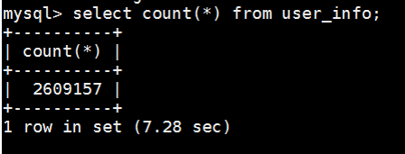
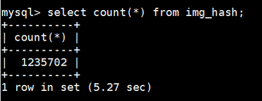
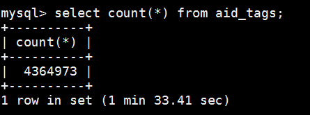
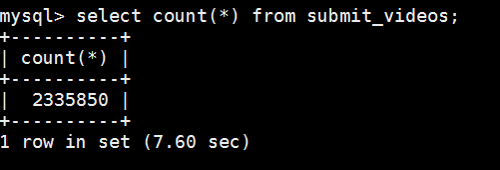
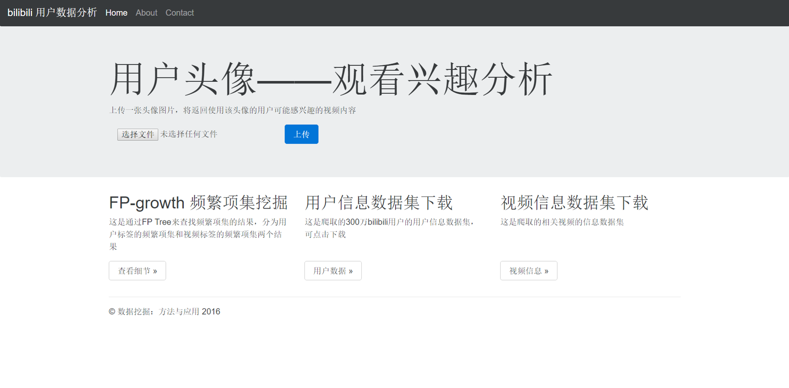
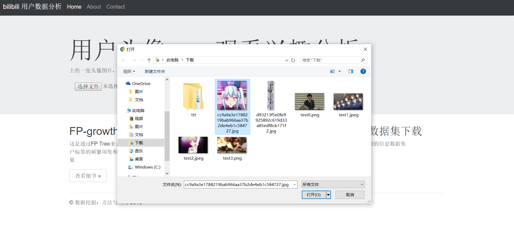
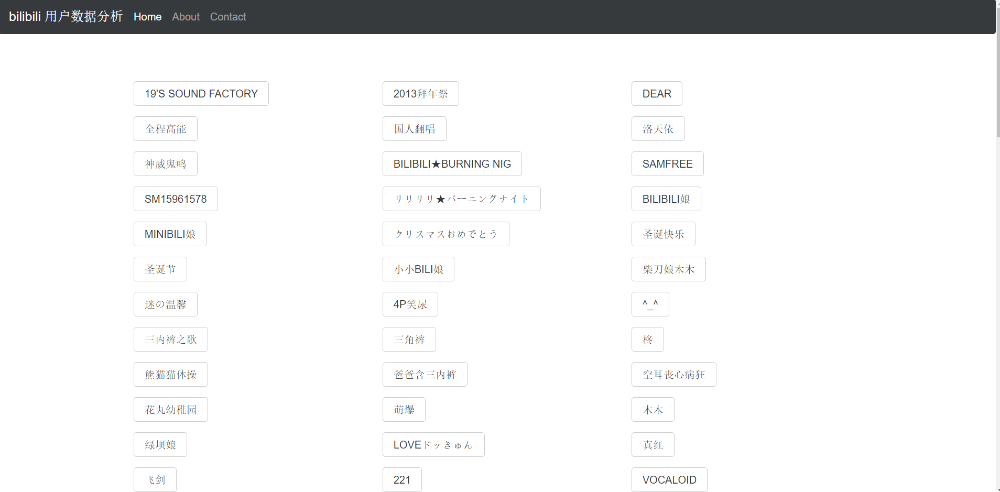
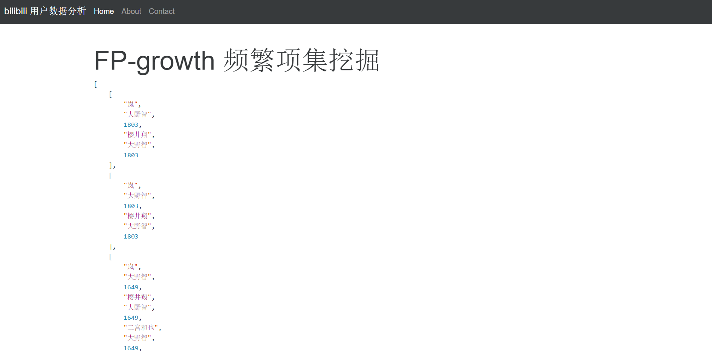

## 文件结构

```
数据挖掘.zip 

	代码 （这个文件夹里是全部代码）
	报告.html  （报告）
	img  （报告.html能显示图片用的）
```

## 1.前言 - 数据获取
### 哔哩哔哩弹幕视频网
哔哩哔哩弹幕视频网，简称“B站”，是一个国内的大型视频分享网站，特色是悬浮于视频上方的实时评论功能。与其他视频网站相比，其用户特征非常明显，以25岁以下年轻人为主。

*	分析网站结构
	bilibili网页文字内容以视频介绍、弹幕等视频相关信息为主，但是可以发现，如果在评论区等地方直接点击用户名，如下所示
	
	这时就会跳转到该用户的详细信息界面，如图
	
	于是就以该页面为基础，设置网络爬虫的爬取

	爬虫部分的代码在文件夹 `代码/code` 中，每一个spider开头的py文件是一部分网站信息的爬取，可以在linux下使用命令运行爬虫
	```
	scrapy runspider --nolog "这个文件夹里的某个spider开头的py文件.py"
	```

*	相关工具
	*	在腾讯云服务器上运行爬虫爬取数据，后续操作也在服务器上完成
	*	Scrapy是一个比较著名的Python网络爬虫框架，使用scrapy框架进行bilibili用户相关数据的爬取
	*	使用mysql作为数据库存储爬取到的相关数据


## 2. 数据清洗
上一步爬到了许多数据，需要对数据进行一些处理。还有在上一步得到的数据都是分散的，比如用户信息和视频信息。

这一步耗时较多，但是都是一些琐碎的事情。比如，是因为B站的历史遗留问题，有些项的默认值有好多种；有些只能是为正的值，可能是因为B站版本更换的原因，部分用户成为了负数等等

*	大致结果统计
	*	总爬到的用户数量
		
	*	清洗后用户数量
		
	*	在这260万用户中，设置了用户头像的有120万
		
	*	这些用户相关的标签数量
		
	*	和用户相关的用户数量，表名叫`submit_videos`是一个"历史遗留"问题，第一个爬虫爬的时候这么用了，后面就懒得改了，其实里面包括了用户相关的收藏夹视频、投币视频和上传视频信息
		

	这一步的代码还是在文件夹`代码/code`中，不已spider开头的应该都是，可以在Linux下直接使用如下命令运行
	```
	python "这个文件夹里的某个py文件.py"
	```

*	相关工具
	*	继续在腾讯云服务器上完成操作
	*	使用python进行相关的操作
	*	使用redis存一些值非常方便，尤其是一边写一遍调试的时候
	*	使用mysql作为数据库存储爬取到的相关数据

## 3. 数据分析与挖掘

首先对这些信息进行一些大致的观察，可以得到一些有趣的信息。比如在这些用户中选取注册时间最早的10万名用户，从他们喜爱的视频种类进行统计分析，发现最火的不是B站代表鬼畜类视频和动画类视频，而是日剧和搞笑集锦类视频；

在这260万名用户中，上传了头像的有120万。头像是纯白色或者纯黑色头像的用户最多，加起来有上千名用户，比其他完全重合头像的群体都要多。把系统默认头像截图然后作为头像的人第二多，加起来有上百名用户。

我使用了一个网站来展示结果
```
http://data.honoumi.com
```

上面爬到的数据也可以在这上面查看和下载

这部分的代码分布比较广，首先是整个网站的代码，包括网站后端与前端，在文件夹 `代码/django` 中，后端运算的具体逻辑都在上面这个文件夹里的`bili`这个文件夹中
FP-growth 是直接预处理过的，所以没和网站代码放在一起，在文件夹 `代码/code/fp_Growth` 中

可以上传一张头像图片
比如

因为我没怎么优化代码，所以后台算的比较慢，需要等大概几十秒
返回结果


也可以查看fp-growth结果


也可以下载我用爬虫爬到的数据集，不过点击的时候要小心流量，总大小有2-3个G左右

*	相关工具
	*	python
		*	django，一个python的后端框架
		*	numpy，一个python的数学库
		*	python imaging library，一个python的图像处理库
	*	mysql，用来存数据的数据库
	*	腾讯云，从第一步开始就一直在腾讯云上运行代码
	*	github，用了github的静态网页托管服务
	*	bootstrap，一个前端框架