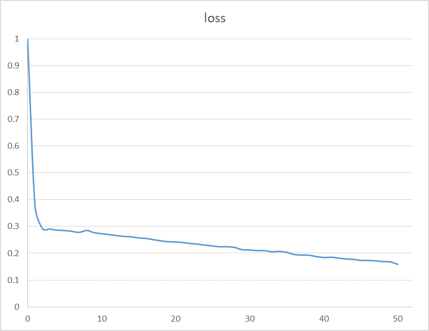
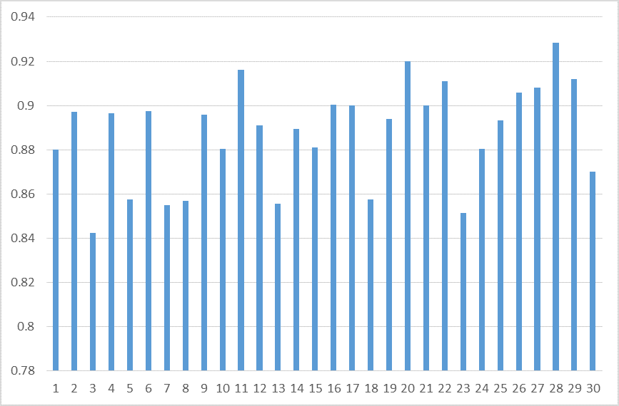

In this problem, we are given reference genome of Homo sapiens and
the genomic loci of all circRNAs. Given a certain genomic locus, our goal is to develop a classifier
to predict whether a pair of two loci will form a circRNA or not

FASTA format is used to store reference genome. Details of this format can be found in (https://en.wikipedia.org/wiki/FASTA_format). For python user, we use tools like biopython to parse fasta files (https://www.biostars.org/p/710/).

All other data are stored in BED format. chrom is the name of the chromosome. chromStart is
the starting position of the circRNA in the chromosome. Note that the first base in a chromosome
is numbered 0; chromEnd is the ending position of the circRNA in the chromosome. Note that
chromEnd base should not be included in the display of circRNA. For example, the first 200 bases
of a chromosome are defined as chromStart=0, chromEnd=200, and span the bases numbered 0-199. strand defines the strand that circRNA lies in. Note that the FASTA file of the reference
genome only contains + strand, we should covert + strand to − strand. A complete description of BED format can be found in
http://genome.ucsc.edu/FAQ/FAQformat.html#format1

hsa hg19 Rybak2015.bed stores the genomic loci of circRNAs (positions where DNA sequence
can be transcribed and form circRNAs) of Homo sapiens. These data are considered as positive
examples.

all exons.bed store thes genomic loci of exons. We should use this file to construct negative
examples. All exons that are not overlapped with circRNAs can be considered as negative examples.
hg19 Alu.bed stores the genomic loci of Alu.

####Dependency package:
* Python 3.5
* Keras 1.2.0
* Tensorflow r0.12
* Numpy 1.7.1

neural network structure:
10000->640(relu)->dropout->64(relu)->dropout->1(sigmoid)


```python
# coding:utf-8


from keras.models import Sequential
import numpy as np
import random
from matplotlib import pyplot as plt
from keras.preprocessing import sequence
from keras.layers import Dense, Dropout, Embedding, LSTM, Bidirectional, SimpleRNN
from keras.layers.core import Activation

dna2int = {
    'A': 1,
    'T': 2,
    'C': 3,
    'G': 4,
    'a': 5,
    't': 6,
    'c': 7,
    'g': 8,
    'N': 9,
}

def dna2vec(dna):
    d = []
    for c in dna:
        if c == '\n':
            continue
        temp_l = [0 for i in range(10)]
        temp_l[dna2int[c]] = 1
        d.append(temp_l)
    return d

def dna_to_int(dna):
    d = []
    for c in dna:
        if c == '\n':
            break
        d.append(dna2int[c])
    return d

MAX_LEN = 5000
DATA_STEP = 20000
data1 = []
data2 = []
with open('formalization_all_exons_lines.txt', 'r') as f1:
    with open('formalization_hsa_hg19_Rybak2015_lines.txt', 'r') as f2:
        lines_1 = f1.readlines()
        lines_2 = f2.readlines()

        data_start_number_1 = random.randint(0, len(lines_1) - DATA_STEP)
        data_start_number_2 = random.randint(0, len(lines_2) - DATA_STEP)
        print('data_start_number_1 :', data_start_number_1, 'data_start_number_2 :', data_start_number_2)


        dataX = lines_1[data_start_number_1:data_start_number_1+DATA_STEP] + lines_2[data_start_number_2:data_start_number_2+DATA_STEP]
        dataY = [1 for i in range(DATA_STEP)] + [0 for i in range(DATA_STEP)]

        testX = lines_1[:1000] + lines_2[:1000]
        testY = [1 for i in range(1000)] + [0 for i in range(1000)]


testX = [dna_to_int(l) for l in testX]

dataX = [dna_to_int(l) for l in dataX]
dataY = dataY

data_set = dataX
test_set = testX

target_set = np.array(dataY, np.int)
test_tag_set = target_set

data_set = sequence.pad_sequences(data_set, maxlen=MAX_LEN, dtype='int32')
test_set = sequence.pad_sequences(test_set, maxlen=MAX_LEN, dtype='int32')
data_set = np.array(data_set)
test_set = np.array(test_set)

data = data_set

X_train = data_set
Y_train = target_set

model = Sequential()
model.add(Dense(640, input_dim=MAX_LEN))
model.add(Activation('relu'))
model.add(Dropout(0.1))
model.add(Dense(64, input_dim=MAX_LEN))
model.add(Activation('relu'))
model.add(Dropout(0.1))
model.add(Dense(1, activation='sigmoid'))


model.compile('adam', 'binary_crossentropy', metrics=['accuracy'])
model.fit(X_train, Y_train, nb_epoch=50, batch_size=32)

print(model.evaluate(X_train, Y_train, batch_size=32))

for i in range(30):
    step = 1000
    start_number_1 = random.randint(0, len(lines_1) - step)
    start_number_2 = random.randint(0, len(lines_2) - step)

    print('start_number_1 :', start_number_1, 'start_number_2 :', start_number_2)

    testX = lines_1[start_number_1:start_number_1+step] + lines_2[start_number_2:start_number_2+step]
    testY = [1 for i in range(step)] + [0 for i in range(step)]

    testX = [dna_to_int(l) for l in testX]
    test_set = sequence.pad_sequences(testX, maxlen=MAX_LEN, dtype='int32')
    test_set = np.array(test_set)
    test_tag_set = np.array(testY, np.int)

    print(model.evaluate(test_set, test_tag_set, batch_size=32))

```

* train dataset size: 40000
* accuracy: 0.94082
* total time: 55.8 minutes



test dataset(random) :
* step size : 2000
* total size : 30
* accuracy : 

