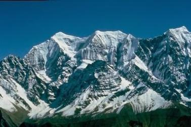
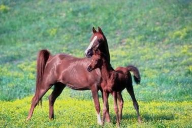
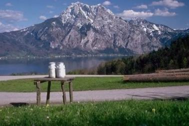

利用色彩直方图对图像进行检索。

首先定义图像向量。

其中P为原图像，Q为目标图像

使用3种算法来测量图像距离。

1. Euclidean (L2)

2. Histogram Intersection (HI)

3. Bhattacharyya (Bh)


生成直方图
```python
# coding:utf-8
import cv2
import json

def rgb_histogram_16(img, height, width):

    l = [0 for i in xrange(16)]

    r_m = 256 // 2
    g_m = 256 // 4
    b_m = 256 // 2

    for i in xrange(height):
        for j in xrange(width):
            (r, g, b) = img[i,j]

            index = (r // r_m) + 2 * (g // g_m) + 2 * 4 * (b // b_m)
            l[index] = l[index] + 1

    return l

def rgb_histogram_128(img, height, width):

    l = [0 for i in xrange(128)]

    r_m = 256 // 4
    g_m = 256 // 8
    b_m = 256 // 4

    for i in xrange(height):
        for j in xrange(width):
            (r, g, b) = img[i,j]
            index = (r // r_m) + 4 * (g // g_m) + 4 * 8 * (b // b_m)
            l[index] = l[index] + 1

    return l

data_dict = {'16':{}, '128':{}}

with open('AllImages.txt', 'r') as f:
    for line in f:
        sl = line.split(' ')
        if len(sl) > 2:
            image_name = sl[0]
            width = int(sl[1])
            height = int(sl[2])
            img = cv2.imread(image_name)
            data_dict['16'][image_name] = rgb_histogram_16(img, height, width)
            data_dict['128'][image_name] = rgb_histogram_128(img, height, width)

with open('init-data.json', 'w') as f:
    f.write(json.dumps(data_dict))
```

计算距离
```python
# coding:utf-8

import json
import math

data_dict = {}

with open('init-data.json', 'r') as f:
    data_dict = json.load(f)

query_images = []

with open('QueryImages.txt', 'r') as f:
    for line in f:
        sl = line.split(' ')
        if len(sl) > 2:
            image_name = sl[0]
            width = sl[1]
            height = sl[2]
            query_images.append([image_name, int(width), int(height)])

bins_16_histogram = []
data_dict_16 = data_dict['16']

for img_name in data_dict_16:
    l = data_dict_16[img_name]

    total = 0
    for i in xrange(len(l)):
        total = total + l[i]

    for i in xrange(len(l)):
        l[i] = 1.0 * l[i] / total

    bins_16_histogram.append({'name':img_name,'data':l})


def L2_distance(l1, l2):
    s = 0
    for i in xrange(len(l1)):
        s = s + pow(l1[i] - l2[i], 2)

    return math.sqrt(s)


def HI_distance(l1, l2):
    s = 0
    for i in xrange(len(l1)):
        s = s + min(l1[i], l2[i])

    return 1 - s

def Bh_distance(l1, l2):
    s = 0
    for i in xrange(len(l1)):
        s = s + math.sqrt(l1[i] * l2[i])

    return math.sqrt(1 - s)

average_precision_16 = {}
average_precision_16['L2'] = []
average_precision_16['HI'] = []
average_precision_16['Bh'] = []


for query_img in query_images:
    name = query_img[0]
    width = query_img[1]
    height = query_img[2]

    bins_16 = []
    for d in bins_16_histogram:
        if d['name'] == name:
            bins_16 = d['data']
            break

    L2_distance_list = []
    HI_distance_list = []
    Bh_distance_list = []
    for d in bins_16_histogram:
        d_name = d['name']
        data_l = d['data']

        if d_name == name:
            continue

        L2_distance_list.append({'name':d_name,
                                 'dis':L2_distance(data_l, bins_16)})
        HI_distance_list.append({'name':d_name,
                                 'dis':HI_distance(data_l, bins_16)})
        Bh_distance_list.append({'name':d_name,
                                 'dis':Bh_distance(data_l, bins_16)})

    L2_distance_list = sorted(L2_distance_list, key=lambda x:x['dis'])[0:30]
    HI_distance_list = sorted(HI_distance_list, key=lambda x:x['dis'])[0:30]
    Bh_distance_list = sorted(Bh_distance_list, key=lambda x:x['dis'])[0:30]

    def write_dis_list(l, f):
        for x in l:
            f.write(x['name'] + ' ' + str(x['dis']) + '\n')

    filename = 'res_' + name.replace('/','-') + '_16bins_'
    with open(filename + 'L2.txt', 'w') as f:
        write_dis_list(L2_distance_list, f)
    with open(filename + 'HI.txt', 'w') as f:
        write_dis_list(HI_distance_list, f)
    with open(filename + 'Bh.txt', 'w') as f:
        write_dis_list(Bh_distance_list, f)

    average_precision_16['L2'].append({'name':name, 'average':
                                       sum(map(lambda x: x['dis'],
                                               L2_distance_list)) / 30})

    average_precision_16['HI'].append({'name':name, 'average':
                                       sum(map(lambda x: x['dis'],
                                               HI_distance_list)) / 30})


    average_precision_16['Bh'].append({'name':name, 'average':
                                       sum(map(lambda x: x['dis'],
                                               Bh_distance_list)) / 30})

bins_128_histogram = []
data_dict_128 = data_dict['128']

for img_name in data_dict_128:
    l = data_dict_128[img_name]

    total = 0
    for i in xrange(len(l)):
        total = total + l[i]

    for i in xrange(len(l)):
        l[i] = 1.0 * l[i] / total

    bins_128_histogram.append({'name':img_name,'data':l})

average_precision_128 = {}
average_precision_128['L2'] = []
average_precision_128['HI'] = []
average_precision_128['Bh'] = []

for query_img in query_images:
    name = query_img[0]
    width = query_img[1]
    height = query_img[2]

    bins_128 = []
    for d in bins_128_histogram:
        if d['name'] == name:
            bins_128 = d['data']
            break

    L2_distance_list = []
    HI_distance_list = []
    Bh_distance_list = []
    for d in bins_128_histogram:
        d_name = d['name']
        data_l = d['data']

        if d_name == name:
            continue

        L2_distance_list.append({'name':d_name,
                                 'dis':L2_distance(data_l, bins_128)})
        HI_distance_list.append({'name':d_name,
                                 'dis':HI_distance(data_l, bins_128)})
        Bh_distance_list.append({'name':d_name,
                                 'dis':Bh_distance(data_l, bins_128)})

    L2_distance_list = sorted(L2_distance_list, key=lambda x:x['dis'])[0:30]
    HI_distance_list = sorted(HI_distance_list, key=lambda x:x['dis'])[0:30]
    Bh_distance_list = sorted(Bh_distance_list, key=lambda x:x['dis'])[0:30]

    def write_dis_list(l, f):
        for x in l:
            f.write(x['name'] + ' ' + str(x['dis']) + '\n')

    filename = 'res_' + name.replace('/','-') + '_128bins_'
    with open(filename + 'L2.txt', 'w') as f:
        write_dis_list(L2_distance_list, f)
    with open(filename + 'HI.txt', 'w') as f:
        write_dis_list(HI_distance_list, f)
    with open(filename + 'Bh.txt', 'w') as f:
        write_dis_list(Bh_distance_list, f)


    average_precision_128['L2'].append({'name':name, 'average':
                                       sum(map(lambda x: x['dis'],
                                               L2_distance_list)) / 30})

    average_precision_128['HI'].append({'name':name, 'average':
                                       sum(map(lambda x: x['dis'],
                                               HI_distance_list)) / 30})

    average_precision_128['Bh'].append({'name':name, 'average':
                                       sum(map(lambda x: x['dis'],
                                               Bh_distance_list)) / 30})

def write_average_list(l, f):
    for i in l:
        f.write(i['name'] + ' ' + str(i['average']) + '\n')

    f.write(str(sum(map(lambda x: x['average'], l)) / len(l)))

with open('res_overall_L2_16.txt', 'w') as f:
    write_average_list(average_precision_16['L2'], f)
with open('res_overall_HI_16.txt', 'w') as f:
    write_average_list(average_precision_16['HI'], f)
with open('res_overall_Bh_16.txt', 'w') as f:
    write_average_list(average_precision_16['Bh'], f)

with open('res_overall_L2_128.txt', 'w') as f:
    write_average_list(average_precision_128['L2'], f)
with open('res_overall_HI_128.txt', 'w') as f:
    write_average_list(average_precision_128['HI'], f)
with open('res_overall_Bh_128.txt', 'w') as f:
    write_average_list(average_precision_128['Bh'], f)
```

以图像 `beach/113.jpg` 为例


先是对比按不同距离计算方式的结果
* L2

```
beach/134.jpg 0.137677186442
beach/122.jpg 0.139919900136
beach/112.jpg 0.170543123144
mountains/809.jpg 0.188651267777
beach/132.jpg 0.202992710514
mountains/823.jpg 0.208174379021
beach/133.jpg 0.216244682711
beach/136.jpg 0.219083278382
beach/119.jpg 0.228236175802
mountains/805.jpg 0.229282880798
```
其中 `beach/134.jpg` 距离 0.137677186442


  `beach/122.jpg` 距离 0.139919900136


  `beach/112.jpg` 距离 0.170543123144

感觉匹配结果还可以，图像比较相似

* HI

```
beach/134.jpg 0.131981187537
beach/122.jpg 0.15210590409
mountains/809.jpg 0.196460065508
beach/112.jpg 0.222421684723
mountains/834.jpg 0.226862349878
beach/132.jpg 0.234053497942
mountains/830.jpg 0.240593768372
beach/133.jpg 0.244698496683
beach/115.jpg 0.24916015789
beach/135.jpg 0.255952380952
```
其中`flowers/614.jpg`


  `beach/122.jpg`


  `mountains/809.jpg`

和 L2 时的前两张图片相同，第三张和第四张图片互换了一下位置

* Bh

```
beach/122.jpg 0.127089051466
beach/134.jpg 0.154179502958
mountains/834.jpg 0.197902754449
mountains/809.jpg 0.199309111313
beach/119.jpg 0.218180358319
mountains/830.jpg 0.22271219433
beach/128.jpg 0.238612162928
beach/127.jpg 0.240160635222
buses/312.jpg 0.244401249701
beach/133.jpg 0.247038963759
```
其中 `beach/122.jpg`


  `beach/134.jpg`


  `mountains/834.jpg`

前二名又是这两个，看来它们的确很相似
从这个例子看来，这三种距离对于比较相似的图像的识别还是比较有共通之处的，不过对于有所不同的图像的反应就有一些区别

对比 16 bins 和 128 bins 的结果，上面已经出现了 16 的时候，下面放上 128 的图像

* 128、L2
```
horses/719.jpg 0.327136088981
foods/901.jpg 0.366376131948
beach/112.jpg 0.377965906873
buses/311.jpg 0.37865737103
horses/716.jpg 0.380330431777
foods/920.jpg 0.380744280326
foods/919.jpg 0.383257892651
mountains/824.jpg 0.384145857933
buses/313.jpg 0.384914322625
mountains/800.jpg 0.386463744417
```
其中 `buses/311.jpg`

好像匹配到了奇怪的东西，可能是代码有问题，再重新检查代码


重新检查了代码，果然有问题，修改之后
* 128、L2
```
beach/134.jpg 0.183660623617
beach/127.jpg 0.216883234872
mountains/830.jpg 0.218500081174
mountains/835.jpg 0.241195427718
mountains/803.jpg 0.247272211702
mountains/833.jpg 0.252977377995
mountains/829.jpg 0.260260550787
beach/135.jpg 0.267152675287
mountains/834.jpg 0.26737878973
buses/308.jpg 0.271912188021
```
其中 `beach/134.jpg`

果然又出现了这个图像

  `beach/127.jpg`


  `mountains/830.jpg`


* 128、HI
```
beach/134.jpg 0.313450071387
beach/127.jpg 0.336073318216
mountains/830.jpg 0.355757117662
mountains/833.jpg 0.369383555891
mountains/835.jpg 0.394400352734
mountains/834.jpg 0.406294616612
mountains/803.jpg 0.415711346267
beach/135.jpg 0.415826824557
mountains/828.jpg 0.424256739733
buses/309.jpg 0.424456202234
```
其中 `DataSet/beach/134.jpg` 


  `DataSet/beach/127.jpg`


  `DataSet/mountains/830.jpg`

和 L2 时结果的前三一样

* 128、Bh
```
beach/134.jpg 0.307872386787
beach/127.jpg 0.314306473374
mountains/833.jpg 0.321804919999
mountains/803.jpg 0.364784598703
mountains/830.jpg 0.379896729202
beach/135.jpg 0.384291280058
beach/128.jpg 0.386842551973
buses/309.jpg 0.389839269003
mountains/835.jpg 0.400281106657
mountains/834.jpg 0.401127742134
```
其中 `DataSet/beach/134.jpg`


  `DataSet/beach/127.jpg`


  `DataSet/mountains/833.jpg`

前三张中只有一张和 L2、HI 不同
感觉 128 和 16 之间出现了直接的差别，但是距离计算方式之间的差别不算很大。

观察一下总体的情况，对于下面的文件
```
res_overall_Bh_128.txt
res_overall_Bh_16.txt
res_overall_HI_128.txt
res_overall_HI_16.txt
res_overall_L2_128.txt
res_overall_L2_16.txt
```
以 Bh 为例
`res_overall_Bh_16.txt`文件
```
arborgreens/Image01.jpg 0.188324000561
arborgreens/Image02.jpg 0.18992732555
arborgreens/Image03.jpg 0.172542218214
beach/110.jpg 0.18276675412
beach/112.jpg 0.294493955404
beach/113.jpg 0.269598983469
elephants/510.jpg 0.253993692233
elephants/511.jpg 0.271067761446
elephants/512.jpg 0.275212797227
flowers/600.jpg 0.33531091889
flowers/601.jpg 0.356802480673
flowers/602.jpg 0.330024311649
foods/901.jpg 0.327076701864
foods/902.jpg 0.19078837401
foods/903.jpg 0.204641689287
football/Image09.jpg 0.197247384163
football/Image10.jpg 0.180235797361
football/Image11.jpg 0.165268902942
horses/700.jpg 0.256349675865
horses/701.jpg 0.197522748907
horses/702.jpg 0.324929520272
mountains/800.jpg 0.25526255972
mountains/802.jpg 0.244074748031
mountains/803.jpg 0.224138218296
tribe/10.jpg 0.211874575496
tribe/12.jpg 0.175787494598
tribe/17.jpg 0.172481896183
0.238805388386
```
`res_overall_Bh_128.txt` 文件
```
arborgreens/Image01.jpg 0.379575253107
arborgreens/Image02.jpg 0.333328661185
arborgreens/Image03.jpg 0.316437638502
beach/110.jpg 0.375161917182
beach/112.jpg 0.554815545637
beach/113.jpg 0.418935344047
elephants/510.jpg 0.412968653424
elephants/511.jpg 0.44334773381
elephants/512.jpg 0.402083430353
flowers/600.jpg 0.538939154945
flowers/601.jpg 0.476439257062
flowers/602.jpg 0.494710982403
foods/901.jpg 0.496855297716
foods/902.jpg 0.37010252108
foods/903.jpg 0.35283214766
football/Image09.jpg 0.322061988105
football/Image10.jpg 0.321620711879
football/Image11.jpg 0.355264769844
horses/700.jpg 0.4284228142
horses/701.jpg 0.330747641145
horses/702.jpg 0.466105453911
mountains/800.jpg 0.470838863069
mountains/802.jpg 0.404510471363
mountains/803.jpg 0.387979761501
tribe/10.jpg 0.343733980937
tribe/12.jpg 0.289036235818
tribe/17.jpg 0.303311898278
0.399635856599
```
128 和 16 相比，平均距离明显上升，L2 和 HI 也是同样的情况，可能是因为分箱变多，能分辨出的差异就越多

所以可以通过提高分箱数来提升查询精度。由于直方图是一种全局的信息，也可以增加使用特征点算法或者感知哈希等方法来提升查询精度