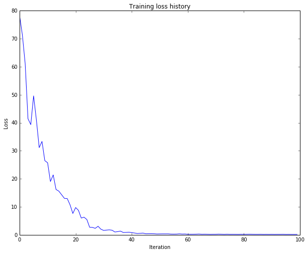
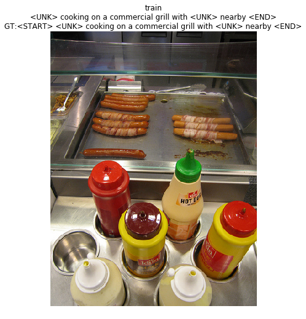
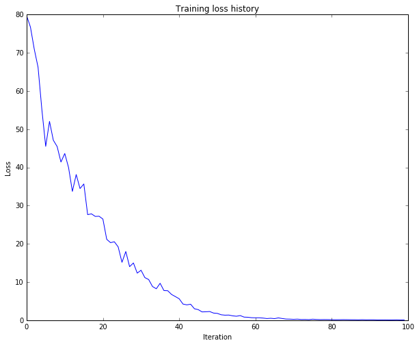
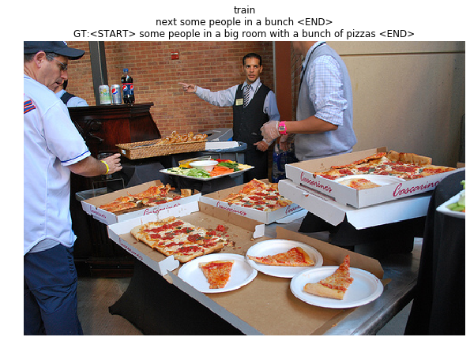
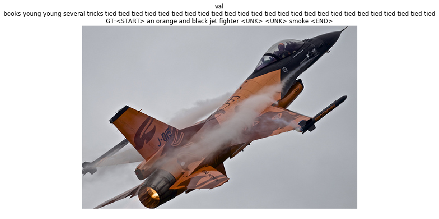

## Option 1. Image Captioning using RNN and LSTM

### Q1: Image Captioning with Vanilla RNNs

The IPython notebook `RNN_Captioning.ipynb` walk through the implementation of an image captioning system on MS-COCO using vanilla recurrent networks.

The file `cs231n/rnn_layers.py` contains implementations of different layer types that are needed for recurrent neural networks. The file `cs231n/classifiers/rnn.py` contains implementations of CaptioningRNN class.

run the following command

```
ipython notebook RNN_Captioning.ipynb
```



result





code: in `cs231n/classifiers/rnn.py`
```python
  def loss(self, features, captions):
    """
    Compute training-time loss for the RNN. We input image features and
    ground-truth captions for those images, and use an RNN (or LSTM) to compute
    loss and gradients on all parameters.

    Inputs:
    - features: Input image features, of shape (N, D)
    - captions: Ground-truth captions; an integer array of shape (N, T) where
      each element is in the range 0 <= y[i, t] < V

    Returns a tuple of:
    - loss: Scalar loss
    - grads: Dictionary of gradients parallel to self.params
    """
    # Cut captions into two pieces: captions_in has everything but the last word
    # and will be input to the RNN; captions_out has everything but the first
    # word and this is what we will expect the RNN to generate. These are offset
    # by one relative to each other because the RNN should produce word (t+1)
    # after receiving word t. The first element of captions_in will be the START
    # token, and the first element of captions_out will be the first word.
    captions_in = captions[:, :-1]
    captions_out = captions[:, 1:]
    # You'll need this
    mask = (captions_out != self._null)

    # Weight and bias for the affine transform from image features to initial
    # hidden state
    W_proj, b_proj = self.params['W_proj'], self.params['b_proj']
    # Word embedding matrix
    W_embed = self.params['W_embed']
    # Input-to-hidden, hidden-to-hidden, and biases for the RNN
    Wx, Wh, b = self.params['Wx'], self.params['Wh'], self.params['b']
    # Weight and bias for the hidden-to-vocab transformation.
    W_vocab, b_vocab = self.params['W_vocab'], self.params['b_vocab']
    loss, grads = 0.0, {}
    ############################################################################
    # TODO: Implement the forward and backward passes for the CaptioningRNN.   #
    # In the forward pass you will need to do the following:                   #
    # (1) Use an affine transformation to compute the initial hidden state     #
    #     from the image features. This should produce an array of shape (N, H)#
    # (2) Use a word embedding layer to transform the words in captions_in     #
    #     from indices to vectors, giving an array of shape (N, T, W).         #
    # (3) Use either a vanilla RNN or LSTM (depending on self.cell_type) to    #
    #     process the sequence of input word vectors and produce hidden state  #
    #     vectors for all timesteps, producing an array of shape (N, T, H).    #
    # (4) Use a (temporal) affine transformation to compute scores over the    #
    #     vocabulary at every timestep using the hidden states, giving an      #
    #     array of shape (N, T, V).                                            #
    # (5) Use (temporal) softmax to compute loss using captions_out, ignoring  #
    #     the points where the output word is <NULL> using the mask above.     #
    #                                                                          #
    # In the backward pass you will need to compute the gradient of the loss   #
    # with respect to all model parameters. Use the loss and grads variables   #
    # defined above to store loss and gradients; grads[k] should give the      #
    # gradients for self.params[k].                                            #
    ############################################################################

    affine_out, affine_cache = affine_forward(features, W_proj, b_proj)
    embed_out, embed_cache = word_embedding_forward(captions_in, W_embed)
    forward = rnn_forward if self.cell_type == 'rnn' else lstm_forward
    forward_out, forward_cache = forward(embed_out, affine_out, Wx, Wh, b)
    temporal_out, temporal_cache = temporal_affine_forward(forward_out, W_vocab, b_vocab)
    loss, dx = temporal_softmax_loss(temporal_out, captions_out, mask, False)
    drnn, dW_vocab, db_vocab = temporal_affine_backward(dx, temporal_cache)
    backward = rnn_backward if self.cell_type == 'rnn' else lstm_backward
    dembed, daffine, dWx, dWh, db = backward(drnn, forward_cache)
    dW_embed = word_embedding_backward(dembed, embed_cache)
    dx, dW_proj, db_proj = affine_backward(daffine, affine_cache)
    grads = {'W_vocab':dW_vocab,'b_vocab':db_vocab,'Wx':dWx,'Wh':dWh,'b':db,
             'W_embed':dW_embed,'W_proj':dW_proj,'b_proj':db_proj}

    ############################################################################
    #                             END OF YOUR CODE                             #
    ############################################################################
    return loss, grads
```
in `cs231n/classifiers/rnn.py`
```python
  def sample(self, features, max_length=30):
    """
    Run a test-time forward pass for the model, sampling captions for input
    feature vectors.

    At each timestep, we embed the current word, pass it and the previous hidden
    state to the RNN to get the next hidden state, use the hidden state to get
    scores for all vocab words, and choose the word with the highest score as
    the next word. The initial hidden state is computed by applying an affine
    transform to the input image features, and the initial word is the <START>
    token.

    For LSTMs you will also have to keep track of the cell state; in that case
    the initial cell state should be zero.

    Inputs:
    - features: Array of input image features of shape (N, D).
    - max_length: Maximum length T of generated captions.

    Returns:
    - captions: Array of shape (N, max_length) giving sampled captions,
      where each element is an integer in the range [0, V). The first element
      of captions should be the first sampled word, not the <START> token.
    """
    N = features.shape[0]
    captions = self._null * np.ones((N, max_length), dtype=np.int32)

    # Unpack parameters
    W_proj, b_proj = self.params['W_proj'], self.params['b_proj']
    W_embed = self.params['W_embed']
    Wx, Wh, b = self.params['Wx'], self.params['Wh'], self.params['b']
    W_vocab, b_vocab = self.params['W_vocab'], self.params['b_vocab']

    ###########################################################################
    # TODO: Implement test-time sampling for the model. You will need to      #
    # initialize the hidden state of the RNN by applying the learned affine   #
    # transform to the input image features. The first word that you feed to  #
    # the RNN should be the <START> token; its value is stored in the         #
    # variable self._start. At each timestep you will need to do to:          #
    # (1) Embed the previous word using the learned word embeddings           #
    # (2) Make an RNN step using the previous hidden state and the embedded   #
    #     current word to get the next hidden state.                          #
    # (3) Apply the learned affine transformation to the next hidden state to #
    #     get scores for all words in the vocabulary                          #
    # (4) Select the word with the highest score as the next word, writing it #
    #     to the appropriate slot in the captions variable                    #
    #                                                                         #
    # For simplicity, you do not need to stop generating after an <END> token #
    # is sampled, but you can if you want to.                                 #
    #                                                                         #
    # HINT: You will not be able to use the rnn_forward or lstm_forward       #
    # functions; you'll need to call rnn_step_forward or lstm_step_forward in #
    # a loop.                                                                 #
    ###########################################################################

    if self.cell_type == 'rnn':
      prev_word = np.zeros((N, 1), dtype=np.int32) + self._start
      prev_h, affine_cache = affine_forward(features, W_proj, b_proj)
      for t in xrange(max_length):
        embed_out, embed_cache = word_embedding_forward(prev_word, W_embed)
        embed_out = embed_out.reshape((embed_out.shape[0],embed_out.shape[2]))
        h, rnn_cache = rnn_step_forward(embed_out, prev_h, Wx, Wh, b)
        scores, affine_cache = affine_forward(h, W_vocab, b_vocab)
        prev_word = captions[:, t] = scores.argmax(axis=1)
        prev_word = prev_word.reshape(N, 1)
        prev_h = h
    else:
      prev_word = np.zeros((N, 1), dtype=np.int32) + self._start
      prev_h, affine_cache = affine_forward(features, W_proj, b_proj)
      N, H = prev_h.shape
      prev_c = np.zeros((N,H))
      for t in xrange(max_length):
        embed_out, embed_cache = word_embedding_forward(prev_word, W_embed)
        embed_out = embed_out.reshape((embed_out.shape[0],embed_out.shape[2]))
        h, c, lstm_cache = lstm_step_forward(embed_out, prev_c, prev_h, Wx, Wh, b)
        scores, affine_cache = affine_forward(h, W_vocab, b_vocab)
        prev_word = captions[:, t] = scores.argmax(axis=1)
        prev_word = prev_word.reshape(N, 1)
        prev_h = h
        prev_c = c

    ############################################################################
    #                             END OF YOUR CODE                             #
    ############################################################################
    return captions
```

### Q2: Image Captioning with LSTMs

The IPython notebook `LSTM_Captioning.ipynb` walk through the implementation of Long-Short Term Memory (LSTM) RNNs, and apply them to image captioning on MS-COCO.

The file `cs231n/rnn_layers.py` contains implementations of different layer types that are needed for LSTM. The file `cs231n/classifiers/rnn.py` contains implementations of CaptioningRNN class.

run the following command

```
ipython notebook LSTM_Captioning.ipynb
```



result






code: in `cs231n/rnn_layers.py`
```python
def rnn_step_forward(x, prev_h, Wx, Wh, b):
  """
  Run the forward pass for a single timestep of a vanilla RNN that uses a tanh
  activation function.

  The input data has dimension D, the hidden state has dimension H, and we use
  a minibatch size of N.

  Inputs:
  - x: Input data for this timestep, of shape (N, D).
  - prev_h: Hidden state from previous timestep, of shape (N, H)
  - Wx: Weight matrix for input-to-hidden connections, of shape (D, H)
  - Wh: Weight matrix for hidden-to-hidden connections, of shape (H, H)
  - b: Biases of shape (H,)

  Returns a tuple of:
  - next_h: Next hidden state, of shape (N, H)
  - cache: Tuple of values needed for the backward pass.
  """
  next_h, cache = None, None
  ##############################################################################
  # TODO: Implement a single forward step for the vanilla RNN. Store the next  #
  # hidden state and any values you need for the backward pass in the next_h   #
  # and cache variables respectively.                                          #
  ##############################################################################

  next_h = np.tanh(np.dot(x, Wx) + np.dot(prev_h, Wh) + b)

  cache = (x, prev_h, Wx, Wh, next_h)
  ##############################################################################
  #                               END OF YOUR CODE                             #
  ##############################################################################
  return next_h, cache
```

in `cs231n/rnn_layers.py`
```python
def rnn_step_backward(dnext_h, cache):
  """
  Backward pass for a single timestep of a vanilla RNN.

  Inputs:
  - dnext_h: Gradient of loss with respect to next hidden state
  - cache: Cache object from the forward pass

  Returns a tuple of:
  - dx: Gradients of input data, of shape (N, D)
  - dprev_h: Gradients of previous hidden state, of shape (N, H)
  - dWx: Gradients of input-to-hidden weights, of shape (N, H)
  - dWh: Gradients of hidden-to-hidden weights, of shape (H, H)
  - db: Gradients of bias vector, of shape (H,)
  """
  dx, dprev_h, dWx, dWh, db = None, None, None, None, None
  ##############################################################################
  # TODO: Implement the backward pass for a single step of a vanilla RNN.      #
  #                                                                            #
  # HINT: For the tanh function, you can compute the local derivative in terms #
  # of the output value from tanh.                                             #
  ##############################################################################

  x, prev_h, Wx, Wh, next_h = cache

  dt = (1 - next_h ** 2) * dnext_h
  dx = np.dot(dt, np.transpose(Wx))
  dprev_h = np.dot(dt, np.transpose(Wh))
  dWx = np.dot(np.transpose(x), dt)
  dWh = np.dot(np.transpose(prev_h), dt)
  db = np.sum(dt, axis=0)

  ##############################################################################
  #                               END OF YOUR CODE                             #
  ##############################################################################
  return dx, dprev_h, dWx, dWh, db
```

in `cs231n/rnn_layers.py`
```python
def rnn_forward(x, h0, Wx, Wh, b):
  """
  Run a vanilla RNN forward on an entire sequence of data. We assume an input
  sequence composed of T vectors, each of dimension D. The RNN uses a hidden
  size of H, and we work over a minibatch containing N sequences. After running
  the RNN forward, we return the hidden states for all timesteps.

  Inputs:
  - x: Input data for the entire timeseries, of shape (N, T, D).
  - h0: Initial hidden state, of shape (N, H)
  - Wx: Weight matrix for input-to-hidden connections, of shape (D, H)
  - Wh: Weight matrix for hidden-to-hidden connections, of shape (H, H)
  - b: Biases of shape (H,)

  Returns a tuple of:
  - h: Hidden states for the entire timeseries, of shape (N, T, H).
  - cache: Values needed in the backward pass
  """
  h, cache = None, None
  ##############################################################################
  # TODO: Implement forward pass for a vanilla RNN running on a sequence of    #
  # input data. You should use the rnn_step_forward function that you defined  #
  # above.                                                                     #
  ##############################################################################

  N, T, D = x.shape
  N, H = h0.shape
  h = np.zeros((N, T, H))
  cache = []
  prev_h = h0
  for i in xrange(T):
    prev_h, _cache = rnn_step_forward(x[:, i, :], prev_h, Wx, Wh, b)
    cache.append(_cache)
    h[:, i, :] = prev_h

  ##############################################################################
  #                               END OF YOUR CODE                             #
  ##############################################################################
  return h, cache
```
in `cs231n/rnn_layers.py`
```python
def rnn_backward(dh, cache):
  """
  Compute the backward pass for a vanilla RNN over an entire sequence of data.

  Inputs:
  - dh: Upstream gradients of all hidden states, of shape (N, T, H)

  Returns a tuple of:
  - dx: Gradient of inputs, of shape (N, T, D)
  - dh0: Gradient of initial hidden state, of shape (N, H)
  - dWx: Gradient of input-to-hidden weights, of shape (D, H)
  - dWh: Gradient of hidden-to-hidden weights, of shape (H, H)
  - db: Gradient of biases, of shape (H,)
  """
  dx, dh0, dWx, dWh, db = None, None, None, None, None
  ##############################################################################
  # TODO: Implement the backward pass for a vanilla RNN running an entire      #
  # sequence of data. You should use the rnn_step_backward function that you   #
  # defined above.                                                             #
  ##############################################################################

  N, T, H = dh.shape
  N, D = cache[0][0].shape
  dx = np.zeros((N, T, D))
  dh0 = np.zeros((N, H))
  dWx = np.zeros((D, H))
  dWh = np.zeros((H, H))
  db = np.zeros(H)
  dprevh= np.zeros((N, H))
  for i in xrange(T - 1, -1, -1):
    t_dx, t_dprevh, t_dWx, t_dWh, t_db = rnn_step_backward(dh[:,i,:] + dprevh, cache[i])
    dx[:,i,:] = t_dx
    dWx += t_dWx
    dWh += t_dWh
    db += t_db
    dprevh = t_dprevh
  dh0 = dprevh

  ##############################################################################
  #                               END OF YOUR CODE                             #
  ##############################################################################
  return dx, dh0, dWx, dWh, db
```

in `cs231n/rnn_layers.py`
```python
def word_embedding_forward(x, W):
  """
  Forward pass for word embeddings. We operate on minibatches of size N where
  each sequence has length T. We assume a vocabulary of V words, assigning each
  to a vector of dimension D.

  Inputs:
  - x: Integer array of shape (N, T) giving indices of words. Each element idx
    of x muxt be in the range 0 <= idx < V.
  - W: Weight matrix of shape (V, D) giving word vectors for all words.

  Returns a tuple of:
  - out: Array of shape (N, T, D) giving word vectors for all input words.
  - cache: Values needed for the backward pass
  """
  out, cache = None, None
  ##############################################################################
  # TODO: Implement the forward pass for word embeddings.                      #
  #                                                                            #
  # HINT: This should be very simple.                                          #
  ##############################################################################

  N, T = x.shape
  V, D = W.shape
  out = np.zeros((N, T, D))
  for i in xrange(N):
    for j in xrange(T):
      out[i, j] = W[x[i, j]]

  cache = (x, W, out)

  ##############################################################################
  #                               END OF YOUR CODE                             #
  ##############################################################################
  return out, cache
```

in `cs231n/rnn_layers.py`
```python
def word_embedding_backward(dout, cache):
  """
  Backward pass for word embeddings. We cannot back-propagate into the words
  since they are integers, so we only return gradient for the word embedding
  matrix.

  HINT: Look up the function np.add.at

  Inputs:
  - dout: Upstream gradients of shape (N, T, D)
  - cache: Values from the forward pass

  Returns:
  - dW: Gradient of word embedding matrix, of shape (V, D).
  """
  dW = None
  ##############################################################################
  # TODO: Implement the backward pass for word embeddings.                     #
  #                                                                            #
  # HINT: Look up the function np.add.at                                       #
  ##############################################################################

  x, W, o = cache
  dW = np.zeros((W.shape[0], dout.shape[2]))
  np.add.at(dW, x, dout)

  ##############################################################################
  #                               END OF YOUR CODE                             #
  ##############################################################################
  return dW
```
in `cs231n/rnn_layers.py`
```python
def lstm_step_forward(x, prev_h, prev_c, Wx, Wh, b):
  """
  Forward pass for a single timestep of an LSTM.

  The input data has dimension D, the hidden state has dimension H, and we use
  a minibatch size of N.

  Inputs:
  - x: Input data, of shape (N, D)
  - prev_h: Previous hidden state, of shape (N, H)
  - prev_c: previous cell state, of shape (N, H)
  - Wx: Input-to-hidden weights, of shape (D, 4H)
  - Wh: Hidden-to-hidden weights, of shape (H, 4H)
  - b: Biases, of shape (4H,)

  Returns a tuple of:
  - next_h: Next hidden state, of shape (N, H)
  - next_c: Next cell state, of shape (N, H)
  - cache: Tuple of values needed for backward pass.
  """
  next_h, next_c, cache = None, None, None
  #############################################################################
  # TODO: Implement the forward pass for a single timestep of an LSTM.        #
  # You may want to use the numerically stable sigmoid implementation above.  #
  #############################################################################

  N, H = prev_h.shape
  a = np.dot(prev_h, Wh) + np.dot(x, Wx) + b
  i = sigmoid(a[:,:H])
  f = sigmoid(a[:,H:2*H])
  o = sigmoid(a[:,2*H:3*H])
  g = np.tanh(a[:,3*H:])
  next_c = g*i + prev_c*f
  next_h = np.tanh(next_c) * o
  cache = (next_c, i, f, o, g, a, x, Wx, Wh, prev_h, prev_c)

  ##############################################################################
  #                               END OF YOUR CODE                             #
  ##############################################################################

  return next_h, next_c, cache
```

in `cs231n/rnn_layers.py`
```python
def lstm_step_backward(dnext_h, dnext_c, cache):
  """
  Backward pass for a single timestep of an LSTM.

  Inputs:
  - dnext_h: Gradients of next hidden state, of shape (N, H)
  - dnext_c: Gradients of next cell state, of shape (N, H)
  - cache: Values from the forward pass

  Returns a tuple of:
  - dx: Gradient of input data, of shape (N, D)
  - dprev_h: Gradient of previous hidden state, of shape (N, H)
  - dprev_c: Gradient of previous cell state, of shape (N, H)
  - dWx: Gradient of input-to-hidden weights, of shape (D, 4H)
  - dWh: Gradient of hidden-to-hidden weights, of shape (H, 4H)
  - db: Gradient of biases, of shape (4H,)
  """
  dx, dh, dc, dWx, dWh, db = None, None, None, None, None, None
  #############################################################################
  # TODO: Implement the backward pass for a single timestep of an LSTM.       #
  #                                                                           #
  # HINT: For sigmoid and tanh you can compute local derivatives in terms of  #
  # the output value from the nonlinearity.                                   #
  #############################################################################

  next_c, i, f, o, g, a, x, Wx, Wh, prev_h, prev_c = cache
  dnext_c = dnext_c + (dnext_h*o) * (1 - np.tanh(next_c)**2)
  dprev_c = dnext_c*f
  di = g*dnext_c
  df = dnext_c*prev_c
  do = np.tanh(next_c)*dnext_h
  dg = dnext_c*i
  da = np.zeros(a.shape)
  H = next_c.shape[1]
  da[:,:H] = di*i*(1-i)
  da[:,H:2*H] = df*f*(1-f)
  da[:,2*H:3*H] = do*o*(1-o)
  da[:,3*H:] = dg*(1-g**2)
  db = np.sum(da, axis=0)
  dWx = np.dot(np.transpose(x), da)
  dWh = np.dot(np.transpose(prev_h), da)
  dx = np.dot(da, np.transpose(Wx))
  dprev_h = np.dot(da, np.transpose(Wh))

  ##############################################################################
  #                               END OF YOUR CODE                             #
  ##############################################################################

  return dx, dprev_h, dprev_c, dWx, dWh, db
```

in `cs231n/rnn_layers.py`
```python
def lstm_forward(x, h0, Wx, Wh, b):
  """
  Forward pass for an LSTM over an entire sequence of data. We assume an input
  sequence composed of T vectors, each of dimension D. The LSTM uses a hidden
  size of H, and we work over a minibatch containing N sequences. After running
  the LSTM forward, we return the hidden states for all timesteps.

  Note that the initial cell state is passed as input, but the initial cell
  state is set to zero. Also note that the cell state is not returned; it is
  an internal variable to the LSTM and is not accessed from outside.

  Inputs:
  - x: Input data of shape (N, T, D)
  - h0: Initial hidden state of shape (N, H)
  - Wx: Weights for input-to-hidden connections, of shape (D, 4H)
  - Wh: Weights for hidden-to-hidden connections, of shape (H, 4H)
  - b: Biases of shape (4H,)

  Returns a tuple of:
  - h: Hidden states for all timesteps of all sequences, of shape (N, T, H)
  - cache: Values needed for the backward pass.
  """
  h, cache = None, None
  #############################################################################
  # TODO: Implement the forward pass for an LSTM over an entire timeseries.   #
  # You should use the lstm_step_forward function that you just defined.      #
  #############################################################################

  N, T, D = x.shape
  N, H = h0.shape
  h = np.zeros((N, T, H))
  prev_h = h0
  prev_c = np.zeros((N, H))
  cache = []
  for t in xrange(T):
    prev_h, prev_c, t_cache = lstm_step_forward(x[:,t,:],prev_h,prev_c,Wx,Wh,b)
    h[:,t,:] = prev_h
    cache.append(t_cache)
  cache = (cache, D)

  ##############################################################################
  #                               END OF YOUR CODE                             #
  ##############################################################################

  return h, cache
```

in `cs231n/rnn_layers.py`
```python
def lstm_backward(dh, cache):
  """
  Backward pass for an LSTM over an entire sequence of data.]

  Inputs:
  - dh: Upstream gradients of hidden states, of shape (N, T, H)
  - cache: Values from the forward pass

  Returns a tuple of:
  - dx: Gradient of input data of shape (N, T, D)
  - dh0: Gradient of initial hidden state of shape (N, H)
  - dWx: Gradient of input-to-hidden weight matrix of shape (D, 4H)
  - dWh: Gradient of hidden-to-hidden weight matrix of shape (H, 4H)
  - db: Gradient of biases, of shape (4H,)
  """
  dx, dh0, dWx, dWh, db = None, None, None, None, None
  #############################################################################
  # TODO: Implement the backward pass for an LSTM over an entire timeseries.  #
  # You should use the lstm_step_backward function that you just defined.     #
  #############################################################################
  N, T, H = dh.shape
  cache, D = cache
  dx = np.zeros((N, T, D))
  dh0 = np.zeros((N, H))
  dWx = np.zeros((D, 4*H))
  dWh = np.zeros((H, 4*H))
  db = np.zeros((4*H,))
  dprev_h = np.zeros((N, H))
  dprev_c = np.zeros((N, H))
  for i in xrange(T-1, -1, -1):
    dx_i,dprev_h,dprev_c,dWx_i,dWh_i,db_i = lstm_step_backward(dh[:,i,:]+dprev_h,dprev_c,cache[i])
    dx[:,i,:] = dx_i
    dWh += dWh_i
    dWx += dWx_i
    db += db_i
  dh0 = dprev_h

  ##############################################################################
  #                               END OF YOUR CODE                             #
  ##############################################################################

  return dx, dh0, dWx, dWh, db
```
