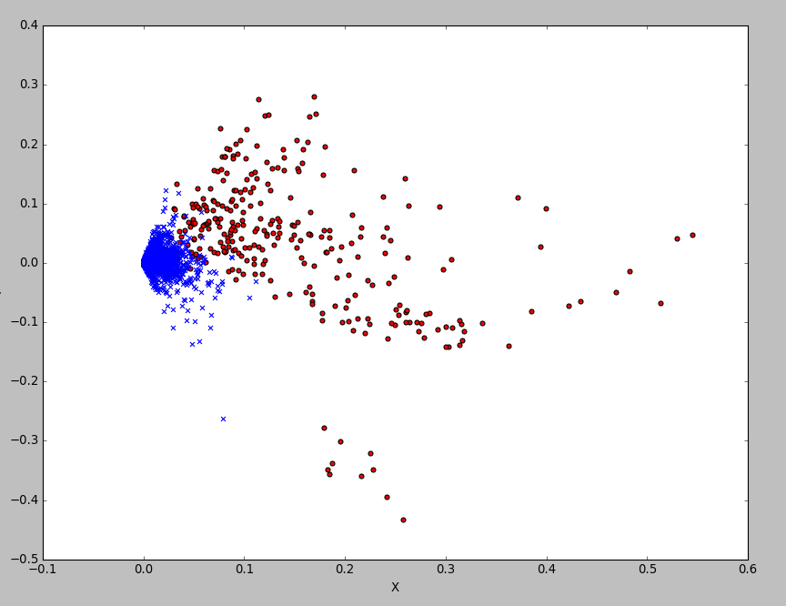
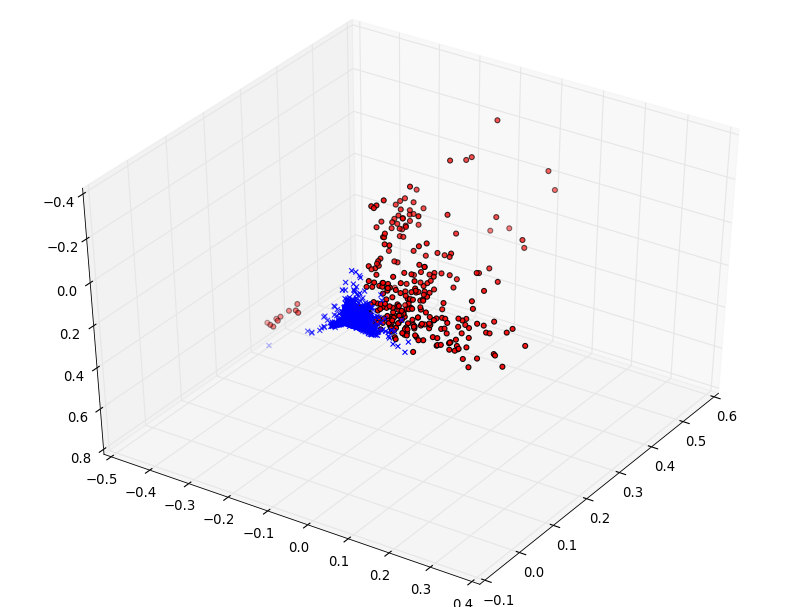

在 zhwiki 数据集中取300篇文章作为数据集，进行LSI分析，借助python的gensim库使用tfidf
```python
# coding:utf-8

from gensim import corpora, models
import numpy as np
import thulac
import heapq

news = []
with open('news.txt', 'r') as f:
    news = f.readlines()

thu1 = thulac.thulac("-seg_only")
texts = [thu1.cut(n) for n in news]
dictionary = corpora.Dictionary(texts)
corpus = [dictionary.doc2bow(text) for text in texts]
tfidf = models.TfidfModel(corpus)
corpus_tfidf = tfidf[corpus]

def split_sen(document):
    doc = document
    l = ['。', '，', ',', '：', '？', '！', '；']
    for i in l:
        doc = ' '.join(doc.split(i))

    return doc.split()

def dedupe(items):
    seen = set()
    for item in items:
        if item not in seen:
            yield item
            seen.add(item)

def has_num(word):
    s = '1234567890'
    for i in s:
        if i in word:
            return True
    return False

for test_n in [10,21,66,71,87]:
    test_news = news[test_n]
    test_sentences = test_news.split('。')
    test_sentences = split_sen(test_news)

    test_sentences = list(dedupe(test_sentences[3:]))

    sen_list = []
    for sentence in test_sentences:
        word_list = thu1.cut(sentence)
        tf_list = []
        w_tf_list = []
        for n in tfidf[dictionary.doc2bow(word_list)]:
            tf_list.append([dictionary[n[0]], n[1]])

        temp_l = heapq.nlargest(10, tf_list, key=lambda x: x[1])
        gi = 0
        if len(temp_l) < 4:
            gi = 0.1
        else:
            gi = 0
            for index, g_n in enumerate(temp_l):
                gi = gi + g_n[1]

        g = gi / np.log(30 + len(word_list))

        sen_list.append((sentence, g))

    res = list(heapq.nlargest(3, sen_list, key=lambda s: s[1]))
    print test_n + 1
    res_list = []
    for s in res:
        res_list.append([s[0], test_sentences.index(s[0])])

    res = sorted(res_list, key=lambda x: x[1])

    for s in res:
        print s[0]
```


*	k取不同值时，对term-doc矩阵近似程度的变化情况
	当 k=2 时

	```
	[[[ 0.          0.16872732]
	  [ 1.          0.28385104]]
	
	 [[ 0.          0.17087512]
	  [ 1.          0.25177949]]
	
	 [[ 0.          0.09310504]
	  [ 1.          0.06657734]]
	
	 ..., 
	 [[ 0.          0.12855813]
	  [ 1.          0.05259002]]
	
	 [[ 0.          0.16851364]
	  [ 1.         -0.05191722]]
	
	 [[ 0.          0.10435963]
	  [ 1.          0.02791414]]]
	
	```
	k=3 时
	```
	[[[ 0.          0.16897327]
	  [ 1.          0.28507598]
	  [ 2.          0.13649461]]
	
	 [[ 0.          0.17080689]
	  [ 1.          0.24925751]
	  [ 2.          0.08284236]]
	
	 [[ 0.          0.09272927]
	  [ 1.          0.06470531]
	  [ 2.          0.00207098]]
	
	 ..., 
	 [[ 0.          0.12813977]
	  [ 1.          0.04945443]
	  [ 2.         -0.06896024]]
	
	 [[ 0.          0.1677073 ]
	  [ 1.         -0.05385373]
	  [ 2.         -0.13225321]]
	
	 [[ 0.          0.10473032]
	  [ 1.          0.02769582]
	  [ 2.         -0.03988227]]]
	```
	k=4 时
	```
	[[[ 0.          0.16871857]
	  [ 1.         -0.28459085]
	  [ 2.         -0.13770419]
	  [ 3.         -0.069019  ]]
	
	 [[ 0.          0.17117359]
	  [ 1.         -0.25219388]
	  [ 2.         -0.08207103]
	  [ 3.         -0.09496462]]
	
	 [[ 0.          0.09306016]
	  [ 1.         -0.06247403]
	  [ 2.         -0.00422359]
	  [ 3.         -0.01881501]]
	
	 ..., 
	 [[ 0.          0.12850835]
	  [ 1.         -0.04631836]
	  [ 2.          0.06921176]
	  [ 3.         -0.1830543 ]]
	
	 [[ 0.          0.16830373]
	  [ 1.          0.05348783]
	  [ 2.          0.13382081]
	  [ 3.         -0.1658659 ]]
	
	 [[ 0.          0.10508035]
	  [ 1.         -0.02866824]
	  [ 2.          0.03776732]
	  [ 3.         -0.14062948]]]
	```
	k=10 时
	```
	[[[  0.00000000e+00   1.68929300e-01]
	  [  1.00000000e+00   2.81778194e-01]
	  [  2.00000000e+00   1.39412123e-01]
	  ..., 
	  [  7.00000000e+00   5.72861970e-02]
	  [  8.00000000e+00  -1.24237738e-01]
	  [  9.00000000e+00  -1.26407685e-01]]
	
	 [[  0.00000000e+00   1.70888003e-01]
	  [  1.00000000e+00   2.48411625e-01]
	  [  2.00000000e+00   8.09905073e-02]
	  ..., 
	  [  7.00000000e+00   8.28638508e-02]
	  [  8.00000000e+00  -1.15528742e-01]
	  [  9.00000000e+00   1.88724720e-02]]
	
	 [[  0.00000000e+00   9.24077340e-02]
	  [  1.00000000e+00   6.41785279e-02]
	  [  2.00000000e+00   1.33265938e-02]
	  ..., 
	  [  7.00000000e+00  -7.64332711e-03]
	  [  8.00000000e+00  -2.11026728e-02]
	  [  9.00000000e+00   5.42782920e-02]]
	
	 ..., 
	 [[  0.00000000e+00   1.28673796e-01]
	  [  1.00000000e+00   5.48490181e-02]
	  [  2.00000000e+00  -7.34370691e-02]
	  ..., 
	  [  7.00000000e+00  -1.09288792e-01]
	  [  8.00000000e+00   2.09079613e-03]
	  [  9.00000000e+00   2.57721482e-01]]
	
	 [[  0.00000000e+00   1.67892585e-01]
	  [  1.00000000e+00  -5.02225432e-02]
	  [  2.00000000e+00  -1.28673874e-01]
	  ..., 
	  [  7.00000000e+00  -1.16714887e-02]
	  [  8.00000000e+00  -5.75828930e-03]
	  [  9.00000000e+00   2.78914422e-02]]
	
	 [[  0.00000000e+00   1.04604000e-01]
	  [  1.00000000e+00   2.73290079e-02]
	  [  2.00000000e+00  -4.04171763e-02]
	  ..., 
	  [  7.00000000e+00  -1.52651544e-01]
	  [  8.00000000e+00  -2.51226745e-03]
	  [  9.00000000e+00   2.34189977e-01]]]
	```
	可以看到，k较小时，近似效果较强，但会损失一些信息
*	当k取2时，所有相关词和相关文档投射到同一个二维潜在语义空间上的情形
	
	其中红色圆点代表文档，蓝色叉号为单词
	相近的词会拥有较为相似的权值
*	分别构造原始的term-term、doc-doc矩阵，以及k取2时的term-term、doc-doc矩阵，分别画出词、文档投射到二维潜在语义空间上的情形，并对词和词、文档和文档之间的相似度进行比较
	原始的term-term矩阵为
	```
	[[ 0.00048803  0.00024793  0.00030132 ...,  0.          0.          0.        ]
	 [ 0.00024793  0.00039648  0.00030132 ...,  0.          0.          0.        ]
	 [ 0.00030132  0.00030132  0.0003662  ...,  0.          0.          0.        ]
	 ..., 
	 [ 0.          0.          0.         ...,  0.01086935  0.01086935
	   0.01086935]
	 [ 0.          0.          0.         ...,  0.01086935  0.01086935
	   0.01086935]
	 [ 0.          0.          0.         ...,  0.01086935  0.01086935
	   0.01086935]]
	```

	原始的doc-doc矩阵为
	```
	[[ 1.          0.09597075  0.01256651 ...,  0.02078486  0.01757974
	   0.06769401]
	 [ 0.09597075  1.          0.03060802 ...,  0.02004322  0.01013162
	   0.01479339]
	 [ 0.01256651  0.03060802  1.         ...,  0.00817854  0.0031423
	   0.00641839]
	 ..., 
	 [ 0.02078486  0.02004322  0.00817854 ...,  1.          0.00933102
	   0.00819435]
	 [ 0.01757974  0.01013162  0.0031423  ...,  0.00933102  1.          0.01914053]
	 [ 0.06769401  0.01479339  0.00641839 ...,  0.00819435  0.01914053
	   0.98913065]]
	```

	k取2时的term-term矩阵为
	```
	[[  9.35276963e+00   2.69901289e-14]
	 [  2.69901289e-14   4.09090060e+00]]
	```
	doc-doc矩阵为
	```
	[[ 0.1065028   0.09890749  0.03303424 ...,  0.03655308  0.01427938
	   0.02576516]
	 [ 0.09890749  0.09213056  0.03146902 ...,  0.03531263  0.01608087
	   0.02516947]
	 [ 0.03303424  0.03146902  0.01250538 ...,  0.01524178  0.01248608
	   0.0115397 ]
	 ..., 
	 [ 0.03655308  0.03531263  0.01524178 ...,  0.01929222  0.01882462
	   0.01497451]
	 [ 0.01427938  0.01608087  0.01248608 ...,  0.01882462  0.03065     0.01610867]
	 [ 0.02576516  0.02516947  0.0115397  ...,  0.01497451  0.01610867
	   0.01180562]]
	```
*	当k取3时
	term-term矩阵为
	```
	[[  9.35281176e+00  -4.56032781e-14   1.03085943e-14]
	 [ -4.56032781e-14   4.09011943e+00  -6.34128167e-15]
	 [  1.03085943e-14  -6.34128167e-15   3.78963029e+00]]
	```
	doc-doc矩阵为
	```
	[[ 0.12634687  0.10942283  0.03535683 ...,  0.02701973 -0.00381796
	   0.01941215]
	 [ 0.10942283  0.09709541  0.03306415 ...,  0.02955603  0.0058315
	   0.02124305]
	 [ 0.03535683  0.03306415  0.01319404 ...,  0.01503685  0.01140856
	   0.01127659]
	 ..., 
	 [ 0.02701973  0.02955603  0.01503685 ...,  0.02345334  0.02733017
	   0.01751517]
	 [-0.00381796  0.0058315   0.01140856 ...,  0.02733017  0.04731181
	   0.02149145]
	 [ 0.01941215  0.02124305  0.01127659 ...,  0.01751517  0.02149145
	   0.01335409]]
	```
	将相关词和相关文档投射到同一个三维潜在语义空间
	红色圆点为文档，蓝色叉号为词
	