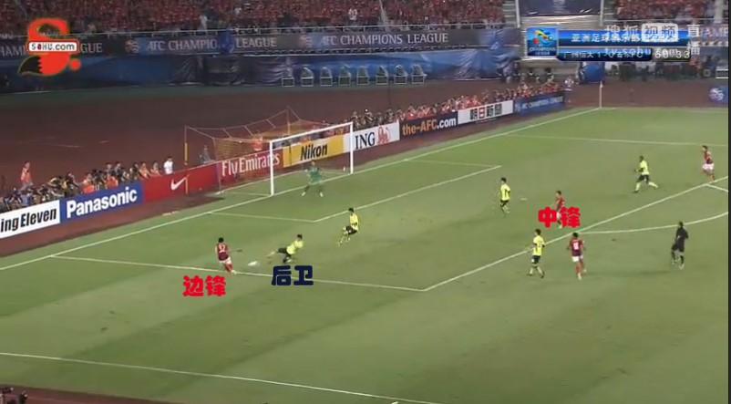
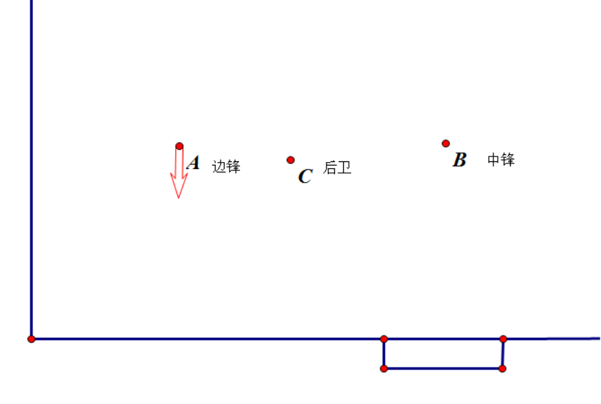
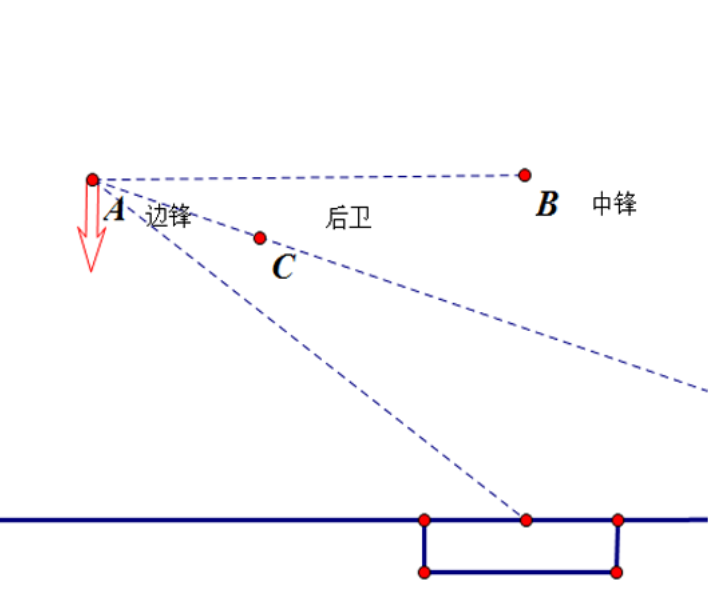
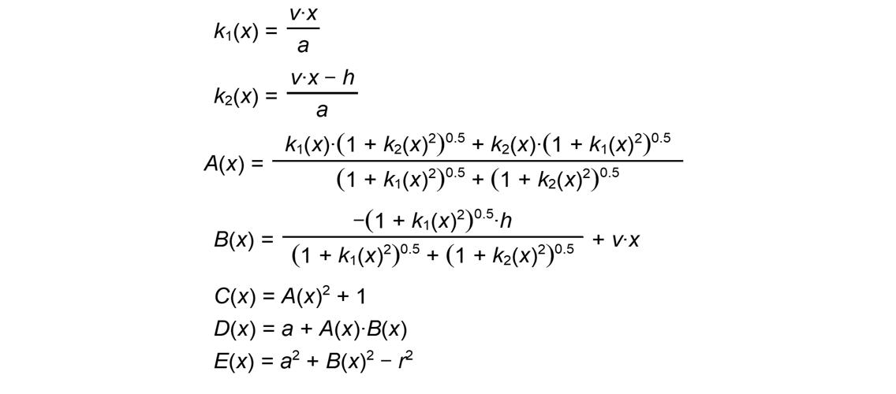
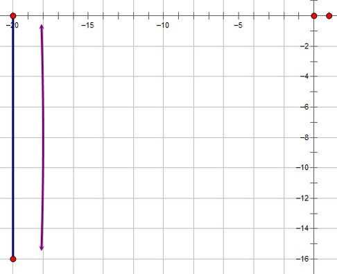
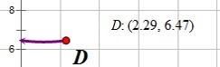
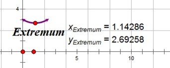

在一场足球赛上，甲方边前锋从边路带球到乙方球门附近，乙方后卫上前阻拦，那么乙方后卫最佳的防御姿态（他面朝的方向，他的运动情况，他和甲方前锋的距离等）应该是怎样的？

#### 背景
边锋是球赛中从边路进攻的球员，关于边锋一个很常用的战术就是下底传中。即边锋带球从边路插到球场底部，再将球传给正对球门处等待的中锋，让中锋射门。

边锋从边路带球时，他有可能下底传中给中锋，但我们也没有排除他直接射门的可能。因此后卫的任务此时就是尽量防止边锋传中或者射门。这就是我们问题的背景。

#### 数据
速度7m/s，体育课体质测试，大多数人的50m成绩都在7s以上，因此奔跑速度我们定为7m/s（我们没有考虑专业运动员的情况）
突越距离1m。中锋距球门16m，初始时边锋距离中锋20m

我们对于这个问题进行了一些初步的探索，发现不恰当的模型假设会使模型相当复杂。因此我们先从最简单的情况进行了考虑，以下是我们对于这个问题一个最简单情形的分析。

#### 假设
1. 边锋以恒定速度运动，运动方向如图。

2. 中锋始终静止。
3. 假设人的转身、踢球等动作发生所需要的时间为0。
4. 后卫与边锋距离始终不变。
5. 忽略速度变化所需要的时间问题，即假设速度变化可以是瞬时的。
6. 忽略人与球的实际形状所带来的问题，即把人与球的运动假设为点的运动
7.	假设为理想环境，即双方球员均遵守比赛规则，无天气、场地等环境因素影响，无受伤、犯规等偶然因素影响，无个人身体素质与水平等个人差异影响
8. 假定除对方边锋、中锋与我方后卫在我方后场，其他球员相距较远且不造成影响。
9. 假设我方后卫的目的只是防住对方边锋射门或者传球给中锋。（假设两者同等重要）
10. 边锋踢球不偏，且射门时对着球门中心射门（为了简单起见）。
11. 后卫拦球时，忽略反应时间，边锋一旦传球或射门后卫能迅速突进一小段距离d（假设d=1m），若突进后能在球的运行轨迹上则视为拦球成功。
12. 此模型目前只考虑二维平面情况。

怎样的防守方案视为最合理的方案？我们定义：在有效拦球的前提下尽量节省体力的防守视作最合理的防守。因此，我们要设计的防守方案是要能使后卫拦住球并且奔跑时速度最小。接下来我们就设计了一个防守方案并且求出后卫奔跑的速度。

由假设9、10可知，后卫应当站在边锋中锋的连线和边锋球门中心连线的角平分线上。即如图：

为此我们建立平面直角坐标系，以中锋为原点（中锋和球门中心都在y轴上，初始时边锋在x轴上）设边锋速度v，位置（-a，0），球门中心位置（0，-h），边锋t时刻的位置（-a，vt）。设后卫位置（x，y），由后卫在角平分线上知应有方程：

又由于假设4，因此后卫始终在以边锋为圆心的固定半径r的圆上。将直线方程和圆的方程联立，取较大的解即可得到后卫的轨迹方程。

其中相关替代元情况如下：

Y（x）是后卫随着时间x变化，纵坐标变化的方程，X（x）是后卫随着时间x变化，横坐标变化的方程。
对这两个函数分别求导，我们可以得到后卫X方向和Y方向的速度。
由于函数过于复杂，无法从形式上把导函数写出来，即使是能够求导的几何画板也无法做到，因此我们从导数的定义出发，把导数写成了如图的形式，这样的近似能符合我们的要求。

所以，

就是后卫的总的速度大小随时间x的变化。这个函数过于复杂，我们无法在形式上去研究它，因此只能够带入具体的数据利用相关软件绘图研究。
我们上网查找资料，给出了一些基本量的大小：边锋带球奔跑速度7m/s，边锋初始位置距离中锋a=20m，中锋距离球门中心h=16m，假定后卫和边锋的距离始终是r=2m，我们绘出了图像

图中的直的蓝色线段为边锋轨迹，紫色的曲线为后卫的轨迹
我们也绘制出了后卫速度大小随时间变化的图像：时间取值在0到16/7s之内

图中的D点是图像的极大值点，即后卫奔跑的速度的最大值是6.47m/s。在几何画板软件中，我们不断调试边锋后卫距离r的值，发现速度图线总是随着r的增大而下降的，因此r越大，后卫奔跑的越省力。
但是r并不是越大越好，因为我们都知道，r太大根本达不到防守的效果。因此我们要给r定一个上限。此时，由假设11可知，后卫站在角平分线上时，和两条边的距离不能够超过d。所以r的最大值随着t的变化为：（d为参数）

其中的𝐴(𝑥)、𝑘_1 (𝑥)和前文一致，x变量代表t。
d=1时，我们绘制出了函数r(x)的图像

这表明当后卫在角平分线上时各个时间所能有的r的最大值。因为在这个模型当中，后卫奔跑时r是不变的，因此在这个模型当中我们应该寻找到一个能够满足t从0到16/7s的r，因此这个r应该取极小值的r，为2.69。至此，在这个初步的简单的模型下，我们得到了一个比较合理的解。

所以，这个模型下的最合理的防守方案应当是：后卫始终站在边锋中锋连线，边锋中锋球门中心连线的角平分线上，和边锋距离始终保持在2.69m。

