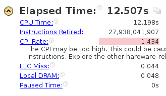
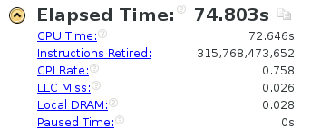

## 初始代码

```cpp	
#include <iostream>
#include <stdlib.h>

using namespace std;

const int x_dim = 500;
const int y_dim = 500;
const int z_dim = 500;

const int t_steps = 3;


int main()
{
    double(*in)[y_dim + 2][z_dim + 2] = new double[x_dim + 2][y_dim + 2][z_dim + 2];
    double(*out)[y_dim + 2][z_dim + 2] = new double[x_dim + 2][y_dim + 2][z_dim + 2];
    double(*temp)[y_dim + 2][z_dim + 2] = NULL;

    for (int x = 0; x < x_dim + 2; x++)
        for (int y = 0; y < y_dim + 2; y++)
            for (int z = 0; z < z_dim + 2; z++) {
                in[x][y][z] = 0.0;
                out[x][y][z] = 0.0;
            }

    for (int t = 0; t < t_steps; t++) {

        for (int z = 1; z < z_dim + 1; z++) {
            for (int y = 1; y < y_dim + 1; y++) {
                for (int x = 1; x < x_dim + 1; x++) {
                    out[x][y][z] = 0.4 * in[x][y][z]
                        + 0.1 * (in[x - 1][y][z] + in[x + 1][y][z]
                            + in[x][y - 1][z] + in[x][y + 1][z]
                            + in[x][y][z - 1] + in[x][y][z + 1]);
                }
            }
        }

        temp = out;
        out = in;
        in = temp;
    }

    delete[] in;
    delete[] out;

    return 0;
}
```

* 当 `x_dim` `y_dim` `z_dim` 都为20时运行时间小于0.002s
* 当 `x_dim` `y_dim` `z_dim` = 100, `t_steps` = 3 时

使用 `Xming` 工具输出如下信息


时间还是较短，进一步加大问题规模

* 当 `x_dim` `y_dim` `z_dim` = 500, `t_steps` = 3 时

使用 `Xming` 工具输出如下信息


运行了32秒，速度较慢，从信息中可以看出缓存的命中率较低

## 提升空间局部性
修改代码
```cpp
		for (int x = 1; x < x_dim + 1; x++) {
			for (int y = 1; y < y_dim + 1; y++) {
				for (int z = 1; z < z_dim + 1; z++) {
					out[x][y][z] = 0.4 * in[x][y][z]
						+ 0.1 * (in[x - 1][y][z] + in[x + 1][y][z]
							+ in[x][y - 1][z] + in[x][y + 1][z]
							+ in[x][y][z - 1] + in[x][y][z + 1]);
				}
			}
		}
```

* 此时 `x_dim` `y_dim` `z_dim` = 500 

 `Xming` 工具输出如下信息


速度有了不小的提升

## 使用 IVDEP 编译指示，开启编译器优化选项
修改代码
```cpp
	const int x_dim_add_2 = x_dim + 2;
	const int y_dim_add_2 = y_dim + 2;
	const int z_dim_add_2 = z_dim + 2;
	const int x_dim_add_1 = x_dim + 1;
	const int y_dim_add_1 = y_dim + 1;
	const int z_dim_add_1 = z_dim + 1;

	for (int x = 0; x < x_dim_add_2; x++)
		for (int y = 0; y < y_dim_add_2; y++)
			for (int z = 0; z < z_dim_add_2; z++) {
				in[x][y][z] = 0.0;
				out[x][y][z] = 0.0;
			}

	for (int t = 0; t < t_steps; t++) {

		for (int x = 1; x < x_dim_add_1; x++) {
			for (int y = 1; y < y_dim_add_1; y++) {
				#pragma ivdep
				for (int z = 1; z < z_dim_add_1; z++) {
					out[x][y][z] = 0.4 * in[x][y][z]
						+ 0.1 * (in[x - 1][y][z] + in[x + 1][y][z]
							+ in[x][y - 1][z] + in[x][y + 1][z]
							+ in[x][y][z - 1] + in[x][y][z + 1]);
				}
			}
		}
```

* 当 `x_dim` `y_dim` `z_dim` = 500，`t_steps` = 3 时

编译时开启 `icc -O3` 级别优化

 `Xming` 工具输出如下信息


速度又有了较大提升

加大问题规模进行测试

* 使 `x_dim` `y_dim` `z_dim` = 1000 



* 使 `x_dim` `y_dim` `z_dim` = 1500 


* 使 `t_steps` = 30


看到CPI Rate下降了，猜测可能是因为初始化大量提升了CPI Rate值，步数多了之后不再明显

* 使 `t_steps` = 300




