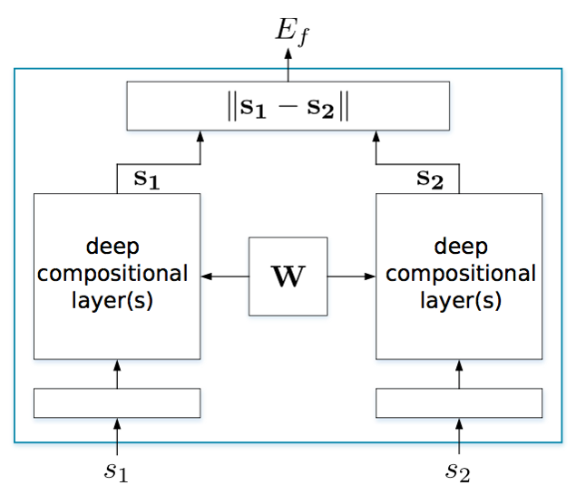
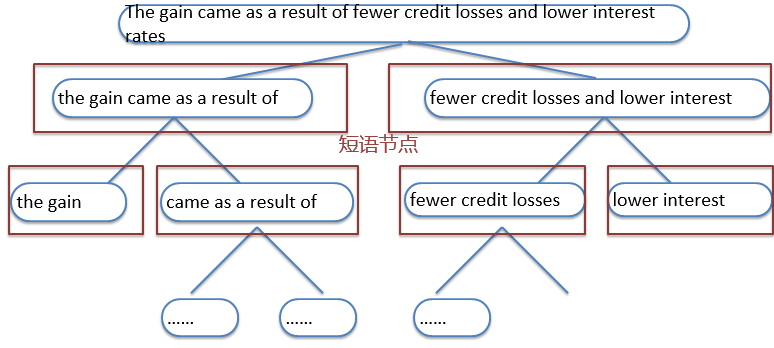
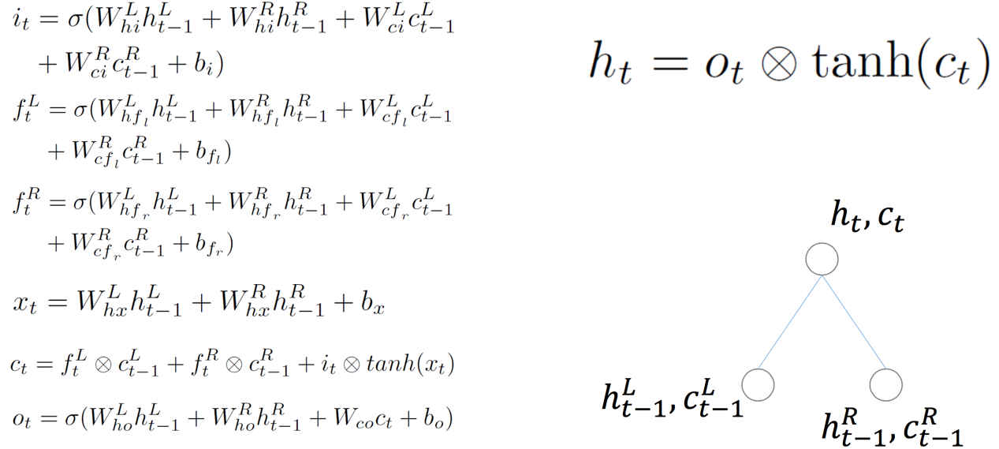
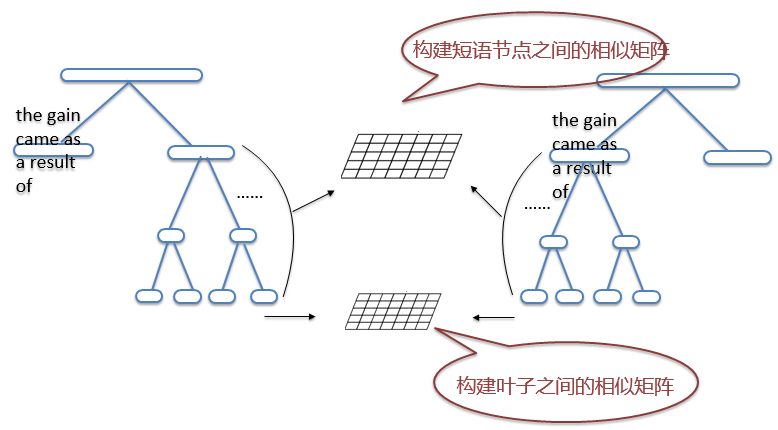
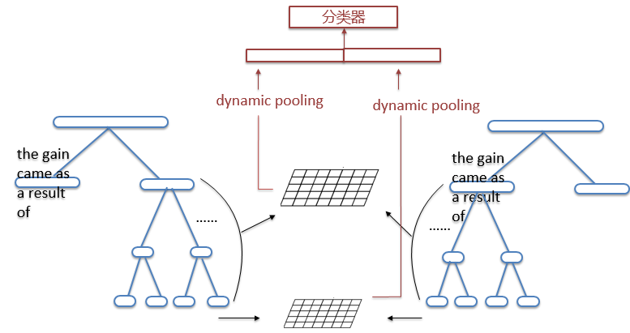

同义句检测： 对于表述方式不同的两句话判断是否含义类似

example：

    The Prime Minister, Junichiro Koizumi, joined the criticism.
    Prime Minister Junichiro Koizumi said Mr Ota deserved to be criticised.

true （是同义句）

应用：
* 问答系统中对于问题和答案的识别和处理
* 文本压缩和摘要提取过程中识别排除含义相同的句子
* 信息和数据库的生成和收集
* 提高用户交互过程中的理解能力

作为一个重要的传统任务，以往的方法可以大概分为3类：

1. #### 基于规则的配对
    早期会有基于规则的判断方法，通过替换词语、构建模板等方法结合语料库进行学习，这样的最大缺点是费时费力，且灵活度不高
    example：
    1. ∀x ∀y assassinate(x, y)
            ⇒ kill(x, y) 
    2. why do we use X?
    what  did X replace ?

2. #### 基于相似度
    另外一个常见的方法是在word embedding之后提取句子的一些特征来看两个句子的相似度是否大于一定的阈值，常用的特征有：实体重叠程度、consine。

    单词嵌入+字符串特征
    1. cosine similarity
    2. named entity overlapping
    3. unmatched word 
    4. sentence focus feature
    5. Tree-editing distance

3. #### 基于神经网络的学习
    最后一种，是通过神经网络如CNN RNN 等训练，进行判断。这种方法不仅人工参与少，而且比较灵活，实验结果也很可观。
    1. 学习到句子特征向量
    2. 用分类器判断
    3. 神经网络模型多种：
    4. RNN /CNN /LSTM

通过观察数据，我们可以得到两个特点

1. 同义句很多基于同义的短语

    example： is the author of  <=>  wrote ;  
                    is the key to       <=>  is very important

2. 同义句之间有很多短语部分的顺序调整

    example：according to A 可以在句首、句中、句尾

处理句子对的结构

第一步对句子进行建模

LSTM网络在处理句子信息方面效果比较突出，它可以通过三个门结构适当保留之前的句子信息

* 基于树结构的LSTM网络建模
    1. 自底向上合成  
    2. 词向量经过预训练处理

我们知道，LSTM在产生最终的句子向量的过程中，会产生一系列的隐状态，这些隐状态节点向量实际就是我们需要的短语向量。
然后我们构建一个相似矩阵，包含了两个句子中的所有短语向量之间的比较。矩阵的元素是节点i和节点j的距离（差异程度）
为保证信息利用的更加充分，我们用相同的方法构建单词之间的相似矩阵

接下来我们将把两个矩阵输入到分类器中判断，因为句子是不等长的，所以我们需要加一步dynamic pooling的处理,可以输出等维度的矩阵

